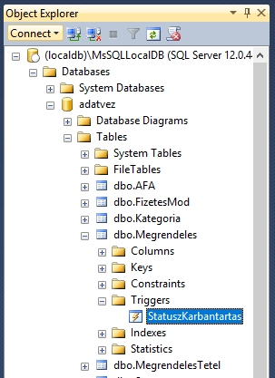

# Microsoft SQL Server használata

A Microsoft SQL Server kiszolgálóhoz az SQL Server Management Studio szoftverrel kapcsolódunk. A kiszolgáló helyben fut, az un. LocalDB verziót használjuk, de otthoni használatra megfelel az Express változat is (bármely verzió).

Letöltési linkek:

- A LocalDB Visual Studio-val települ
- <https://www.microsoft.com/en-us/sql-server/sql-server-editions-express>
- <https://docs.microsoft.com/en-us/sql/ssms/download-sql-server-management-studio-ssms>

## SQL Server Management Studio használata

A tanszéki laborokban a programot a start menüből indíthatjuk. A program indulása után kapcsolódhatunk az adatbázishoz a felugró ablakban. LocalDB használata esetén a _Server name_ `(localdb)\mssqllocaldb`, Express Edition használata esetén `.\sqlexpress` (alapbeállításokkal való telepítés esetén). Mindkét esetben _Windows Authentication_-t használunk.

A sikeres kapcsolódást követően a főablak bal oldalán az _Object Explorer_-ben kibontható a _Databases_ elem, és ha már létrehoztunk adatbázist, azt is kibontva láthatóak a tábláink és egyéb séma elemek.

SQL kód futtatásához egy új _Query_ ablakra van szükségünk, amelyet az eszköztáron található  ikonnal nyithatunk. A _Query_ ablak parancsai az aktuálisan kiválasztott adatbázison fognak lefutni, ezt az adatbázist az eszköztáron a legördülő menüben tudjuk megváltoztatni (lásd az alábbi képen sárgával). Több _Query_ ablak is lehet nyitva egyszerre.

Az SQL utasításokat lefuttatni a  gombbal tudjuk. Ha van kijelölt utasítás, csak azt futtatja, ellenkező esetben az ablak teljes tartalmát végrehajtja. Az eredmény, vagy a hibaüzenet a script alatt látható.

### Új adatbázis létrehozása

Ha még nincs adatbázisunk, először létre kell hozni egyet. Ezt az _Object Explorer_-ben a _Databases_-en jobb kattintással tehetjük meg. Az adatbázisnak csak nevet kell adni, más beállításra nincs szükség. Az adatbázis létrehozása után a _Query_ ablakban ne felejtsük átállítani az aktuális adatbázist!

### Párhuzamos tranzakciók

Párhuzamos tranzakciók szimulálásához két _Query_ ablakra van szükség a _New Query_ gomb kétszeri megnyomásával. Érdemes az ablakokat egymás mellé tenni: a _Query_ fül fejlécére jobb egérrel kattintva válasszuk a _New Vertical Tab Group_ opciót.

### Táblák tartalmának listázása, egyszerűsített módosítás

A táblák tartalmának listázásához az _Object Explorer_-ben bontsuk ki az adatbázisunk alatt a _Tables_ mappát. Bármely táblára jobb egérrel kattintva használjuk a _Select Top 1000 Rows_ elemet. Hasonló módon lehetőség van a tábla tartalmának szerkesztésére is (az első 200 sorra, amely a minta adatbázisban pont elegendő) az _Edit Top 200 Rows_ menüelemmel.

### Intellisense újratöltése

Az SQL Management Studio query ablakban az intellisense első körben sosem működik magától, használni kell a Control+Shift+R-t az intellisense cache frissítésére. Akkor is, ha új objektumot (pl. tárolt eljárást) hozunk létre.

### Tárolt eljárások és triggerek készítése, debuggolása

Tárolt eljárás és trigger létrehozására a _Query_ ablak használható, amelyben a megfelelő létrehozó-módosító utasítást futtatjuk. Ügyeljünk rá, hogy ha már létrejött egyszer a trigger vagy tárolt eljárás, utána már csak módosítani tudjuk.

A már létező tárolt eljárások az _Object Explorer_-ben az adatbázisunk alatti a _Programability/Stored Procedures_ mappában láthatóak. (Az újonnan létrehozott elemek nem jelennek meg automatikusan a már kibontott mappában. A frissítéshez a _Stored Procedures_ mappán jobb egérrel kattintva válasszuk a _Refresh_-t.)

A triggerek az _Object Explorer_-ben megkereshetőek, a táblára definiált triggerek a tábla kibontásával a _Triggers_ mappában láthatóak (a rendszer szintű triggerek pedig az adatbázis alatti _Programability_ mappában).

A tárolj eljárásaink és triggereink kódját megtekinthetjük, ha a fentebb ismertetett módon megkeressük őket, és jobb egérrel kattintva a _Modify_ menüt választjuk. Ez a művelet egy új Query ablakot nyit, amelybe generál egy _alter_ utasítást az aktuális programkóddal.

A programkódokat lehetséges debuggolni is, ehhez azonban adminisztrátori jogra van szükség, amely a tanszéki laborokban nem adott. Otthoni környezetben a _Query_ ablak fölötti  gombbal indítható a debuggolás, amely után a _Query_ ablakban sárga nyíl mutatja az aktuális utasítást, és láthatóvá válnak a szokásos léptető gombok. Trigger illetve tárolt eljárás debuggolásához a tárolt eljárást meghívó, avagy a triggert kiváltó kódot kell írni majd debuggolni, és így "léphetünk bele" a tárolt eljárás vagy trigger kódjába.
