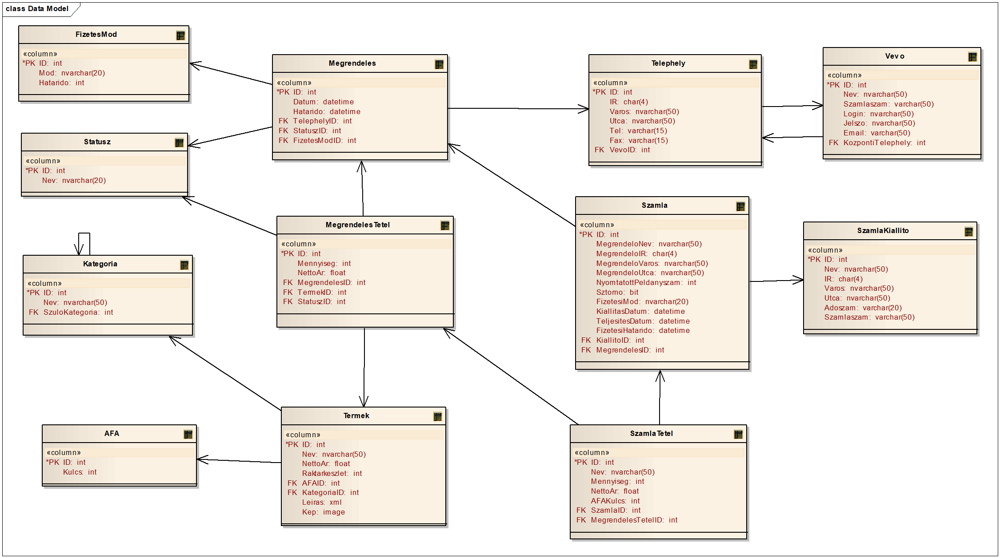

# Minta adatbázis sémája

A félév során a gyakorlati példákat egy egységes mintapéldán keresztül szemléltetjük. A mintapélda egy egyszerű vevő-megrendelésnyilvántartási rendszer. Az alábbi leírás a Microsoft SQL Server relációs sémáját ismerteti, a MongoDB "séma" ennek átültetése.

## Az adatbázis kontextusa

A rendszer termékek értékesítési folyamatának a követésére szolgál. A termékeket kategóriákba lehet sorolni, mely kategóriák hierarchikusan egymásra épülhetnek. A vevők megrendeléseiket és azok státuszát nyomon tudják követni webes felületen keresztül, megrendeléseket weben, emailen, faxon, ill. az ügyfélszolgálati irodában személyesen adhatnak fel.

Az ügyfeleken több telephelyük is lehet, az egyes megrendelések feladásakor, tisztázni kell, hogy az ügyfél mely telephelyére történik meg a kiszállítás. Minden vevőnek kell rendelkeznie központi telephellyel, mely a számlázási címül is szolgál. Természetesen egy megrendeléshez több tétel is tartozhat, az egyes tételek státusza külön- külön is követhető, ezáltal a vevő látja, hogy esetleg mely termékre kell várnia. A kész megrendelésekről számlát kell készíteni.

A számla olyan bizonylat, melynek az adatai később nem változtathatók, valamint az első nyomtatást követően csak számlamásolatot lehet csak kiállítani. Figyelembe kell venni azt is, hogy az egyes termékek ÁFA besorolása ill. ÁFA kulcsa megváltozhat az idők során, viszont a kiállított számlákon természetesen már ez az információ sem változhat meg.

## Adatmodell

Az alábbi ábra szemlélteti a nyilvántartórendszer adatmodelljét.



### Táblák és attribútumok

| **Tábla**      | **Oszlop**                                                                                                                           | **Leírás**                                          |
| -------------- | ------------------------------------------------------------------------------------------------------------------------------------ | --------------------------------------------------- |
| AFA            | ID                                                                                                                                   | Automatikusan generált azonosító, elsődleges kulcs. |
|                | Kulcs                                                                                                                                | AFA kulcs értéke százalékban megadva. |
| FizetesMod     | ID                                                                                                                                   | Automatikusan generált azonosító, elsődleges kulcs. |
|                | Mod            | Fizetési mód megnevezése (pl.: Készpénz, Átutalás 8 napon belül, …).                                                                 |
|                | Hatarido       | A fizetési módhoz tartozó határidő, azaz a számla teljesítési dátumához képest, hány nappal van később a fizetési határidő.          |
| Statusz        | ID                                                                                                                                   | Automatikusan generált azonosító, elsődleges kulcs. |
|                | Nev            | Megrendelés státusz megnevezése (pl.: új, feldolgozva, árura vár, csomagolva,…).                                                     |
| Kategoria      | ID                                                                                                                                   | Automatikusan generált azonosító, elsődleges kulcs  |
|                | Nev            | Termékkategória megnevezése (pl.: élelmiszer, tejtermék, …).                                                                         |
|                | SzuloKategoria | Kategória hierarchiát leíró idegen kulcs, egy adott kategória szülőjére mutat. A gyökérelemeknél, a szülőkategória azonosítója NULL. |
| Termek         | ID                                                                                                                                   | Automatikusan generált azonosító, elsődleges kulcs. |
|                | Nev            | Termék neve                                                                                                                          |
|                | NettoAr        | Termék nettó ára                                                                                                                     |
|                | Raktarkeszlet  | A termékből a raktárban található mennyiség.                                                                                         |
|                | AFAID          | Idegen kulcs a termék ÁFA kulcsára                                                                                                   |
|                | KategoriaID    | Idegen kulcs a termék kategóriájára.                                                                                                 |
|                | Leiras | A termékhez tartozó XML formátumú leírás |
| Vevo | ID | Automatikusan generált azonosító, elsődleges kulcs. |
|                | Nev | Vevő megnevezése. |
|                | Szamlaszam | Vevő bankszámla száma. |
|                | Login | Vevő login neve a webes rendszerhez. |
|                | Jelszo | Vevő jelszava a webes rendszerhez. |
|                | Email | Vevő email címe. |
|                | KozpontiTelephely | A vevő központi telephelyének azonosítója, külső kulcs a telephely táblára. |
| Telephely | ID | Automatikusan generált azonosító, elsődleges kulcs. |
|                | IR | A cím irányítószám része. |
|                | Varos | A cím város része. |
|                | Utca | A cím utca és házszám része. |
|                | Tel | A telephelyhez kapcsolódó telefonszám. |
|                | Fax | A telephelyhez kapcsolódó fax szám. |
|                | VevoID | Külső kulcs a vevőre |
| Megrendeles | ID | Automatikusan generált azonosító, elsődleges kulcs. |
|                | Datum | Megrendelés dátuma. |
|                | Hatarido | Vállalt szállítási határidő. |
|                | TelephelyID | Külső kulcs a vevő telephelyére, ide kell kiszállítani a megrendelt árukat. |
|                | StatuszID | Külső kulcs a státuszra, ez mutatja, hogy mi a teljes státusza a megrendelésnek. |
|                | FizetesiModID | Külső kulcs a fizetési módra. A megrendeléshez tartozó számlát az itt megadott módon fogják kiegyenlíteni. |
| MegrendelesTetel | ID | Automatikusan generált azonosító, elsődleges kulcs. |
|                | Mennyiseg | Mennyiség, azaz az adott áruból ennyi darabot rendeltek meg. |
|                | NettoAr | Egy egység nettó ára. Alapértelmezésként az termékben található nettó ár másolódik ide, de ettől eltérhet az értékesítő. |
|                | MegrendelesID | Idegen kulcs a megrendelésre, azaz ez azonosítja, hogy az adott tétel mely megrendeléshez tartozik. |
|                | TermekID | Idegen kulcs a termék táblára, ez azonosítja a megrendelt terméket. |
|                | StatuszID | Idegen kulcs a státusz táblára, ezzel lehet leírni a megrendelés tétel státuszát. |
| SzamlaKiallito | ID | Automatikusan generált azonosító, elsődleges kulcs |
|                | Nev | Cégnév, aki a kereskedést folytatja, ez szerepel a számlán. |
|                | IR | A cím irányítószám része. |
|                | Varos | A cím város része. |
|                | Utca | A cím utca része. |
|                | Adoszam | A cég adószáma. |
|                | Szamlaszam | A cég bankszámlaszáma. |
| Szamla | ID | Automatikusan generált azonosító, elsődleges kulcs |
|                | MegrendeloNev | Megrendelő neve, ez az információ fog a számla vevő részén megjelenni. |
|                | MegrendeloIR | A vevő címének irányítószáma. |
|                | MegrendeloVaros | A vevő címének város része. |
|                | MegrendeloUtca | A vevő címének utca része. |
|                | NyomtatottPeldanyszam | A számla hányszor lett kinyomtatva. |
|                | Sztorno | A számla sztornózva lett-e? |
|                | FizetesiMod | A számla fizetési módja. |
|                | KiallitasDatum | A számla kiállításának kelte. |
|                | TeljesitesDatum | A számla teljesítési dátuma. |
|                | FizetesiHatarido | A számla fizetési határideje. |
|                | KiallitoID | Idegen kulcs a számla kiállítóra. |
|                | MegrendelesID | Idegen kulcs a megrendelésre, a számla ezen megrendelés alapján került kiállításra. |
| SzamlaTetel | ID | Automatikusan generált azonosító, elsődleges kulcs |
|                | Nev | Termék neve, mely a számlatételben szerepel. |
|                | Mennyiseg | A vásárolt mennyiség. |
|                | NettoAr | A tétel nettó egységára. |
|                | AFAKulcs | A tétel ÁFA kulcsa |
|                | SzamlaID | Idegen kulcs a számlára, melyhez a a számlatétel tartozik. |
|                | MegrendelesTetelID | Idegen kulcs a megrendelés tételre, melyből a számlatétel keletkezett. |

### Sajátosságok

#### Számlázás

Adatmodell sajátossága, a számlázási adatok tárolása. A számla adatait nem lehet megváltoztatni kinyomtatás után, számlát nem lehet törölni csak sztornózni. Ebből adódón a számlához tartozó összes információt a számla és a számlatétel táblák tartalmazzák, a számlakiállítás során minden információt le kell másolni a vonatkozó megrendelésből. Valamint az első nyomtatást követően a számlából már csak másolatot lehet nyomtatni, eredeti példányt nem.

#### Számla kiállító

Speciális a KiallitoID attribútum a számla táblában, mivel a cég saját adatai ritkán változnak. Viszont a változtathatatlanság követelménye miatt a számla kiállító adatait nem lehet módosítani, ha már van hozzá számla. Ebben az esetben a számla kiállító táblába új rekordot kell felvenni, ebből adódóan az aktuális cégadatokat minidig a legmagasabb ID-vel rendelkező számla kiállító rekord tartalmazza.

#### ÁFA

Egy termék ÁFA kulcsa bármikor megváltozhat, de ez a megrendelés során teljesen természetes, de a kiállított számlák ÁFA tartalma már nem változhat meg. Ezért a megrendelés során az ÁFÁ-ra idegen kulccsal kell hivatkozni, hogy a változást követni lehessen, viszont a kiállított számlában le kell tárolni a kiállítás pillanatában az aktuális ÁFA kulcsot.

#### Termék leírás

A termékekhez tartozhat egy XML formátumú leírás, ennek tartalmát szemlélteti az alábbi példa. Ezen leírás a termékhez tartozó egyéb extra információkat tartalmazza, amelyeket nem fejtettünk ki relációs modellben

```xml
<termek>
  <termek_meret>
    <mertekegyseg>cm</mertekegyseg>
    <szelesseg>15</szelesseg>
    <magassag>2</magassag>
    <melyseg>15</melyseg>
  </termek_meret>
  <csomag_parameterek>
    <csomag_darabszam>1</csomag_darabszam>
    <csomag_meret>
      <mertekegyseg>cm</mertekegyseg>
      <szelesseg>15</szelesseg>
      <magassag>2</magassag>
      <melyseg>15</melyseg>
    </csomag_meret>
  </csomag_parameterek>
  <leiras>
    Tiszta pamut oldalak, élénk színek, vastag kontúrok.
    Ez a mini világ termék a babák életkori sajátosságainak megfelelõen fejleszti a látást, tapintást. Motiválja a babát, hogy megtanulja környezete felismerését.
    Felerõsíthetõ a gyerekágyra, járókára vagy a babakocsira.
    </leiras>
  <ajanlott_kor> 0-18 hónap </ajanlott_kor>
</termek>
```
