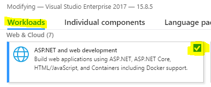
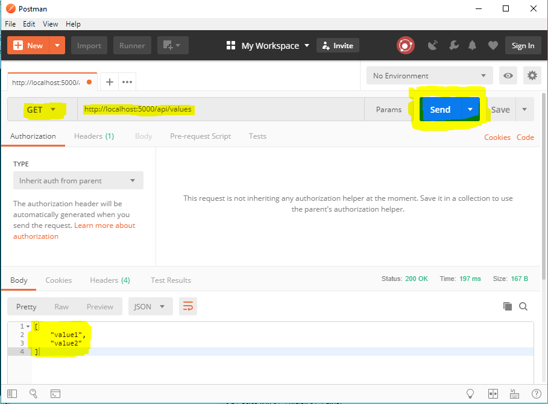

# Opcionális házi feladat 3: Entity Framework és Web API

A házi feladat opcionális. A teljesítéssel **4 iMsc pont** szerezhető.

## Beadás

A feladat megoldása a Visual Studio solution és minden szükséges forráskód. GitHub Classroom segítségével a <https://classroom.github.com/a/IDg3UAOR> linken keresztül hozz létre egy repository-t. Ez tartalmazni fogja a kiinduló állapotot. Ezen állapotot módosítsd, és töltsd fel.

Mielőtt nekiállasz a feladat megoldásának, ha még nem tetted meg, ne felejtsd [ezen a formon](https://1drv.ms/xs/s!ApHUeZ7ao_2ThuJdorOCXZoah2Rjyw?wdFormId=%7BFE4E4230%2DFBEF%2D435A%2D9363%2DF33D02A19B75%7D) megadni a neptun kódod és a GitHub account neved.

Határidő: **2018. december 2. vasárnap 23.59**

## Szükséges eszközök

* Microsoft SQL Server
  * Express változat ingyenesen használható, avagy Visual Studio telepítésével a gyakorlatokon is használt "localdb" változat elérhető
* Microsoft SQL Server Management Studio
* A tanszéki honlapról letölthető adatbázis létrehozó szkript.
  * Előkészületként hozz létre egy új adatbázist, és futtasd le a táblákat létrehozó szkriptet.
* Microsoft Visual Studio 2017, 15.8-as vagy újabb verzió
  * Community változat is megfelelő.
* [Postman](https://www.getpostman.com/)

## Előkészítés

Visual Studio 2017-ből legalább 15.8-as verzió szükséges. A verziót a _Visual Studio Installer_ elindításával ellenőrizhetjük, illetve frissíteni is itt lehet.


A telepítéskor ki kell pipálni a _ASP.NET and web development_ nevű Workloadot. Meglevő telepítés a _Visual Studio Installer_-ben a _Modify_ gombbal módosítható, ill. ellenőrizhető.



## Kód váz letöltése és kipróbálása

A létrehozott és klónozott repository-ban megtalálható a kiinduló kód váz. Nyitsd meg Visual Studio-val és indítsd el. Egy konzol alkalmazásnak kell elindulnia, amely hosztolja a web alkalmazást.

Próbáld ki (miközben fut a program): böngészőben nyitsd meg a http://localhost:5000/api/values oldalt. Ez egy teszt Controller az alkalmazásban.


Próbáld ki ugyanezt a Postman használatával. A Postmannel REST kéréseket küldhetünk az alkalmazásnak. Amíg nincs felhasználói felület, így tudunk tesztelni. Elindítva a Postman-t, zárjuk be a felugró ablakokat, hogy az alapképernyőhöz jussunk. URL-nek adjuk meg http://localhost:5000/api/values címet, a kérés típus legyen GET, és nyomjuk meg a Send gombot. Alul megjelenik a kapott JSON válasz.



## Feladat: Adatbázis leképzés Code First modellel és termékek nevének listázása

Az adatbázis modell leképzése **1 iMsc pontot** ér. A további feladatokhoz elengedhetetlen ennek a részfeladatnak a megoldása.

Készítsük el az adatbázisunk Entity Framework leképzését Code First megoldással. Az Entity Framework Core csomag már része a projektünknek, így rögtön kódolhatunk is. Az adatelérési rétegünket a _DAL_ mappában készítjük el.

Az adatelés központi eleme a DbContext. Ez az osztály már lértezik CRMDbContext néven. Nézd meg a tartalmát.

```C#
using Microsoft.EntityFrameworkCore;

namespace HF_EF_WebAPI.DAL
{
    public class CRMDbContext : DbContext
    {
        // VEDD KI A KOMMENTET, HA LETREHOZTAD A DbTermek OSZTALYT
        //public DbSet<DbTermek> Termekek { get; set; }

        protected override void OnConfiguring(DbContextOptionsBuilder optionsBuilder)
        {
            optionsBuilder.UseSqlServer(getSqlConnectionString());
            base.OnConfiguring(optionsBuilder);
        }

        private static string getSqlConnectionString()
        {
            // EZT A RESZT NE MODOSITSD
            var environmentConnString = System.Environment.GetEnvironmentVariable("DATABASE_CONNECTIONSTRING");
            if (!string.IsNullOrEmpty(environmentConnString))
            {
                return environmentConnString;
            }
            // EDDIG NE MODOSITSD
            else
            {
                // EZT A CONNECTION STRINGET ATIRHATOD
                return @"data source=(localdb)\mssqllocaldb;initial catalog=adatvez;integrated security=true";
            }
        }
    }
}
```
A kód inicializálja a kapcsolatot az SQL szerverrel. Ehhez először környezeti változóból próbálja megkeresni a connection stringet, ha nem találja, akkor használja a beégetett értéket. A beégetett értéket módosíthatod, de az előtte levő részt hagyd érintetlenül.

Képezd le a termékeket. Hozz létre egy új osztályt a DAL mappába DbTermek néven az alábbi kóddal. (A _Db_ prefix egyértelművé teszi, hogy az osztály az adatbázis kontextusában értelmezett.)

```C#
using System.ComponentModel.DataAnnotations.Schema;

namespace HF_EF_WebAPI.DAL
{
    [Table("Termek")]
    public class DbTermek
    {
        [DatabaseGenerated(DatabaseGeneratedOption.Identity)]
        public int ID { get; set; }
        public string Nev { get; set; }
        public double NettoAr { get; set; }
        public int Raktarkeszlet { get; set; }
    }
}
```

Menj vissza a DbContext-hez és töröld a kommentet a _Termekek_ property elől.

Adj egy új controllert a projekthez, amely a termékkel kapcsolatos szolgáltatásokat nyújtja. A controllers mappára jobb egérrel kattintva az Add menü alatt válasszuk a Controller-t, majd az _API Controller - Empty_ opciót. Készíts egy olyan metódust, ami minden termék nevét listázza. Ezzel tesztelhetjük, hogy az infrastruktúra rendben működik-e. A TermekController-t az alábbiak szerint implementáljuk.

```C#
using System.Collections.Generic;
using System.Linq;
using Microsoft.AspNetCore.Mvc;

namespace HF_EF_WebAPI.Controllers
{
    [Route("api/[controller]")]
    public class TermekController : Controller
    {
        [HttpGet]
        public IEnumerable<string> Get()
        {
            using (var db = new DAL.CRMDbContext())
            {
                return (from t in db.Termekek
                       select t.Nev).ToArray();
            }
        }
    }
}
```

Indítsd el a webalkalmazást, és Postman-ben a http://localhost:5000/api/termek címre küldj GET kérést. Válaszul meg kell kapd a termékek neveit.

Megjegyzés: a ToArray()-re azért van szükségünk, mert anélkül a return kulcsszó a lekérdezés leíróját, az IQueryable interfészt adná vissza, ami az eredményeket nem tartalmazza. A tényleges adatbázis elérés abban az esetben az IQueryable iterálásakor kezdődne meg, amit a keretrendszer a JSON sorosítás során végezne; mindez pedig a mi függvényünkből való visszatérés után történne, ami pedig a DbContext lezárása után fut csak.

## Feladat: termék keresése

A feladat összesen **3 iMsc pontot** ér.

* Képezd le a Termek entitás AFA táblára mutató kapcsolatát. (1 pont)
* Készíts egy termék modell osztályt, ami az adatbázistól függetlenül reprezentálja a terméket az áfa kulcs értékével együtt, és amely osztály közvetlenül JSON sorosítható. (1 pont)
* Készíts egy API függvényt, amivel keresni lehet a termékek között név alapján és a termékek adatait adja válaszul. Az API függvénynél törekedjen a Web API személet helyes alkalmazására. (1 pont)

A feladatot az alábbi lépések mentén old meg.

1. Készíts egy _DbAfa_ osztályt az AFA tábla leképzésére a _DbTermek_-hez hasonlóan. Ne felejtsd el felvenni a DbSet-et a CRMDbContext-be.

2. Képezd le a Termek - AFA kapcsolatot.

A DbTermek osztályba vegyél fel egy DbAFA típusú get-set property-t, ez lesz a navigation property. Használd az alábbi attribútumot a property felett, ami meghatározza a külső kulcs adatbázis mezőjét.

```C#
[ForeignKey("AFAID")]
public DbAFA AFA { get; set; }
```

Vedd fel ennek az egy-több kapcsolatnak a másik oldalát a DbAFA osztályba. Mivel POCO proxy-kat használunk, a property ICollection<DbTermek> típusú legyen.

```C#
public ICollection<DbTermek> Termekek { get; set; }
```

3. Készíts egy új modell osztályt, ami a terméket reprezentálja, de közvetlenül tartalmazza az áfa kulcsot is. Ez az osztály az adatbázis adataiból építkezik, de egységbe zárja az adatokat anélkül, hogy az adatbázishoz kellene fordulni a kapcsolódó áfa rekord lekérdezéséhez. Valamint ez az osztály JSON sorosítható is lesz (a DbTermek osztály a navigation property miatt nem igazán sorosítható, legalábbis nem praktikus arra is használni).

Készíts egy _Model_ mappát, és készíts ebbe a mappába egy _TermekAfaval_ nevű osztályt, ami tartalmazza a DbTermek leképzett tulajdonságait, de a DbAfa-ra mutató navigation property helyett az int típusú áfakulcs értékét tartalmazza. (Ennek az osztálynak már nincs köze az adatbázishoz, a CRMDbContext-be nem kell felvenni semmilyen módon.)

Készíts egy statikus segédfüggvényt, ami egy DbTermek entitásból készít egy TermekAfaval osztály példányt. A függvényt teheted egy új osztályba is, de az egyszerűség kedvéért lehet a TermekAfaval osztályban is.

```C#
public static TermekAfaval Convert(DbTermek db) { ... }
```

Szükségünk lesz olyan segédfüggvényre is, ami nem csupán egy DbTermek, hanem egy egész eredményhalmaz konvertálását megvalósítja. Készíts ehhez is egy segédfüggvényt.

```C#
using System.Linq;
...

public static TermekAfaval[] Convert(IEnumerable<DbTermek> db)
{
     return db.Select(Convert).ToArray();
}
```

4. Készíts a TermekContoller-be egy GET kérésre válaszoló, egy darab string bemeneti paraméterrel rendelkező API metódust, ami a kapott string paraméterrel a termékek nevében keresve visszaadja az talált termékeket TermekAfaval típusként. Ha nincs egyezés, üres listát adjon vissza.

A metódus az API-n a http://localhost:5000/api/termek/keresettnev URL-en legyen elérhető, ahol a keresett név töredéket a /termek/ utáni részben adjuk meg.

```C#
[HttpGet("{keres}")]
public IEnumerable<Model.TermekAfaval> Search(string keres)
```

Az így definiált eredmény JSON sorosításról a keretrendszer gondoskodni fog.

Ne felejtsd a Termek lekérdezésekor az AFA irányú navigation property-n a lazy loadingot kikapcsolni (Include használatával). Az adatbázisból lekérdezett DbTermek példányokat a korábban készített segédfüggvénnyel közvetlenül konvertálhatod.