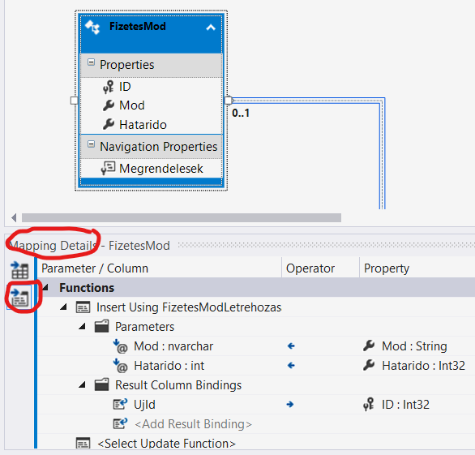

# Entity Framework

## Célkitűzés

A gyakorlat célja, hogy a hallgatók megismerjék a Linq lekérdezések használatát, valamint az Entity Framework működését.

## Előfeltételek

A labor elvégzéséhez szükséges eszközök:

- Microsoft Visual Studio 2015/2017/2019 (_nem_ VS Code)
- Microsoft SQL Server (LocalDB vagy Express edition)
- SQL Server Management Studio
- Adatbázis létrehozó script: [mssql.sql](https://raw.githubusercontent.com/bmeviauac01/gyakorlatok/master/mssql.sql)

Amit érdemes átnézned:

- C# nyelv
- Entity Framework és Linq

## Gyakorlat menete

A gyakorlat végig vezetett, a gyakorlatvezető utasításai szerint haladjunk. Egy-egy részfeladatot próbáljunk meg először önállóan megoldani, utána beszéljük meg a megoldást közösen. Az utolsó feladat opcionális, ha belefér az időbe.

Emlékeztetőként a megoldások is megtalálhatóak az útmutatóban is. Előbb azonban próbáljuk magunk megoldani a feladatot!

## Feladat 0: Adatbázis létrehozása, ellenőrzése

Az adatbázis az adott géphez kötött, ezért nem biztos, hogy a korábban létrehozott adatbázis most is létezik. Ezért először ellenőrizzük, és ha nem találjuk, akkor hozzuk létre újra az adatbázist. (Ennek mikéntjét lásd az első gyakorlat anyagában.)

## Feladat 1: Projekt létrehozása, adatbázis leképzése

Hozz létre Visual Studio segítségével egy C# konzolalkalmazást (_File / New / Project... / Visual C# / Windows desktop / Console application_). A `c:\work` mappába dolgozz. (**Ne** .NET _Core_ alkalmazást hozzunk létre, mert abban nincs _Database First_ leképzés, amit használni fogunk.)

1. Adj a projekthez egy *ADO.NET Entity Data Model*t.

   - Solution Explorer-ben a projektre jobb egér / _Add / New Item / Data / ADO.NET Entity Data Model_. Az ablak alján a Name mezőben `AdatvezEntities`-t adj meg.
   - A modellt meglévő adatbázis alapján építsd fel (a varázslóban "EF designer from database").
   - A kapcsolatok megadásánál a saját adatbázishoz kapcsolódj. Hozz létre egy új kapcsolatot a varázsló segítségével, és mentsd el a kapcsolódási adatokat a config fájlba.
     - _Data source_: Microsoft SQL Server
     - _Server name_: `(localdb)\mssqllocaldb`
     - _Select or enter database name_: adjuk meg az adatbázis nevét
     - _Save connection settings in App.Config_:
       - igen (pipa)
       - alatta a szerkesztőmezőben az `AdatvezEntities`-t add meg (ilyen néven fog a DbContext osztály legenerálódni)
   - Entity Framework 6.0-as leképzést használj.
   - Az összes táblát képezzük le.
   - _Model namespace_: pl. `AdatvezEntitiesModel`

1. Keressük meg a _connection stringet_ az `app.config` fájlban. Nézzük meg a tartalmát.

   > Azért jó, ha ide kerül a _connection string_, mert az alkalmazáshoz tartozó adatbázis helye telepítésenként változhat. Ha a forráskódban van a szerver elérhetősége, akkor újra kell fordítani az alkalmazást minden telepítéshez. Az `app.config` fájl viszont az exe mellett része az alkalmazásnak, és szerkeszthető. Ha szükséges, kiemelhető a fájl más konfigurációs állományba is.

1. Nyissuk meg az EF adatmodellt. Vizsgáljuk meg: nézzük meg az entitásokat és kapcsolatokat.

   - Ha szerkeszteni akarjuk a modellt, az _Entity Data Model Browser_ és _Entity Data Model Mapping Details_ ablakokon keresztül lehet szerkeszteni (ezek a _View_ menü, _Other windows_ menüponton keresztül érhetők el).
   - Javítsuk ki az alábbi entitás tulajdonság neveket, hogy jobban illeszkedjenek a valósághoz:

     - Customer.CustomerSite1 -> **.Sites**
     - CustomerSite.Customer1 -> **.MainCustomer**
     - Order.OrderItem -> .OrderItem**s**
     - Product.OrderItem -> .OrderItem**s**
     - VAT.Product -> .Product**s**
     - Category.Product -> .Product**s**

     Mentsük a változtatások után a modellt.

1. Nézd meg a _DbContext_ és egy választott entitás osztály C# kódját. Bontsd ki a _Solution Explorer_-ben az EDM modell fájlját, és alatta ott találhatóak a C# fájlok.

   > Ezen fájlokba _nem_ szerkesztünk bele, mert minden EDM módosítás után újragenerálódnak. Viszont figyeljük meg, hogy minden osztály _partial_-ként van definiálva, így ha szükséges, tudunk a meglevő kód "mellé" új forrásfájlokba sajátot is írni.

## Feladat 2: Lekérdezések

A leképzett adatmodellen fogalmazd meg az alábbi lekérdezéseket Linq használatával. Írd ki konzolra az eredményeket.

Debugger segítségével nézd meg, hogy milyen SQL utasítás generálódik: az IQueryable típusú változóra húzva az egeret látható a generált SQL, amint az eredményhalmaz iterálása elkezdődik.

1. Listázd azon termékek nevét és raktárkészletét, melyből több mint 30 darab van raktáron!

1. Írj olyan lekérdezést, mely kilistázza azon termékeket, melyből legalább kétszer rendeltek!

1. Készíts olyan lekérdezést, mely kilistázza azokat a megrendeléseket, melyek összértéke több mint 30.000 Ft! Az eredményhalmaz kiírásakor a vevő nevet követően soronként szerepeljenek az egyes tételek (Termék név, mennyiség, nettó ár).

1. Listázd ki a legdrágább termék adatait!

1. Listázd ki azokat a vevő párokat, akiknek ugyanabban a városban van telephelyük. Egy pár, csak egyszer szerepeljen a listában.

<details><summary markdown="span">Megoldás</summary>

```csharp
Console.WriteLine("***** Második feladat *****");
using (var db = new AdatvezEntities())
{
    // 2.1
    Console.WriteLine("\t2.1:");
    var qProductStock = from p in db.Product
                        where p.Stock > 30
                        select p;
    foreach (var p in qProductStock)
        Console.WriteLine("\t\tName={0}\tStock={1}", p.Name, p.Stock);

    // 2.2
    Console.WriteLine("\t2.2:");
    var qProductOrder = from p in db.Product
                        where p.OrderItems.Count >= 2
                        select p;

    foreach (var p in qProductOrder)
        Console.WriteLine("\t\tName={0}", p.Name);

    // 2.3
    Console.WriteLine("\t2.3:");
    var qOrderTotal = from o in db.Order
                        where o.OrderItems.Sum(oi => oi.Amount * oi.Price) > 30000
                        select o;
    foreach (var o in qOrderTotal)
    {
        Console.WriteLine("\t\tName={0}", o.CustomerSite.MainCustomer.Name);
        foreach (var oi in o.OrderItems)
            Console.WriteLine("\t\t\tProduct={0}\tPrice={1}\tAmount={2}", oi.Product.Name, oi.Price, oi.Amount);
    }

    // 2.3 második megoldás
    // Ehhez szükség van a következő névtér importálására: innen vegyük ki és tegyük be
    // a fájl elejére !!!
    // using System.Data.Entity;

    // Csak egy lekérdezést fog generálni, a Navigation Propertyket is feltölti rögtön
    Console.WriteLine("\tc 2.3 alternatív megoldás:");
    var qOrderTotal2 =
        from o in db.Order
            .Include(o => o.OrderItems)                          // vagy .Include("OrderItem")
            .Include(o => o.OrderItems.Select(oi => oi.Product)) // vagy .Include("OrderItem.Product")
            .Include(o => o.CustomerSite)                        // vagy .Include("CustomerSite")
            .Include(o => o.CustomerSite.MainCustomer)           // vagy .Include("CustomerSite.Customer")
        where o.OrderItems.Sum(oi => oi.Amount * oi.Price) > 30000
        select o;

    foreach (var o in qOrderTotal2)
    {
        Console.WriteLine("\t\tName={0}", o.CustomerSite.MainCustomer.Name);
        foreach (var oi in o.OrderItems)
            Console.WriteLine("\t\t\tProduct={0}\tPrice={1}\tAmount={2}", oi.Product.Name, oi.Price, oi.Amount);
    }

    // 2.4
    Console.WriteLine("\t2.4:");
    var qPriceMax = from p in db.Product
                    where p.Price == db.Product.Max(a => a.Price)
                    select p;
    foreach (var t in qPriceMax)
        Console.WriteLine("\t\tName={0}\tPrice={1}", t.Name, t.Price);

    // 2.5
    Console.WriteLine("\t2.5:");
    var qJoin = from s1 in db.CustomerSite
                join s2 in db.CustomerSite on s1.City equals s2.City
                where s1.CustomerID > s2.CustomerID
                select new { c1 = s1.MainCustomer, c2 = s2.MainCustomer };
    foreach (var v in qJoin)
        Console.WriteLine("\t\tCustomer 1={0}\tCustomer 2={1}", v.c1.Name, v.c2.Name);
}
```

</details>

## Feladat 3: Adatmódosítások

A DbContext nem csak lekérdezéshez használható, hanem rajta keresztül módosítások is végrehajthatóak.

1. Írj olyan Linq-ra épülő C# kódot, mely az "LEGO" (ügyelj az írásmódra!) kategóriás termékek árát megemeli 10 százalékkal!

1. Hozz létre egy új kategóriát _Expensive toys_ néven, és sorod át ide az összes olyan terméket, melynek ára, nagyobb, mint 8000 Ft!

<details><summary markdown="span">Megoldás</summary>

```csharp
Console.WriteLine("***** Harmadik feladat *****");
using (var db = new AdatvezEntities())
{
    // 3.1
    Console.WriteLine("\t3.1:");
    var qProductsLego = from p in db.Product
                        where p.Category.Name == "LEGO"
                        select p;
    Console.WriteLine("\tMódosítás előtt:");
    foreach (var p in qProductsLego)
    {
        Console.WriteLine("\t\t\tName={0}\tStock={1}\tPrice={2}", p.Name, p.Stock, p.Price);
        p.Price = 1.1 * p.Price;
    }

    db.SaveChanges();

    qProductsLego = from p in db.Product
                    where p.Category.Name == "LEGO"
                    select p;
    Console.WriteLine("\tMódosítás után:");
    foreach (var p in qProductsLego)
        Console.WriteLine("\t\t\tName={0}\tStock={1}\tPrice={2}", p.Name, p.Stock, p.Price);

    // 3.2
    Console.WriteLine("\t3.2:");
    Category categoryExpensiveToys = (from c in db.Category
                                        where c.Name == "Expensive toys"
                                        select c).SingleOrDefault();

    if (categoryExpensiveToys == null)
    {
        categoryExpensiveToys = new Category { Name = "Expensive toys" };

        // Erre nem feltetlenul van szukseg: ha van atrendelt termek, ahhoz hozzakotjuk a kategoria entitast
        // es bekerul automatikusan a kategoria tablaba is. Igy viszont, hogy explicit felvesszuk, (1) jobban
        // kifejezi a szandekunkat; es (2) akkor is felvesszuk a kategoriat, ha vegul nincs atrendelt termek.
        db.Category.Add(categoryExpensiveToys);
    }

    var qProductExpensive = from p in db.Product
                            where p.Price > 8000
                            select p;

    foreach (var p in qProductExpensive)
        p.Category = categoryExpensiveToys;
    db.SaveChanges();

    qProductExpensive = from p in db.Product
                        where p.Category.Name == "Expensive toys"
                        select p;

    foreach (var t in qProductExpensive)
        Console.WriteLine("\t\tName={0}\tPrice={1}", t.Name, t.Price);
}
```

</details>

## Feladat 4: Tárolt eljárások használata

Tárolt eljárások is felvehetők az EDM modellbe modellfrissítés során. A tárolj eljárás vagy a DbContext függvényeként, vagy entitás módosító műveletére köthető be.

A tárolt eljárás leképzésének beállításait (pl. a tárolt eljárás visszatérési típusát) az *Entity Data Model Browser*ben, az adott függvény *Function Import*jához tartozó tulajdonságainál szerkesztenünk.


1. Készíts egy tárolt eljárást, mely új fizetési mód rögzítésére szolgál, és visszaadja az új rekord azonosítóját! Használd ezt a tárolt eljárást új entitás felvételéhez!

   - Hozd létre a tárolt eljárást SQL Management Studio segítségével.

     ```sql
     CREATE PROCEDURE CreateNewPaymentMethod
     (
     @Method nvarchar(20),
     @Deadline int
     )
     AS
     insert into PaymentMethod
     values(@Method,@Deadline)
     select scope_identity() as NewId
     ```

   - A tárolt eljárást állítsd be a `PaymentMethod` entitás _insert_ metódusának.

     - Add hozzá a tárolt eljárást az EDM-hez. Az EDM Browser-ben jobb kantitással hozd elő a kontextus menüt, használd az "Update model from database"-t, és importáld (_Add_) az új tárolt eljárást.
     - Mentsd el a modell változásait. Ekkor generálódik a háttérben a C# kód.
     - Állítsd be ezt a metódust a `PaymentMethod` entitás _insert_ metódusaként: kiválasztva az EDM-ben a `PaymentMethod` elemet a _Mapping Details_ ablakban válts át a _Map Entity to Functions_ nézetre, és állítsd be _Insert_ metódusnak. A visszatérési értéket feleltesd meg az _ID_ tulajdonságnak. Mentsd el a modell változásait.

       

   - Próbáld ki a működést: C# kódból adj hozzá egy új fizetési módot a DbContext `PaymentMethod` gyűjteményéhez az `Add` metódussal. Ellenőrizd az adatbázisban a rekord létrejöttét.

1. Készíts egy tárolt eljárást, mely kilistázza azon termékeket melyből legalább egy megadott darabszám felett adtak el. Hívd meg a tárolj eljárást C# kódból!

   - Hozd létre a tárolt eljárást az alábbi kóddal.

     ```sql
     CREATE PROCEDURE dbo.PopularProducts (
     @MinAmount int = 10
     )
     AS
     SELECT Product.* FROM Product INNER JOIN
     (
     SELECT OrderItem.ProductID
     FROM OrderItem
     GROUP BY OrderItem.ProductID
     HAVING SUM(OrderItem.Amount) > @MinAmount
     ) a ON Product.ID = a.ProductID
     ```

   - Importáld az EDM-be a tárolt eljárást. Az eljárás beállításainál (_EDM Model Browser_-ben a _function_-re dupla kattintással nyílik) állítsd be a visszatérési értéket `Produc` típusúra. Mentsd el a modell változásait.

   

   - Használd a DbContext-en generált új függvényt a tárolt eljárás meghívásához, és írasd ki a termékek nevét!

<details><summary markdown="span">Megoldás</summary>

```csharp
Console.WriteLine("***** Negyedik feladat *****");
using (var db = new AdatvezEntities())
{
    // 4.3
    Console.WriteLine("\t4.3:");

    var pm = new PaymentMethod
    {
        Method = "Apple pay",
        Deadline = 99999
    };

    db.PaymentMethod.Add(pm);
    db.SaveChanges();

    // 4.6
    Console.WriteLine("\t4.6:");
    var qPopularProducts = db.PopularProducts(5);
    foreach (var p in qPopularProducts)
        Console.WriteLine("\t\tName={0}\tStock={1}\tPrice={2}", p.Name, p.Stock, p.Price));
}
```

</details>
