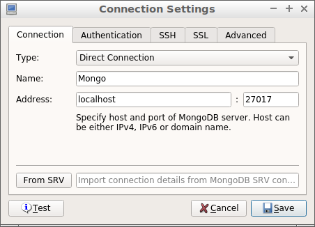
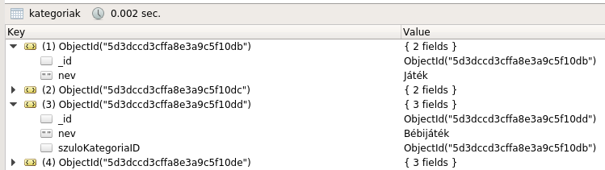

# MongoDB

## Célkitűzés

A gyakorlat célja, hogy a hallgatók megismerjék a _MongoDB_ általános célú dokumentumkezelő adatbázis alapvető működését, valamint a _MongoDB C#/.NET Driver_ használatát.

## Előfeltételek

A labor elvégzéséhez szükséges eszközök:

- Microsoft Visual Studio 2015/2017/2019 (_nem_ VS Code)
- MongoDB Community Edition
- Robo 3T
- Adatbázis létrehozó script: [mongo.js](https://raw.githubusercontent.com/bmeviauac01/gyakorlatok/master/mongo.js)
- Kiinduló alkalmazás kódja: <https://github.com/bmeviauac01/gyakorlat-seminar-mongo-starter>

Amit érdemes átnézned:

- C# nyelv és Linq kifejezések
- MongoDB előadás
- [MongoDB használata segédlet](../Adatbazis/mongodb.md)

## Gyakorlat menete

A gyakorlat végig vezetett, a gyakorlatvezető utasításai szerint haladjunk. Egy-egy részfeladatot próbáljunk meg először önállóan megoldani, utána beszéljük meg a megoldást közösen.

Emlékeztetőként a megoldások is megtalálhatóak az útmutatóban is. Előbb azonban próbáljuk magunk megoldani a feladatot!

## Feladat 0: Adatbázis létrehozása, projekt megnyitása

1. Hozzunk létre egy mappát, ahol dolgozni fogunk, például `c:\work\NEPTUN`.

   > A továbbiakban kezeljük ezt "munkakönyvtárként", tehát minden új mappát ebben hozzunk létre.

1. Indítsuk el a MongoDB szervert és hozzuk létre az adatbázist.

   - Hozzunk létre egy mappát az adatbázisfájloknak, például `db` néven. (Ezt a mappát az előbb létrehozott munkakönyvtárban hozzuk létre.)
   - Nyissunk egy _command prompt_-ot és indítsuk el a MongoDB szervert: `mongod.exe --dbpath="c:\work\<NEPTUN>\db"`
     - _Command prompt_ például a start menüben megkereshető a "cmd" kulcsszóval.
     - A laborokban a MongoDB a `c:\tools\mongodb\bin` könyvtárban van. Navigáljunk el ide a `cd` utasítással.
     - Ezt a command promptot ne zárjuk be, mert ebben fut a szerver. Leállítani Ctrl+C billentyűkombinációval lehet.

1. Hozzuk létre az adatbázis.

   - Töltsük le az adatbázislétrehozó scriptet és mentsük el `mongo.js` néven a munkakönyvtárunkba.
   - Nyissunk egy **új** _command prompt_-ot és hozzuk létre az adatbázist: `mongo.exe localhost:27017/datadriven c:\work\<NEPTUN>\mongo.js`
     - Ez az exe most nem mongo**d**, csak mongo. Ez egy kliensprogram, amivel a szerverhez csatlakozva parancsokat futtathatunk.
     - A laborokban ezt az exe-t is a `c:\tools\mongodb\bin` könyvtárban találjuk.
     - Ügyeljünk a connection stringre, amiben a szerver elérése után az adatbázis neve is benne van!

1. Ellenőrizzük, hogy létrejött az adatbázis Robo3T segítségével.

   - Indítsuk el a Robo3T programot (laborokban a `c:\tools\robo3t` könyvtárban) és csatlakozzunk a MongoDB szerverhez.

     

   - Ellenőrizzük, hogy létrejöttek a megfelelő _Collection_-ök.

     

1. Töltsük le a méréshez tartozó projekt vázat!

   - Nyissunk egy **új** _command prompt_-ot a munkakönyvtárunkba.
   - Adjuk ki a következő parancsot: `git clone --depth 1 https://github.com/bmeviauac01/gyakorlat-seminar-mongo-starter.git`

1. Nyissuk meg a forrásban az _sln_ fájlt Visual Studio-val.

1. Vizsgáljuk meg a projektet.

   - Ez egy .NET Core konzol alkalmazás. Felépítésében hasonlít az Entity Framework gyakorlaton látotthoz: az `Entities` mappában találhatók az entitás osztályok, a megoldást pedig a `Program.cs` fájlba írjuk.
   - Nézzük meg a `Program.cs` tartalmát. Itt már megtalálható a MongoDB kommunikációhoz szükséges inicializáció.
     - Az `IMongoClient` interfész tartalmazza az adatbázissal való kommunikációhoz szükséges metódusokat. Ezeket nem fogjuk közvetlenül használni.
     - Az `IMongoDatabase` interfész reprezentálja a `datadriven` adatbázist a MongoDB-n belül.
     - A különböző `IMongoCollection<TEntity>` interfészek pedig a különböző kollekciókat reprezentálják. Ezeket használva tudunk lekérdezéseket és módosító utasításokat kiadni.
   - Az adatbázisunk entitásainak C# osztályra való leképezése az `Entities` mappában található. Különbség itt az Entity Frameworkhöz képest, hogy itt ezt nekünk kézzel kell elkészítenünk.
     - Az entitások egy részének a leképezése már megtalálható itt.
     - A labor során még visszatérünk ide, és fogunk magunk is készíteni entitás osztályt.

## Feladat 1: Lekérdezések

A leképzett adatmodellen fogalmazd meg az alábbi lekérdezéseket a _MongoDB C#/.NET Driver_ használatával. Írd ki konzolra az eredményeket.

1. Listázd azon termékek nevét és raktárkészletét, melyből több mint 30 darab van raktáron!

1. Írj olyan lekérdezést, mely kilistázza azon megrendeléseket, melyekhez legalább két megrendeléstétel tartozik!

1. Készíts olyan lekérdezést, mely kilistázza azokat a megrendeléseket, melyek összértéke több mint 30000 Ft! Az eredményhalmaz kiírásakor a vevő ID-t követően soronként szerepeljenek az egyes tételek (Termék ID, mennyiség, nettó ár).

1. Listázd ki a legdrágább termék adatait!

1. Írj olyan lekérdezést, mely kilistázza azon termékeket, melyből legalább kétszer rendeltek!

<details><summary markdown="span">Megoldás</summary>

1. Ehhez a feladathoz csupán a termékeket reprezentáló gyűjteményben kell egy egyszerű lekérdezést kiadnunk. A szűrési feltételt kétféleképpen is megfogalmazhatjuk: lambda kifejezés segítségével, és kézzel összerakva is.

   ```csharp
   Console.WriteLine("***** Első feladat *****");

   //2.1
   Console.WriteLine("\t2.1 1. megoldás:");
   var qProductAndStock1 = productsCollection
       .Find(p => p.Stock > 30)
       .ToList();

   foreach (var p in qProductAndStock1)
       Console.WriteLine($"\t\tName={p.Name}\tStock={p.Stock}");

   // 2.1 második megoldás
   Console.WriteLine("\t2.1 2. megoldás:");
   var qProductAndStock2 = productsCollection
       .Find(Builders<Product>.Filter.Gt(p => p.Stock, 30))
       .ToList();

   foreach (var t in qProductAndStock2)
       Console.WriteLine($"\t\tName={p.Name}\tStock={p.Stock}");
   ```

1. Ez a feladat nagyon hasonló ez előzőhöz. Figyeljük meg, hogy az SQL-es adatbázis séma esetén ehhez már `JOIN`-t (`Navigation Property`) kellett alkalmazni. Ezzel szemben itt minden szükséges adat a megrendelés kollekcióban található.

   ```csharp
   // 2.2
   Console.WriteLine("\t2.2 1. megoldás:");
   var qOrderItems1 = ordersCollection
       .Find(o => o.OrderItems.Length >= 2)
       .ToList();

   foreach (var o in qOrderItems1)
       Console.WriteLine($"\t\tCustomerID={o.CustomerID}\tOrderID={o.ID}\tItems={o.OrderItems.Length}");

   //2.2 második megoldás
   Console.WriteLine("\t2.2 2. megoldás:");
   var qOrderItems2 = ordersCollection
       .Find(Builders<Order>.Filter.SizeGte(o => o.OrderItems, 2))
       .ToList();

   foreach (var o in qOrderItems2)
       Console.WriteLine($"\t\tCustomerID={o.CustomerID}\tOrderID={o.ID}\tItems={o.OrderItems.Length}");
   ```

1. Ehhez a feladathoz már nem elegendő számunkra a sima lekérdezés kifejezőereje, így az aggregációs pipeline-t kell alkalmaznunk. Figyeljük meg azonban, hogy a séma felépítése miatt továbbra is minden szükséges adat rendelkezésre áll egyetlen gyűjteményben.

   ```csharp
   //2.3
   Console.WriteLine("\t2.3:");
   var qOrderTotal = ordersCollection
       .Aggregate()
       .Project(order => new
       {
           CustomerID = order.CustomerID,
           OrderItems = order.OrderItems,
           Total = order.OrderItems.Sum(oi => oi.Amount * oi.Price)
       })
       .Match(order => order.Total > 30000)
       .ToList();

   foreach (var o in qOrderTotal)
   {
       Console.WriteLine($"\t\tCustomerID={o.CustomerID}");
       foreach (var oi in o.OrderItems)
           Console.WriteLine($"\t\t\tProductID={oi.ProductID}\tPrice={oi.Price}\tAmount={oi.Amount}");
   }
   ```

1. A legdrágább termékek lekérdezéséhez két lekérdezést kell kiadnunk: először lekérdezzük a legmagasabb nettóár értékét, utána pedig lekérdezzük azokat a termékeket, melyeknek a nettóára megegyezik ezzel az értékkel.

   ```csharp
   //2.4
   Console.WriteLine("\t2.4:");
   var maxPrice = productsCollection
       .Find(_ => true)
       .SortByDescending(p => p.Price)
       .Limit(1)
       .Project(p => p.Price)
       .Single();

   var qProductMax = productsCollection
       .Find(p => p.Price == maxPrice)
       .ToList();

   foreach (var t in qProductMax)
       Console.WriteLine($"\t\tName={t.Name}\tPrice={t.Price}");
   ```

1. Ez a feladat azért nehéz a jelenlegi adatbázissémánk mellett, mert itt már nem igaz az, hogy egyetlen kollekcióban rendelkezésre áll minden adat. Szükségünk van ugyanis a termék kollekcióból a termék nevére és raktárkészletére, a megrendelések kollekcióból pedig a termékhez tartozó megrendelések számára.

   Ilyen helyzetben MongoDB esetén kénytelenek vagyunk kliensoldalon (értsd: C# kódból) "joinolni". A megoldás itt tehát hogy lekérdezzük az összes megrendelést, majd pedig C#-ból, LINQ segítségével összegyűjtjük az adott termékhez tartozó megrendeléstételeket. Ezután lekérdezzük az adatbázisból a termékeket is, hogy azok adatai is rendelkezésünkre álljanak.

   ```csharp
   //2.5
   Console.WriteLine("\t2.5:");
   var qOrders = ordersCollection
       .Find(_ => true)
       .ToList();

   var productOrders = qOrders
       .SelectMany(o => o.OrderItems) // Egyetlen listába gyűjti a tételeket
       .GroupBy(oi => oi.ProductID)
       .Where(p => p.Count() >= 2);

   var qProducts = productsCollection
       .Find(_ => true)
       .ToList();
   var productLookup = qProducts.ToDictionary(p => p.ID);

   foreach (var p in productOrders)
   {
       var product = productLookup.GetValueOrDefault(p.Key);
       Console.WriteLine($"\t\tName={product?.Name}\tStock={product?.Stock}\tOrders={p.Count()}");
   }
   ```

   > Úgy tudnánk hatékonyabbá tenni a lekérdezést, ha csak azokat a termékeket listázzuk, amelyek adataira ténylegesen szükségünk van. Hogyan tehetnénk ezt meg?

</details>

## Feladat 2: Entitásosztály létrehozása

1. Vizsgáld meg a `Product` és a `VAT` entitásosztályokat. Miért van a `Product` entitásban `[BsonId]` annotáció, és miért nincs az `VAT` osztályban?

1. Hozz létre entitásosztályt a `Category` entitásnak, és vedd fel hozzá a megfelelő `IMongoCollection<Category>` interfészt.

<details><summary markdown="span">Megoldás</summary>

1. A `Product` osztály a `products` gyűjteményt reprezentálja az adatbázisban, ezért tartozik hozzá egyedi `ObjectID` ami alapján hivatkozni tudunk rá az adatbázis felé. Ezzel szemben az `VAT` osztály a `Product` egy beágyazott objektuma, önmagában nem jelenik meg gyűjteményként. Ezért nem tartozik hozzá `ObjectID` érték.

1. Hozzunk létre új POCO osztályt `Category` néven.

   Nézzük meg először a Robo3T program segítségével, hogy milyen adattagok találhatók a `categories` kollekcióban lévő dokumentumokban.

   

   Ez alapján létre tudjuk hozni a `Category` osztályt.

   ```csharp
   public class Category
   {
       [BsonId]
       public ObjectId ID { get; set; }
       public string Name { get; set; }
       public ObjectId? ParentCategoryID { get; set; }
   }
   ```

   A `Program.cs` fájlban vegyül fel az új kollekció interfészt.

   ```csharp
   private static IMongoCollection<Category> categoriesCollection;
   ```

   Az `initialize` metódusban pedig inicializáljuk is ezt a kollekciót.

   ```csharp
   categoriesCollection = database.GetCollection<Category>("categories");
   ```

</details>

## Feladat 3: Adatmódosítások

Az `IMongoColection<TEntity>` interfész nem csak lekérdezéshez használható, hanem rajta keresztül módosítások is végrehajthatóak.

1. Írj olyan _MongoDB C#/.NET Driverre_ épülő C# kódot, mely a "LEGO" (ügyelj az írásmódra!) árát megemeli 10 százalékkal!

1. Hozz létre egy új kategóriát a _Expensive toys_ néven, és sorod át ide az összes olyan terméket, melynek ára, nagyobb, mint 8000 Ft!

1. Töröld ki az összes olyan kategóriát, amelyhez nem tartozik termék.

<details><summary markdown="span">Megoldás</summary>

1. Először lekérdezzük a megfelelő kategória ID-ját, majd az ehhez tartozó termékekre adunk ki módosító utasítást.

   ```csharp
   Console.WriteLine("***** Harmadik feladat *****");

   //3.1
   Console.WriteLine("\t3.1:");
   var categoryLegoId = categoriesCollection
       .Find(c => c.Name == "LEGO")
       .Project(c => c.ID)
       .Single();

   var qProductLego = productsCollection
       .Find(p => p.CategoryID == categoryLegoId)
       .ToList();
   Console.WriteLine("\t\tMódosítás előtt:");
   foreach (var p in qProductLego)
       Console.WriteLine($"\t\t\tName={p.Name}\tStock={p.Stock}\tÁr={p.Price}");

   productsCollection.UpdateMany(
       filter: p => p.CategoryID == categoryLegoId,
       update: Builders<Product>.Update.Mul(p => p.Price, 1.1));

   qProductLego = productsCollection
       .Find(p => p.CategoryID == categoryLegoId)
       .ToList();
   Console.WriteLine("\t\tMódosítás után:");
   foreach (var p in qProductLego)
       Console.WriteLine($"\t\t\tName={p.Name}\tStock={p.Stock}\tÁr={p.Price}");
   ```

1. MongoDB segítségével tranzakció nélkül atomikusan el tudjuk végezni a következő feladatot: "Kérem a `Expensive toys` kategóriát. Amennyiben nem létezik, hozd létre." Ehhez a `FindOneAndUpdate` parancs használatára van szükségünk.

   ```csharp
   //3.2
   Console.WriteLine("\t3.2:");
   var catExpensiveToys = categoriesCollection.FindOneAndUpdate<Category>(
       filter: c => c.Name == "Expensive toys",
       update: Builders<Category>.Update.SetOnInsert(c => c.Name, "Expensive toys"),
       options: new FindOneAndUpdateOptions<Category, Category> { IsUpsert = true, ReturnDocument = ReturnDocument.After });

   productsCollection.UpdateMany(
       filter: p => p.Price > 8000,
       update: Builders<Product>.Update.Set(p => p.CategoryID, catExpensiveToys.ID));

   var qProdExpensive = productsCollection
       .Find(p => p.CategoryID == catExpensiveToys.ID)
       .ToList();
   foreach (var p in qProdExpensive)
       Console.WriteLine($"\t\tName={p.Name}\tPrice={p.Price}");
   ```

1. Lekérdezzük azokat a kategóriákat amelyekhez tartozik termék, majd pedig töröljük azokat, amelyek nem tartoznak ezek közé.

   ```csharp
   //3.3
   Console.WriteLine("\t3.3:");
   Console.WriteLine($"\t\tMódosítás előtt {categoriesCollection.CountDocuments(_ => true)} db kategória");

   var qProductCategory = new HashSet<ObjectId>(
       productsCollection
           .Find(_ => true)
           .Project(p => p.CategoryID)
           .ToList());

   categoriesCollection.DeleteMany(c => !qProductCategory.Contains(c.ID));

   Console.WriteLine($"\t\tMódosítás után {categoriesCollection.CountDocuments(_ => true)} db kategória");
   ```

   > Vegyük észre, hogy ez az utasítás nem atomikus. Ha közben vettek fel új terméket, akkor lehet, hogy olyan kategóriát törlünk amihez azóta tartozik termék. Nem vettük figyelemve továbbá a kategóriák hierarchiáját sem.

</details>
