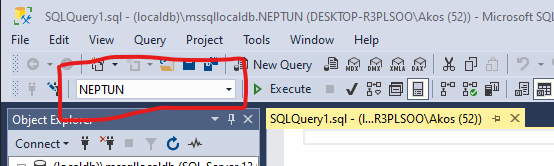

# Tranzakciókezelés

## Célkitűzés

Relációs adatbázisok és a Microsoft SQL Server tranzakciókezelésének megismerése. Serializable izolációs szint gyakorlati használhatóságának korlátai, egyedi adat egymásra hatások szabályozása read committed izolációs szinten.

## Előfeltételek

A labor elvégzéséhez szükséges eszközök:

- Microsoft SQL Server (LocalDB vagy Express edition)
- SQL Server Management Studio
- Adatbázis létrehozó script: [mssql.sql](https://raw.githubusercontent.com/bmeviauac01/gyakorlatok/master/mssql.sql)

Amit érdemes átnézned:

- Tranzakciók tulajdonságai, izolációs szintek.
- [Microsoft SQL Server használata segédlet](../MSSQL-hasznalata/README.md)

## Gyakorlat menete

A gyakorlat vezetett. A szoftverekkel történő megismerkedés után a gyakorlatvezető instrukciói alapján együtt kerülnek elvégzésre a feladatok. A tapasztalt viselkedésekre magyarázatot keresünk, és azt a csoport együtt megbeszéli.

A viselkedések magyarázatát röviden összefoglalja az útmutató is. Előbb azonban gondolkodjunk el magunk a kérdéseken!

## Feladat 1: Adatbázis létrehozása MS SQL Serveren

Első lépésként szükségünk lesz egy adatbázisra. Az adatbázis tipikusan egy központi kiszolgálón helyezkedik el, de fejlesztés közben sokszor a saját gépünkön fut. Mi ez utóbbi opciót választjuk.

1. Kapcsolódjon a Microsoft SQL Serverhez SQL Server Management Studio Segítségével. Indítsa el az alkalmazást, és az alábbi adatokkal kapcsolódjon.

   - Server name: `(localdb)\mssqllocaldb` vagy `.\sqlexpress`
   - Authentication: `Windows authentication`

1. Hozzon létre egy új adatbázist (ha még nem létezik)! Az adatbázis neve legyen a Neptun kódja: _Object Explorer_-ben Databases-en jobb kattintás, és _Create Database_.

1. Hozza létre a minta adatbázist az generáló script lefuttatásával. Nyisson egy új _Query_ ablakot, másolja be a script tartalmát, és futtassa le. Ügyeljen az eszköztáron levő legördülő menüben a megfelelő adatbázis kiválasztására.

   

1. Ellenőrizze, hogy létrejöttek-e a táblák. Ha a _Tables_ mappa ki volt már nyitva, akkor frissíteni kell.

   .

## Feladat 2: Párhuzamos tranzakciók

Nyisson két Query ablakot párhuzamos tranzakciók szimulálásához a New Query gomb kétszeri megnyomásával. Érdemes az ablakokat egymás mellé tenni: a Query fül fejlécére jobb egérrel kattintva válasszuk a _New Vertical Tab Group_ opciót:


Használja az alábbi ütemezést a parancsok végrehajtására. A T1 tranzakció a 4-es megrendelés státuszát ellenőrzi, míg a T2 tranzakció
megváltoztatja a státuszt csomagolváról szállítás alattira.

1. **T1 tranzakció**

   ```sql
   -- Listázzuk ki a megrendelés és a hozzá tartozó tételek státuszát
   select S1.nev, t.nev,s2.nev
   from megrendeles m, megrendelestetel mt, statusz s1, statusz s2, termek t
   where m.id=mt.megrendelesid
   and m.id=4
   and m.statuszid=s1.ID
   and mt.statuszid=s2.ID
   and t.id=mt.termekid
   ```

1. **T2 tranzakció**

   ```sql
   -- Állítsuk át a megrendelés állapotát
   update megrendeles
   set statuszid=4
   where id=4
   ```

1. **T1 tranzakció**: első lépésben kiadott parancs megismételve

1. **T2 tranzakció**

   ```sql
   -- Állítsuk át a megrendeléshez tartozó tételek állapotát
   update megrendelestetel
   set statuszid=4
   where megrendelesid=4
   ```

1. **T1 tranzakció**: első lépésben kiadott parancs megismételve

##### Mit tapasztalt? Miért?

<details><summary markdown="span">Magyarázat</summary>
  
> Kezdetben minden tétel csomagolva státuszban van, ami így konzisztens (nem lehet egy darab tétel postázva, ha a megrendelés nincs postázva). Viszont, amint változatunk a megrendelés állapotán, a csomag státusza ellentmondásosnak látszik a tételek státuszával. Az adatbázis **nem** inkonzisztens, mert a belső szabályai (integritási kritériumai) alapján nincs probléma. De üzleti értelemben ellentmondásos a tartalom.
>
> Az SQL Server alapértelmezésben auto commit üzemmódban fut, azaz egy utasítás az egy tranzakció, amit automatikusan lezár. Tehát a probléma, hogy a módosításaink nem egy tranzakciót képeznek.
>
> A helyes viselkedéshez össze kellene fogni a két adatmódosító utasítást egy tranzakcióba.

</details>

## Feladat 3: Tranzakció indítása, _read committed_ izolációs szint

Ismételje meg az előző feladatot úgy, hogy a két adatmódosítás egy tranzakciót képezzen:

- A **T2 tranzakció** kezdjen egy `begin tran`, és végződjön egy `commit` utasítással.
- Az adatmódosításnál a státuszt ezúttal 3-asra állítsuk (hogy érdemi változás legyen az adatokban).

#### Mit tapasztalt? Miért?

<details><summary markdown="span">Magyarázat</summary>
  
> Amint elkezdtük a státusz módosítását **T2**-ben, a lekérdező **T1**-es utasítás várni fog. Addig vár, amíg az adatmódosító tranzakció be nem fejeződik. Ez azért van, mert a `select` utasítás olvasási zárat akar elhelyezni, de másik tranzakció éppen módosítja az adott rekordot, így kizáró zárat helyezett el rajta.
>
> Jegyezzük meg, hogy az alap izolációs szint, a *read committed* ezen a platformon azt jelenti, hogy módosítás alatt levő adat nem olvasható. Ez egy implementációs kérdés, az SQL szabvány ezt nem rögzíti. Más adatbázis platform viselkedhet máshogy is (pl. az Oracle Server biztosítja, hogy a rekordok commitált képe mindenképpen olvasható marad). Más izolációs szinten az MSSQL szerver is máshogy viselkedik, a *snapshot* izolációs szint használata esetén a módosítás megkezdése előtti változat olvasható.

</details>

## Feladat 4: Tranzakció megszakítása (_rollback_) _read committed_ izolációs szinten

Kezdjük el lefuttatni az előző parancs sorozatot, a tranzakcióval együtt, de a módosító tranzakciót szakítsuk meg a közepén.

1. **T1 tranzakció**

   ```sql
   -- Listázzuk ki a megrendelés és a hozzá tartozó tételek státuszát
   select S1.nev, t.nev,s2.nev
   from megrendeles m, megrendelestetel mt, statusz s1, statusz s2, termek t
   where m.id=mt.megrendelesid
   and m.id=4
   and m.statuszid=s1.ID
   and mt.statuszid=s2.ID
   and t.id=mt.termekid
   ```

1. **T2 tranzakció**

   ```sql
   -- Új tranzakciót kezdünk
   begin tran

   -- Állítsuk át a megrendelés állapotát
   update megrendeles
   set statuszid=4
   where id=4
   ```

1. **T1 tranzakció**: első lépésben kiadott parancs megismételve

1. **T2 tranzakció**

   ```sql
   -- Szakítsuk meg a tranzakciót
   rollback
   ```

#### Mit tapasztalt? Miért?

<details><summary markdown="span">Magyarázat</summary>
  
> Az előzőekben tapasztaltakhoz hasonlóan a módosítás megkezdte után az olvasó utasítás várakozásra kényszerült. Amikor megszakítottuk a tranzakciót, akkor érkezett meg az eredmény. Mivel *read committed* izolációs szinten vagyunk, nem látjuk a módosítás alatt levő tartalmat. Amint a módosító tranzakció befejeződik, akár sikeres `commit`, akár `rollback` miatt, elérhetővé válnak a rekordok.
>
> Vegyük észre, hogy pont elkerültük a piszkos olvasás problémáját. Ha a módosítás futása közben megjelent volna a félkész eredmény, a `rollback` miatt az a tranzakció érvénytelen adattal dolgozna tovább.

</details>

## Feladat 5: Megrendelés rögzítése _serializable_ izolációs szinten

A feladat megkezdése előtt először is szakítsuk meg a félbemaradt tranzakciókat. Mindkét ablakban adjunk ki pár `rollback` utasítást az esetleg ottmaradt tranzakciók leállításához.

Legyen két párhuzamos tranzakciónk, melyek megrendelést rögzítenek. Egy termékre nem vehetünk fel több megrendelést, mint ami a raktárkészlet. Azért, hogy a tranzakciók egymásra hatását elkülönítsük, kapcsoljunk át _serializable_ izolációs szintre.

1. **T1 tranzakció**

   ```sql
   set transaction isolation level serializable
   begin tran

   -- Ellenőrizzük, hogy mennyi van raktáron egy termékből
   select *
   from termek
   where id = 2
   ```

1. **T2 tranzakció**

   ```sql
   set transaction isolation level serializable
   begin tran

   select *
   from termek
   where id = 2
   ```

1. **T1 tranzakció**

   ```sql
   -- Ellenőrizzük, hogy hány, még fel nem dolgozott megrendelés van erre a termékre
   select sum (mennyiseg)
   from megrendelestetel
   where termekid=2
   and statuszid=1
   ```

1. **T2 tranzakció**

   ```sql
   select sum (mennyiseg)
   from megrendelestetel
   where termekid=2
   and statuszid=1
   ```

1. **T1 tranzakció**

   ```sql
   -- Mivel teljesíthető a megrendelés, rögzítsük
   insert into megrendelestetel (MegrendelesID,TermekID,Mennyiseg,StatuszID)
   values(2,2,3,1)
   ```

1. **T2 tranzakció**

   ```sql
   insert into megrendelestetel (MegrendelesID,TermekID,Mennyiseg,StatuszID)
   values(3,2,3,1)
   ```

1. **T1 tranzakció**

   ```sql
   commit
   ```

1. **T2 tranzakció**

   ```sql
   commit
   ```

#### Mit tapasztalt? Miért?

<details><summary markdown="span">Magyarázat</summary>
  
> Holtpont fog kialakulni, mivel a *serializable* izolációs szint miatt mindkét tranzakció megtiltja a megrendeléstétel tábla módosítását. A `select sum` miatt, és a megismételhető olvasás elvárás miatt a rekordokat olvasó zárral látja el a rendszer. Viszont így nem futhat le a másik tranzakcióban az `insert`, amely kizárólagos zárat igényelne. Ez mindkét tranzakció esetén azt jelenti, hogy a másik által fogott zárra vár.
>
> A holtpont eredménye, hogy az egyik tranzakciót le fogja állítani a szerver. Ez elvárt és helyes működést eredményez, mivel megakadályozza, hogy a két tranzakció közt adat egymásrahatás legyen (így nem fordulhat elő, hogy több terméket adunk el, mint amennyi van).

</details>
<br />

Ismételjük meg a fenti műveletsort, csak a megrendelés rögzítésekor más-más termék ID-t használjunk! Ezzel azt szimuláljuk, hogy két megrendelő más-más terméket rendel meg.

- A feladat megkezdése előtt először is szakítsuk meg a félbemaradt tranzakciókat. Mindkét ablakban adjunk ki pár `rollback` utasítást az esetleg ottmaradt tranzakciók leállításához.
- Ahol utasításban `id` vagy `termekid` szerepel, ott egyik tranzakcióban a 2-es, másikban a 3-as terméket használjuk.

#### Mit tapasztalt? Miért?

<details><summary markdown="span">Magyarázat</summary>
  
> Ha különböző termékre történik a rögzítés, akkor is holtpont fog kialakulni. Olyan a zárolási rendszer, hogy a `select sum` az egész táblát zárolja, mivel nem tudja megkülönböztetni `termekid` szerint a rekordokat. Ez természetes is, mivel csak az üzleti logikából adódik, hogy ha két különböző termékre történik a megrendelés rögzítése, akkor azok történhetnének egyszerre is. Az adatbázis ezt nem tudja.
>
> Azaz a *serializable* izolációs szint túl szigorú, üzleti logikát figyelembe véve nagyobb párhuzamosítás engedhető meg. Ezért is ritkán használjuk a gyakorlatban.

</details>

## Feladat 6: Megrendelés rögzítése _read committed_ izolációs szinten

Gondoljuk végig, az előző feladat esetén mi történne, ha a nem állítjuk át a tranzakciók izolációs szintjét? Lenne holtpont? És helyes lenne a működés?

#### Mit tapasztalt? Miért?

<details><summary markdown="span">Magyarázat</summary>
  
> Ha nem változtatunk izolációs szintet, akkor helytelen működés állhatna elő. Mivel a *read committed* izolációs szint nem biztosítja számunkra azt, hogy amíg fut a tranzakciónk, addig egy másik tranzakció berögzítsen rekordokat. Tehát lefuthatna az `insert`, ami miatt végeredményben több árut adnánk el, mint ami a raktárban van. Ez a nem megismételhető olvasás problémája.
>
> Erről az oldalról nézve tehát a *serializable* izolációs szint nem volt feleslegesen szigorú. Tényleg megvédett minket egy problémától.

</details>

## Feladat 7: Manuális zárolás

A feladat megkezdése előtt először is szakítsuk meg a félbemaradt tranzakciókat. Mindkét ablakban adjunk ki pár `rollback` utasítást az esetleg ottmaradt tranzakciók leállításához.

Read committed izolációs szintet használva dolgozzon ki megoldást, amely csak az _azonos termékekre_ történő párhuzamos adatrögzítéseket akadályozza meg. Természetesen feltételezheti hogy mindegyik párhuzamos folyamat ugyanazt a programlogikát követi.

A megoldáshoz kihasználjuk, hogy lehetséges manuálisan zárakat elhelyezni. Ezek a zárak is, úgy, mint a többi zár, a tranzakció végéig élnek.

```sql
select *
from tablanev with(XLOCK)
...
```

#### Hova kell ezt a zárat elhelyezni? Hogyan néz ki így a megrendelés folyamata?

<details><summary markdown="span">Magyarázat</summary>
  
> A megoldás kulcsa, hogy jó helyre tegyük a zárat. A kérdés, hogy mit is kellene zárolni? A válasz, hogy a **terméket**: azt akarjuk meggátolni, hogy ugyanabból a termékből rögzíthető legyen még egy eladás. Tehát a termékre, konkrétan a termék táblában arra a sorra tesszük a zárat, ami a terméket reprezentálja.
>
> Ennek a megoldásnak a hátránya, hogy nagyon alaposan át kell gondolnunk, hogyan és hol végezzük a zárolást.
>
> A lépéseink tehát a következők.

1. **T1 tranzakció**

   ```sql
   set transaction isolation level ***read committed***
   begin tran

   select *
   from termek ***with (xlock)***
   where id = 2
   ```

1. **T2 tranzakció**

   ```sql
   set transaction isolation level ***read committed***
   begin tran

   select *
   from termek ***with (xlock)***
   where id = ***3***
   ```

1. **T1 tranzakció**

   ```sql
   select sum (mennyiseg)
   from megrendelestetel
   where termekid=2
   and statuszid=1
   ```

1. **T2 tranzakció**

   ```sql
   select sum (mennyiseg)
   from megrendelestetel
   where termekid=***3***
   and statuszid=1
   ```

1. **T1 tranzakció**

   ```sql
   insert into megrendelestetel (MegrendelesID,TermekID,Mennyiseg,StatuszID)
   values(2,2,3,1)
   ```

1. **T2 tranzakció**

   ```sql
   insert into megrendelestetel (MegrendelesID,TermekID,Mennyiseg,StatuszID)
   values(3,***3***,3,1)
   ```

1. **T1 tranzakció**

   ```sql
   commit
   ```

1. **T2 tranzakció**

   ```sql
   commit
   ```

</details>

## Feladat 8: Tábla szintű zárolás

A sor szintű zárolás mellett lehetőségünk van tábla szinten is zárolni:

```sql
select *
from tablanev with(TABLOCKX)
...
```

#### Bár ez egyszerű megoldásnak tűnik, gondoljuk végig, miért nem érdemes ezt használni!

<details><summary markdown="span">Magyarázat</summary>
  
> Jelen esetben a tábla szintű zárat a megrendelésekre kellene tennünk, hiszen a konkurens megrendeléseket akarjuk megakadályozni. De ez ugyanazzal az eredménnyel járna, mint a *serializable* izolációs szint használata. Ugyan holtpont nem lenne, de a párhuzamos végrehajtást lehetetlenné tenné. Tehát a tábla szintű zárolásra ugyanaz igaz: az üzleti logikából nagyobb párhuzamosság adódik.

</details>
