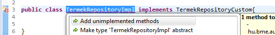

# JPA & Spring Data

## Célkitűzés

A gyakorlat célja, hogy a hallgatók megismerjék a JPA és a Spring Data használatát. A főbb témák: entitások fejlesztése, lekérdezések megfogalmazása különböző módokon, módosítások végrehajtása. A kódokat egy webalkalmazás projektbe integráljuk, amiben a projekt alapvető konfigurációja és egy teszteléshez használható egyszerű webes felületet már készen áll.

## Előfeltételek

A labor elvégzéséhez szükséges eszközök:

- Eclipse for Java EE
- Microsoft SQL Server Express edition (localdb nem alkalmas)
- SQL Server Management Studio
- Adatbázis létrehozó script: [mssql.sql](https://raw.githubusercontent.com/bmeviauac01/gyakorlatok/master/mssql.sql)
- Kiinduló webalkalmazás kódja: <https://github.com/bmeviauac01/gyakorlat-jpa-kiindulas>
- Az MSSQL JDBC driver letöltése innen: <https://www.aut.bme.hu/Upload/Course/adatvezerelt/gyakorlat_anyagok/mssql-jdbc.zip>
  - A zipet csomagold ki ide: `c:\work\javaee\.m2\repository` (a zip egy _com_ nevű könyvtárat tartalmaz, az elvárt végeredmény egy ilyen könyvtárstruktúra: `c:\work\javaee\.m2\repository\com\microsoft\...`)

## Amit érdemes átnézned

- JPA előadás
- EJB, Spring előadás

## Gyakorlat menete

A gyakorlat végig vezetett, a gyakorlatvezető utasításai szerint haladjunk. Egy-egy részfeladatot próbáljunk meg először önállóan megoldani, utána beszéljük meg a megoldást közösen. Az utolsó feladat opcionális, ha belefér az időbe.

Emlékeztetőként a megoldások is megtalálhatóak az útmutatóban is. Előbb azonban próbáljuk magunk megoldani a feladatot!

## Tippek az Eclipse használatához

- Típus (osztály, interfész, enum) keresése: Ctrl+Shift+T (Nem érdemes a Project explorer-ben a mappákat nyitogatni)
- Fájl keresése: Ctrl+Shift+R
- Hiányzó importok megjavítása: Ctrl+Shift+O
- Kód formázása: Ctrl+Shift+F
- Ha a Java Resources alatt egy package-en jobb klikk / New Class/Interfaces, akkor abba a package-be rakja az új elemet by
  default
- Ha a nézeteket becsukjuk/átrendezzük, a default elrendezés visszaállítható: Window / Reset perspective
- Font megnövelése (a tanári gépen hasznos):
  - Window menü / Preferences, ott elkezdjük gépelni, hogy _font_, így megtalálja azt a beállítást, hogy Fonts and Colors
  - Azt kiválasztva, a Basic kategória alatt kell a Text Fontot kijelölni, és a méretét pl. 18-asra állítani

## Feladat 0: Adatbázis létrehozása

1. Csatlakozzunk _Microsoft SQL Server Management Studio_-val a a szerverhez. Ezúttal nem _localdb_-t használunk, a szerver címe: `localhost\sqlexpress`. A bejelentkezéshez _SQL Server Authentication_ módot válasszuk.

1. Hozzunk létre egy `adatvez` nevű adatbázist (ügyeljünk a névre, különben a Java projektben módosítanunk kell). Az adatbázis létrehozásának mikéntjét lásd az első gyakorlat anyagában. Ha a gépen már létezik az adatbázis, akkor nem kell újat létrehozni.

1. Futtassuk le az adatbázis inicializáló sql szkriptet az adatbázisban. Akkor is futtassuk le a szkriptet, ha már létezne az adatbázis (hogy a kezdeti állapotot visszakapjuk.)

## Feladat 1: Eclipse indítása

1. Indítsuk el az Eclipse-et innen: `C:\Work\javaee\eclipse\eclipse.exe`. (Fontos, hogy lehet egy `D:\eclipse` mappa is, nekünk _nem_ az kell.)
1. Indításkor megkérdezi, hova akarunk dolgozni (workspace), itt válasszuk ezt: `C:\Work\javaee\workspaces\adatvez`
1. Ha az indulás után a Project Explorer-ben ott van egy korábbi gyakorlatról a **webshop** nevű projekt, azt töröljük ki: a projekten jobb klikk / _Delete_, amikor rákérdez, pipáljuk be, hogy a fájlrendszerről is törlődjön.

## Feladat 2: Projekt importálása

1. Töltsük le a méréshez tartozó projekt vázat!
   - Nyissunk egy _command prompt_-ot
   - Navigáljunk el egy tetszőleges mappába, például `c/d:\work\NEPTUN`
   - Adjuk ki a következő parancsot: `git clone --depth 1 https://github.com/bmeviauac01/gyakorlat-jpa-kiindulas.git`
1. Importáljuk a letöltött forráskódot a workspace-be:
   - Nyissuk meg a _File / Import..._-ot
   - Kezdjük el gépelni a textboxba, hogy _Existing projects into workspace_, így rá fog szűrni és válasszuk ki ezt
   - Keressük meg a kicsomagolt webshop projektet (a `webshop` mappát a saját könyvtárunk alatt), OK, utána a dialogban pipáljuk be a webshop-ot (lehet, hogy by default be lesz pipálva)
   - Finish
1. Tekintsük át röviden a projektet:

   - Ez egy _maven_ alapú projekt. A maven parancssori build eszköz, ami IDE-khez is illeszthető. Fontos tulajdonsága, hogy képes a szükséges library függőségeket online repository-kból letölteni. Ha megnyitjuk a projekt gyökerében `pom.xml`-t, a maven konfig fájlját, dependency tagekben függőségeket látunk, amik (tranzitív módon) behúzzák a _Hibernate_-et mint JPA implementációt, a _Spring Boot_-ot, a _Spring Data_-t és a webréteghez szükséges _Spring MVC_-t és _Thymeleaf_-et. A laborban a maven offline működésre van konfigurálva, és előre le van töltve az összes függőség, így megelőzzük az esetleges hálózati problémákat.

   - Az _application.properties_-ben van pár alapvető beállítás, itt a DB eléréshez **ellenőrizzük a usernevet és jelszót**. Figyeljük meg az adatbázis JNDI nevének beállításához ezt a sort: `spring.datasource.jndi-name=jdbc/termekDB`. Klasszikus Java EE alkalmazásban ezt a `persistence.xml`-be írnánk be, de a Spring Boot XML nélküli konfigurációt is támogat, itt ezt használjuk ki. (Egy apróság: a projektben mégis van `persistence.xml`, ezt igényli az Eclipse-es JPA plugin, aminek köszönhetően pl. kódkiegészítés működik a NamedQuery-kben. Viszont, mivel igazából nem használja az alkalmazásunk futás közben, üres a persistence.xml.)

   - A `ConnectionProperties` az előző konfig fájl egy részének Java-beli reprezentációja

   - A `WebshopApplication` a Spring Boot alkalmazás belépési pontja és konfigja is. Egy hagyományos webalkalmazást egy külön processzben futó webkonténerre (pl. Tomcat, Jetty) kellene telepíteni. Spring Boot-os fejlesztés esetében viszont maga a Spring Boot fog elindítani egy beágyazott webkonténert (alapértelmezésben Tomcat-et). A `tomcatFactory` metódusban regisztráljuk be az SQL Server JDBC driverét jdbc/termekDB JNDI néven, hogy a JPA majd megtalálja. Ha nem adatvez az adatbázisunk neve, akkor a JDBC URL-t módosítani kell a megfelelő sornál: resource.setProperty("url", "jdbc:sqlserver://localhost;database=**adatvez**");

   - A webes felület egyetlen oldal, az `src\main\resources\templates\testPage.html`. Ebbe nem fogunk majd belenyúlni. Standard html + Thymeleaf-es attribútumok látahtóak benne.

   - WebshopController: a webréteget megvalósító controller osztály, ennek metódusai kezelik az alkalmazáshoz érkező HTTP kéréseket. Jellemzően lekérdezések eredményét akarjuk megjeleníteni az oldalon, ezért a lekérdezés eredményét a modellbe tesszük valamilyen néven, amire hivatkozni tudunk a Thymeleaf segítségével. A `//TODO` részekre kell majd bekötni az egyes feladatokat megvalósító metódusok meghívását.

## Feladat 3: Entitások áttekintése

- Az entitások már előre készen a `hu.bme.aut.adatvez.webshop.model` package-ben találhatók. Ezeket általában vagy kézzel írjuk meg, vagy generáljuk a DB táblákból pl. az Eclipse-es JPA plugin segítségével.

- Az entitások közül nyissunk meg egyet, pl. `Afa`, látszik benne a `@Entity`, a `@Id` annotáció, illetve a kapcsolatok definiálására `@OneToMany` vagy `@ManyToOne`

- Az entitásokhoz a Criteria API használatakor hasznos metamodel osztályok is generálódnak, ezekből nézzünk meg egyet a `target\generated-sources\apt` alatt (A `pom.xml`-ben látható maven-precessor-plugin generálja egyébként őket a build során.)

## Feladat 4: Lekérdezések

A leképzett adatmodellen fogalmazd meg az alábbi lekérdezéseket! A lekérdezéseket JPA és Spring Data használata esetén több módon is megvalósíthatjuk. Az alábbi feladatokban azt is megadjuk, milyen módon kell elkészíteni a lekérdezést, hogy mindegyikre lássunk példát. Fontos megjegyezni, hogy ezek a módszerre vonatkozó megkötések csak oktatási szempontok miatt szerepelnek, valójában bármelyik módszerrel bármelyik lekérdezés megvalósítható lenne.

Az egyes feladatokat megvalósító metódusokat mindig a `WebshopController` osztály megfelelő `//TODO` kommentjeinél kell meghívni, majd a webalkalmazást futtatni és böngészőből tesztelni a
<http://localhost:9080> URL-en.

**a)** Listázd azon termékek nevét és raktárkészletét, melyből több mint 30 darab van raktáron! Módszer: Spring Data repository interfész, metódusnévből származtatott lekérdezés.

**b)** Írj olyan lekérdezést, mely kilistázza azon termékeket, melyből legalább kétszer rendeltek! Módszer: Spring Data repository custom implementációval, injektált EntityManagerrel készített JPQL query.

**c)** Listázd ki a legdrágább termék adatait! Módszer: Named query, amelyet Spring Data repository-ból hívunk meg, vagy custom implementációból, injektált EntityManagerrel hívunk meg, vagy a metódusnév és query név egyezése alapján.

Futás közben a Console nézetben látszódnak a Hibernate által generált SQL utasítások az _application.properties_-beli `spring.jpa.show-sql=true` konfig miatt.

### Futtatás

A projektben megtalálható (a legalsó fájl a Project Explorerben) a **webshop run.launch** nevű konfig fájl. Ezen jobb klikk / _Debug As / webshop run_. Ez debug módban indítja a Spring Boot maven plugin-t, aminek hatására a beágyazott webkonténer elindul, és böngészőből a <http://localhost:9080> URL-en elérhető az alkalmazás. Ha ezt egyszer jobb klikkel megcsináltuk, akkor később a toolbar Debug ikonját lenyitva is megtehetjük:


Ha a _Debug_ ikon alatt már ott van a _webshop run_, akkor az egész fentebb leírt webshop _run.launch_-os módszer szükségtelen.

A futó alkalmazást a _Console_ nézet piros _Terminate_ ikonjával lehet leállítani. Ha leállítás nélkül próbáljuk újra futtatni, akkor a második processz ütközést jelent a 8080-as porton, és leáll. Ilyenkor a sikertelen második futtatás látszik a _Console_ nézetben, a _Terminate_ gomb pedig inaktív, mivel ez a futás már leállt. Nyomjuk meg a Terminate ikon melletti dupla szürke X ikont, ez el fogja távolítani a már leállított futtatásokat, és csak az aktív futtatás látszik, amin viszont már tudunk _Terminate_-et nyomni.

Ha a teljes _Console_ nézetet bezárjuk véletlenül, elő lehet szedni _Alt+Shift+Q, C_ gyorsbillenytűvel, vagy _Window / Show View / Console_ menüvel.

A leállítás utáni újrafuttatáshoz az F11-et is használhatjuk.

A debug módban való futtatás jellegzetessége, hogy a HTML és bizonyos Java kód módosítások azonnal életbe lépnek. (A böngészőt persze frissíteni kell.) Újra kell viszont indítani az alkalmazást, ha a Java kódban:

- új típust adtunk hozzá
- annotációt adtunk hozzá/töröltünk/módosítottunk
- új osztály- vagy tagváltozót, metódust vettünk fel
- metódus szignatúrát módosítottunk

Röviden: a metódus törzsön belüli változásokon kívül mindig újraindítás lesz szükséges.

<details><summary markdown="span">Megoldás</summary>

### 4.a feladat

Nyissuk meg a `dao` package-ben lévő `TermekRepository` interfészt, amely a Spring Data-s `JpaRepository`-ból származik (és az egyelőre üres `TermekRepositoryCustom`-ból). Találunk benne későbbi feladathoz kapcsolódó metódusokat, azokat csak figyeljük meg. Valamelyik `@Query` annotációval definiálja a futtatandó lekérdezést, valamelyiknél az is hiányzik. Nekünk sem lesz szükség `@Query` annotációra, mert a metódus neve alapján a Spring Data képes kitalálni a query-t. Tegyük tehát bele ezt az új metódust:

```java
package hu.bme.aut.adatvez.webshop.dao;

import java.math.BigDecimal;
import java.util.List;
import hu.bme.aut.adatvez.webshop.model.Termek;
import org.springframework.data.jpa.repository.JpaRepository;

public interface TermekRepository extends JpaRepository<Termek, Long>, TermekRepositoryCustom {
  ...
  List<Termek> findByRaktarkeszletGreaterThan(BigDecimal limit);
}
```

A `WebshopController`-ben már be van injektálva egy `TermekRepository` típusú tagváltozó, hívjuk meg rajta a metódust az 4.a TODO-nál:

```java
@Controller
public class WebshopController {

  @Autowired
  TermekRepository termekRepository;

  //...
  // 4.a feladat
  private List<Termek> findTermekek30Folott() {
    return termekRepository.findByRaktarkeszletGreaterThan(BigDecimal.valueOf(30));
  }
}
```

### 4.b feladat

A `dao` package-ben lévő `TermekRepositoryCustom` interfészbe vegyük fel egy `findLegalabbKetszerRendeltTermekek` nevű metódust:

```java
package hu.bme.aut.adatvez.webshop.dao;

import hu.bme.aut.adatvez.webshop.model.Termek;
import java.util.List;

public interface TermekRepositoryCustom {
  List<Termek> findLegalabbKetszerRendeltTermekek();
}
```

A dao package-ben lévő `TermekRepositoryImpl` osztály hibás lesz emiatt, mert nem implementálja a `TermekRepositoryCustom`-ot. Nyissuk meg az osztályt, és az osztály elején, a sor elején megjelenő kis villanykörtére kattintva belegeneráltathatjuk a nem implementált metódus vázát:



Utána a törzsbe írhatjuk az implementációt, melynek lényege: injektált EntityManager-rel hozzuk létre és futtatjuk le a query-t. (Most látszik igazán, hogy az előző, Spring Data-s megoldás mennyi boilerplate kódot spórolt meg nekünk.)

```java
package hu.bme.aut.adatvez.webshop.dao;

import hu.bme.aut.adatvez.webshop.model.Termek;

import java.util.List;

import javax.persistence.EntityManager;
import javax.persistence.PersistenceContext;

public class TermekRepositoryImpl implements TermekRepositoryCustom {

  @PersistenceContext
  EntityManager em;

  @Override
  public List<Termek> findLegalabbKetszerRendeltTermekek(){
    return em.createQuery("SELECT DISTINCT t FROM Termek t
                           LEFT JOIN FETCH t.megrendelestetels
                           WHERE size(t.megrendelestetels) >= :tetelMin", Termek.class)
          .setParameter("tetelMin", 2)
          .getResultList();
  }
}
```

Megjegyzés a megoldáshoz: az első ötletünk ez lehetne: `SELECT t FROM Termek t WHERE size(t.megrendelestetels) /= :tetelMin`. Írjuk be és próbáljuk ki előbb ezt, ilyenkor viszont `org.hibernate.LazyInitializationException` dobódik teszteléskor, mert lecsatolt állapotban akarunk kapcsolódó entitást elérni (amikor a táblázatot generálja a webréteg, és a megrendelestetels listára hivatkozunk). Lehetséges megoldások:

- Az _application.properties_-ben `spring.jpa.open-in-view=true` (ez lenne amúgy a default Spring Boot esetében, de a példa projektben direkt false-ra van állítva): Ilyenkor az EntityManager már a webes kérés legelején létrejön, és csak a view renderelése után záródik be, vagyis a Spring bean-beli metódusok visszatérése után is menedzselt állapotban lenne a termek entitás, és el lehetne kérni a kapcsolódó megrendelestetels listát.
- vagy `@OneToMany(fetch=EAGER)` a megrendelestetels változóra
- vagy _EntityGraph_ definiálása és annak alkalmazása a query létrehozásakor
- vagy `LEFT JOIN FETCH`, mi ezt választottuk a fenti megoldásban. E mellé a `DISTINCT` is kell, különben minden kapcsolódó Megrendelestetel példányra külön Termek sor is lesz.

A meghívás a `WebshopController`-ben triviális:

```java
// 4.b feladat
private List<Termek> findLegalabbKetszerRendeltTermekek() {
  // TODO
  return termekRepository.findLegalabbKetszerRendeltTermekek();
}
```

### 4.c feladat

A `Termek` osztályt nyissuk meg, ott a gyorsabb haladás érdekében már fogunk találni kész named query-ket, a másodikat kell használnunk:

```java
@NamedQueries({
@NamedQuery(name="Termek.findAll", query="SELECT t FROM Termek t"),
@NamedQuery(name="Termek.findLegdragabb", query="SELECT t FROM Termek t
            WHERE t.nettoar IN (SELECT MAX(t2.nettoar) FROM Termek t2)")
})
```

A named query-t két módon is meghívhatjuk. Ha lassú a haladás, elég az első módszerrel megcsinálni. Az első módszer, hogy a named query-vel egyező nevű metódust teszünk a `TermekRepository`-ba (leszámítva a _Termek._ előtagot.) Vagyis:

```java
public List<Termek> findLegdragabb();
```

A másik lehetőség, hogy a `TermekRepositoryImpl`-ben, `EntityManager`-en keresztül hívjuk meg a named query-t:

```java
@Override
public List<Termek> findLegdragabbTermek(){
  return em.createNamedQuery("Termek.findLegdragabb", Termek.class).getResultList();
}
```

Ilyenkor ezt a metódust ki kell még tenni a `TermekRepositoryCustom` interfészbe. Leggyorsabb így: Jobb klikk / _Refactor / Pull up_, és ott a metódus kiválasztható

Végül valamelyik verziót hívjuk meg a `WebshopController` megfelelő pontján:

```java
// 4.c feladat
private List<Termek> findLegdragabbTermekek() {
  // TODO
  // return termekRepository.findLegdragabbTermek();
  return termekRepository.findLegdragabb();
}
```

</details>

## Feladat 5: Adatmódosítás

A JPA nemcsak lekérdezéshez használható, hanem rajta keresztül módosítások is végrehajthatóak.

**a)** Írj olyan JPQL lekérdezést a `TermekRepository` interfészbe, mely az "Építo elemek" árát megemeli 10 százalékkal!

**b)** Írj egy olyan metódust, amely létrehoz egy új kategóriát "Drága játékok" névvel, ha még nem létezik ilyen, és sorold át ide az összes olyan terméket, melynek ára, nagyobb, mint 8000 Ft!

**c)** Egyszerű önálló feladat: az 5.b feladat közös megoldásában egy `EntityManager`-en keresztül lefuttatott lekérdezéssel ellenőrizzük, hogy létezik-e "Drága játékok" nevű kategória. Valósítsd meg ugyanezt a lekérdezést Spring Data repository interfészben, metódus névből származtatott lekérdezéssel, és hívd meg a megfelelő ponton.

<details><summary markdown="span">Megoldás</summary>

### 5.a feladat

A `TermekRepository` interfészben egy _UPDATE query_-t definiálunk. Azt, hogy ez módosító query, közölni kell a Spring Data-val (`@Modifying`), valamint tranzakcióba is kell tennünk `@Transactional`, az `org.springframework...` package-ből):

```java
@Modifying
@Transactional
@Query("UPDATE Termek t SET t.nettoar=t.nettoar*1.1 WHERE t.id IN
(SELECT t2.id FROM Termek t2 WHERE t2.kategoria.nev=:kategoriaNev)")
void kategoriaDragit(@Param("kategoriaNev") String kategoriaNev);
```

Meghívása a `WebshopController`-ből:

```java
// 5.a feladat
@RequestMapping(value = "/epitoElemekDragit", method = {
        RequestMethod.POST, RequestMethod.GET })
private String epitoElemekDragit() {
  // TODO
  termekRepository.kategoriaDragit("Építo elemek");
  return "redirect:/";
}
```

Böngészőben a gomb megnyomása után a gomb alatti táblázatban látszódik az átárazás hatása.

#### 5.b feladat

A `dao` package-be új osztály, `KategoriaService` néven, `@Service` annotációval, szintén `@Transactional` metódussal:

```java
@Service
public class KategoriaService {

  @PersistenceContext
  private EntityManager em;

  @Autowired
  TermekRepository termekRepository;

  @Transactional
  public void createDragaJatekokEsAtsorol(double arLimit){
    String nev = "Drága játékok";
    Kategoria dragaKategoria = null;
    List<Kategoria> resultList =
      em.createQuery("SELECT k from Kategoria k WHERE k.nev=:nev", Kategoria.class)
        .setParameter("nev", nev)
        .getResultList();

    if(resultList.isEmpty()){
	  //0 vagy null id érték esetén fog a @GeneratedValue működésbe lépni. Most primitív long az id-nk, az csak 0 tud lenni, null nem.
	  dragaKategoria = new Kategoria(0, nev);
      em.persist(dragaKategoria);
    }else{
      dragaKategoria = resultList.get(0);
    }

    List<Termek> dragaTermekek = termekRepository.findByNettoarGreaterThan(arLimit);

    for (Termek termek : dragaTermekek) {
      dragaKategoria.addTermek(termek);
    }
  }
}
```

Figyeljük meg, hogy a menedzselt entitás példányokat (amit tranzakción belül találunk meg query-vel, vagy most persist-áltunk frissen) nem kell explicit módon visszamenteni, tranzakció végén automatikusan DB-be íródnak a memóriabeli változások.

Meghívás a `WebshopController`-ből:

```java
@Autowired
KategoriaService kategoriaService;
...

// 5.b feladat
@RequestMapping(value = "/dragaTermekbeAtsorol", method = {
        RequestMethod.POST, RequestMethod.GET })
private String dragaTermekbeAtsorol() {
  // TODO
  kategoriaService.createDragaJatekokEsAtsorol(8000.0);
  return "redirect:/";
}
```

Böngészőben a gomb megnyomása után látszódik a _Drága játékok_ kategória tartalma

#### 5.c feladat

A `dao` package-be új interfész, `KategoriaRepository` néven, a `TermekRepository` mintájára (a Custom-os leszármazás nem kell, mert nem lesznek custom lekérdezéseink) egy metódussal:

```java
public interface KategoriaRepository extends JpaRepository<Kategoria, Long>{
  List<Kategoria> findByNev(String nev);
}
```

Ezután a `KategoriaService` így egyszerűsödik le:

```java
@Service
public class KategoriaService {
...

  @Autowired
  KategoriaRepository kategoriaRepository;

  @Transactional
  public void createDragaJatekokEsAtsorol(double arLimit){
...
    List<Kategoria> resultList = kategoriaRepository.findByNev(nev);
...
  }
}
```

</details>

## Feladat 6: Tárolt eljárások használata

Hívd meg a JPA-ból a _FizetesModLetrehozasa_ nevű tárolt eljárást, mely új fizetési mód rögzítésére szolgál, és visszaadja az új rekord azonosítóját!

- Az SQL Server Management Studioban ellenőrizzük, hogy az adatbázis tartalmazza-e a _FizetesModLetrehozasa_ nevű tárolt eljárást!

- Ha nem, akkor nyisd meg a projekt gyökerében található CreateSP.sql nevű fájlt, és a tartalmát futtasd le a Management Studioban!

<details><summary markdown="span">Megoldás</summary>

A `FizetesMod` entitáson megtaláljuk az alábbi annotációt. Vessük össze a tárolt eljárást definiáló kóddal (_CreateSP.sql_) a változó neveket!

```java
@NamedStoredProcedureQueries({
	@NamedStoredProcedureQuery(name = "fizModSP",
			procedureName = "FizetesModLetrehozasa",
			parameters = {
	        	@StoredProcedureParameter(mode = ParameterMode.IN, name = "Mod", type = String.class),
	        	@StoredProcedureParameter(mode = ParameterMode.IN, name = "Hatarido", type = BigDecimal.class)
	        })
})
public class Fizetesmod implements Serializable {
...
```

A named stored procedure query meghívható Spring Data repositoryból (`dao` package-en _New Interface ... / FizetesmodRepository_):

```java
public interface FizetesmodRepository extends JpaRepository<Fizetesmod, Long> {

  @Procedure(name="fizModSP")
  void ujFizetesmod(@Param("Mod") String nev, @Param("Hatarido") BigDecimal hatarido);
}
```

Spring Data nélkül így menne, `EntityManager`-en keresztül, erre valószínűleg már nem lesz idő:

```java
@Service
public class FizetesmodService {

  @PersistenceContext
  private EntityManager em;

  public void createUjFizetesMod(Fizetesmod fizetesMod){
    StoredProcedureQuery sp = em.createNamedStoredProcedureQuery("fizModSP");
    sp.setParameter("Mod", fizetesMod.getMod());
    sp.setParameter("Hatarido", fizetesMod.getHatarido());
    sp.execute();
  }
}
```

A webrétegbeli meghívás:

- Injektáljuk a `WebshopController`-be a `FizetesmodRepository` interfészt:

```java
@Autowired
FizetesmodRepository fizetesmodRepository;
```

- A WebshopController utolsó TODO-jánál hívjuk meg

```java
fizetesmodRepository.ujFizetesmod(fizetesmod.getMod(), fizetesmod.getHatarido());
```

- A `Fizetesmod` entitás `hatarido` és `mod` tagváltozóin validációs _constraint_-eket találunk. Ezek az annotációk a _Bean Validation API_ részei, amivel a webes rétegben használt Spring MVC, de a JPA és integrálódik, így a webrétegbeli és adatrétegbeli validáció konzisztens módon, redundanciamentesen definiálható.

```java
@NotNull
private BigDecimal hatarido;

@Column(name="MOD")
@NotEmpty
private String mod;
```

</details>
