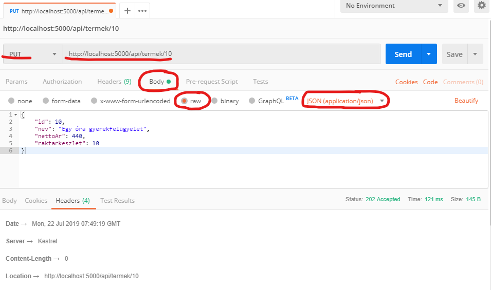

# REST API, ASP.NET Web API

## Célkitűzés

A gyakorlat célja, hogy a hallgatók gyakorolják a REST API-k tervezését, és megismerjék a .NET Web API technológiáját.

## Előfeltételek

A labor elvégzéséhez szükséges eszközök:

- Microsoft Visual Studio 2017/2019 (_nem_ VS Code)
- Microsoft SQL Server (LocalDB vagy Express edition)
- SQL Server Management Studio
- Postman: <https://www.getpostman.com/downloads/>
- Adatbázis létrehozó script: [mssql.sql](https://raw.githubusercontent.com/bmeviauac01/gyakorlatok/master/mssql.sql)
- Kiinduló alkalmazás kódja: <https://github.com/bmeviauac01/gyakorlat-rest-kiindulas>

Amit érdemes átnézned:

- C# nyelv
- Entity Framework és Linq
- REST API és Web API előadás

## Gyakorlat menete

A gyakorlat végig vezetett, a gyakorlatvezető utasításai szerint haladjunk. Egy-egy részfeladatot próbáljunk meg először önállóan megoldani, utána beszéljük meg a megoldást közösen. Az utolsó feladat opcionális, ha belefér az időbe.

Emlékeztetőként a megoldások is megtalálhatóak az útmutatóban is. Előbb azonban próbáljuk magunk megoldani a feladatot!

## Feladat 0: Adatbázis létrehozása, ellenőrzése

Az adatbázis az adott géphez kötött, ezért nem biztos, hogy a korábban létrehozott adatbázis most is létezik. Ezért először ellenőrizzük, és ha nem találjuk, akkor hozzuk létre újra az adatbázist. (Ennek mikéntjét lásd az első gyakorlat anyagában.)

## Feladat 1: Projekt megnyitása

1. Töltsük le a méréshez tartozó projekt vázat!

   - Nyissunk egy _command prompt_-ot
   - Navigáljunk el egy tetszőleges mappába, például `c/d:\work\NEPTUN`
   - Adjuk ki a következő parancsot: `git clone --depth 1 https://github.com/bmeviauac01/gyakorlat-rest-kiindulas.git`

1. Nyissuk meg a `restgyak` könyvtár alatti _sln_ fájlt Visual Studio-val.

1. Vizsgáljuk meg a projektet.

   - Ez egy ASP.NET Core Web API projekt. Kifejezetten REST API-k kiszolgálásához készült. Ha F5-tel elindítjuk, akkor magában tartalmaz egy webszervert a kérések kiszolgálásához.
     - Nézzük meg a `Program.cs` tartalmát. Nem kell értenünk, hogy mi történik itt pontosan, csak lássuk, hogy ez olyan, mint egy konzol alkalmazás: a `Main` függvényben elindít egy webszervert.
   - Az adatbázisunk Entity Framework leképzése (_Code First_ modellel) megtalálható a `Dal` mappában. Az `AdatvezDbContext` lesz az elérés központi osztálya. A _connection stringet_ javítsuk ki szükség esetén ebben az osztályban az `OnConfiguring` függvényben.
   - A `Controllers` mappában már van egy teszt controller. Nyissuk meg és vizsgáljuk meg.
     - Vegyük észre az `[ApiController]` és `[Route]` attribútumokat, valamint a leszármazást. Ettől lesz egy osztály _Web API controller_. Minden további automatikusan működik, a controller metódusai a megadott kérésekre (az útvonal és http metódus függvényében) meg fognak hívódni (tehát nincs további konfigurációra szükség).

1. Indítsuk el az alkalmazást. Fordítás után egy konzol alkalmazás indul el, ahol látjuk a logokat. Nyissunk egy böngészőt, és a <http://localhost:5000/api/values> címet írjuk be. Kapnunk kell egy JSON választ. Állítsuk le az alkalmazást: vagy _Ctrl-C_ a konzol alkalmazásban, vagy Visual Studio-ban állítsuk le.

## Feladat 2: Első Controller és metódus, tesztelés Postmannel

Készítsünk egy új Web API controllert, ami viszaad egy üdvözlő szöveget. Próbáljuk ki a működést Postman használatával.

1. Töröljük ki a `ValuesController` osztályt. Adjuk hozzá helyette egy új _Api Controller_-t üresen `HelloController` néven: a _Solution Explorer_-ben a _Controllers_ mappára jobb egérrel kattintva _Add / Controller... / API Controller - Empty_. A `HelloController` a `/api/hello` url alatt legyen elérhető.
1. Készítsünk egy `GET` kérésre válaszoló metódust, ami egy szöveggel tér vissza. Próbáljuk ki Postman-nel: a GET kérést <http://localhost:5000/api/hello> címre kell küldenünk.
1. Módosítsuk a REST kérést kiszolgáló metódust úgy, hogy opcionálisan fogadjon el egy nevet _query paraméterben_, azaz az urlben, és ha kap ilyet, akkor a válasza legyen "Hello" + a kapott név. Próbáljuk ki ezt is Postmannel: Ha adunk nevet, akkor azt a <http://localhost:5000/api/hello?nev=alma> url-je küldjük.
1. Végül készítsünk egy _új_ REST Api végpontot (új függvényt), ami a <http://localhost:5000/api/hello/alma> url-en fog válaszolni pont úgy, ahogy az előző is tette (csak most a név a _path_ része).

<details><summary markdown="span">Megoldás</summary>

```csharp
[Route("api/hello")]
[ApiController]
public class HelloController : ControllerBase
{
    // 2. alfeladat
    //[HttpGet]
    //public ActionResult<string> Hello()
    //{
    //    return "Hello név nélküli!";
    //}

    // 3. alfeladat
    [HttpGet]
    public ActionResult<string> Hello([FromQuery] string nev)
    {
        if(string.IsNullOrEmpty(nev))
            return "Hello név nélküli!";
        else
            return "Hello " + nev;
    }

    // 4. alfeladat
    [HttpGet]
    [Route("{nev}")] // a route-ban a {} közötti név meg kell egyezzen a paraméter nevével
    public ActionResult<string> Szia(string nev)
    {
        return "Szia " + nev;
    }
}
```

Foglaljuk össze, mi kell ahhoz, hogy egy WebAPI végpontot készítsünk:

- Leszármazni a `ControllerBase`-ből és az `[ApiController]` attribútumot rátenni az osztályra.
- Megadni a route-ot, akár az osztályon, akár a metóduson (vagy mindkettőn) a `[Route]` attribútummal.
- Megfelelő formájú metódust készíteni (pl. visszatérési érték, paraméterek).
- Megadni, milyen http kérésre válaszol a végpont a megfelelő `[Http*]` attribútummal.

</details>

## Feladat 3: Termékek keresése API

A valódi API-t természetesen nem szövegeket adnak vissza. Készítsünk API-t a webshopban árult termékek közötti kereséshez.

- Készítsünk ehhez egy új controller-t.
- Lehessen listázni a termékeket, de csak lapozva (max 5 elem minden lapon).
- Lehessen keresni termék névre.
- A visszaadott termék entitás _ne_ az adatbázis leképzésből jövő entitás legyen, hanem készítsünk egy új, un. _DTO_ (data transfer object) osztályt egy új, `Models` mappában.

Teszteljük a megoldásunkat.

<details><summary markdown="span">Megoldás</summary>

```csharp
// *********************************
// Models/Termek.cs

namespace restgyak.Models
{
    public class Termek
    {
        public Termek(int id, string nev, double? nettoAr, int? raktarkeszlet)
        {
            Id = id;
            Nev = nev;
            NettoAr = nettoAr;
            Raktarkeszlet = raktarkeszlet;
        }

        // Csak a lenyeges tulajdonsagokat tartalmazza, pl. az adatbazis kulso kulcsokat nem.
        // Ertekadas csak a konstruktoron keresztul lehetseges, ezzel jelezve, hogy a peldany
        // egy pillanatkep alapjan jon letre, es nem modosithato.

        public int Id { get; private set; }
        public string Nev { get; private set; }
        public double? NettoAr { get; private set; }
        public int? Raktarkeszlet { get; private set; }
    }
}


// *********************************
// Controllers/TermekController.cs

using System.Linq;
using Microsoft.AspNetCore.Mvc;

namespace restgyak.Controllers
{
    [Route("api/termek")] // adjunk meg explicit urlt inkabb
    [ApiController]
    public class TermekController : ControllerBase
    {
        private readonly Dal.AdatvezDbContext dbContext;

        // Az adatbazist igy kaphatjuk meg. A kornyezet adja a Dependency Injection szolgaltatast.
        // A DbContext automatikusan megszunik, amikor a controller megszunik: a lekerdezes vegen.
        public TermekController(Dal.AdatvezDbContext dbContext)
        {
            this.dbContext = dbContext;
        }

        [HttpGet]
        public ActionResult<Models.Termek[]> List([FromQuery] string search = null, [FromQuery] int from = 0)
        {
            IQueryable<Dal.Termek> szurtLista;

            if (string.IsNullOrEmpty(search)) // ha nincs nev alapu kereses, az osszes termek
                szurtLista = dbContext.Termek;
            else // nev alapjan kereses
                szurtLista = dbContext.Termek.Where(dbTermek => dbTermek.Nev.Contains(search));

            return szurtLista
                    .Skip(from) // lapozashoz: hanyadik termektol kezdve
                    .Take(5) // egy lapon max 5 termek
                    .Select(dbTermek => new Models.Termek(dbTermek.Id, dbTermek.Nev, dbTermek.NettoAr, dbTermek.Raktarkeszlet)) // adatbazis entitas -> DTO
                    .ToArray(); // a fenti IQueryable kiertekelesesen kieroltetese, kulonben hibara futnank
        }
    }
}
```

Vegyük észre, hogy a JSON sorosítással nem kellett foglalkoznunk. Az API csak entitást ad vissza. A sorosításról automatikusan gondoskodik a keretrendszer.

Lapozást azért érdemes beiktatni, hogy korlátozzuk a visszaadott választ (ahogy a felhasználói felületeken is szokás lapozni). Erre tipikus megoldás ez a "-tól" jellegű megoldás.

A metódus eredménye a `ToArray`-t megelőzően egy `IQueryable`. Emlékezzünk arra, hogy az `IQueryable` nem tartalmazza az eredményt, az csak egy leíró. Ha nem lenne a végén `ToArray`, akkor hibára futna az alkalmazás, mert amikor a JSON sorosítás elkezdené iterálni a gyűjteményt, már egy megszűnt adatbázis kapcsolaton próbálna dolgozni. A WebAPI végpontokból soha ne adjunk emiatt `IQueryable` vagy `IEnumerable` visszatérési értéket!

</details>

## Feladat 4: Termékek adatainak szerkesztés API

Egészítsük ki a termékek kereséséhez született API-t az alábbi funkciókkal:

- Lehessen egy adott termék adatait lekérdezni a termék id-ja alapján a `/api/termek/id` url-en.
- Tudjunk módosítani meglevő terméket (nevet, árat, raktárkészletet).
- Lehessen felvenni új terméket (ehhez készítsünk egy új DTO osztályt, amiben csak a név, raktárkészlet és ár van).
- Lehessen törölni egy terméket az id-ja alapján.

Mindegyik végpontot teszteljük!

**Új termék beszúrásához** Postman-ben az alábbi beállításokra lesz szükség:

- POST kérés a helyes URL-re
- A _Body_ fül alatt a `raw` és jobb oldalon a `JSON` kiválasztása
- Az alábbi _body_ json:
  ```json
  {
    "nev": "BME-s kardigán",
    "nettoAr": 8900,
    "raktarkeszlet": 100
  }
  ```

A **módosítás** teszteléséhez pedig az alábbi beállításokra lesz szükség:

- PUT kérés a helyes URL-re
- A _Body_ fül alatt a `raw` és jobb oldalon a `JSON` kiválasztása
- Az alábbi _body_ json:
  ```json
  {
    "id": 10,
    "nev": "Egy óra gyerekfelügyelet",
    "nettoAr": 440,
    "raktarkeszlet": 10
  }
  ```



A tesztelés során nézzük meg a kapott válasz _Header_-jeit is! A szerkesztés és beszúrás esetén keressük meg benne a _Location_ kulcsot. Itt adja vissza a rendszer, hol kérdezhető le az eredmény.

<details><summary markdown="span">Megoldás</summary>

```csharp
// *********************************
// Models/UjTermek.cs

namespace restgyak.Models
{
    public class UjTermek
    {
        public UjTermek(string nev, double? nettoAr, int? raktarkeszlet)
        {
            Nev = nev;
            NettoAr = nettoAr;
            Raktarkeszlet = raktarkeszlet;
        }

        public string Nev { get; private set; }
        public double? NettoAr { get; private set; }
        public int? Raktarkeszlet { get; private set; }
    }
}


// *********************************
// Models/TermekController.cs
namespace restgyak.Controllers
{
    [Route("api/termek")] // adjunk meg explicit urlt inkabb
    [ApiController]
    public class TermekController : ControllerBase
    {
        // ...

        // GET api/termek/id
        [HttpGet]
        [Route("{id}")]
        public ActionResult<Models.Termek> Get(int id)
        {
            var dbTermek = dbContext.Termek.SingleOrDefault(t => t.Id == id);

            if (dbTermek == null)
                return NotFound(); // helyes http valasz, ha nem talalhato a keresett elem
            else
                return new Models.Termek(dbTermek.Id, dbTermek.Nev, dbTermek.NettoAr, dbTermek.Raktarkeszlet); // siker eseten visszaadjuk az adatot magat
        }

        // PUT api/termek/id
        [HttpPut]
        [Route("{id}")]
        public ActionResult Modify([FromRoute] int id, [FromBody] Models.Termek modositott)
        {
            if (id != modositott.Id)
                return BadRequest();

            var dbTermek = dbContext.Termek.SingleOrDefault(t => t.Id == id);

            if (dbTermek == null)
                return NotFound();

            // modositasok elvegzese
            dbTermek.Nev = modositott.Nev;
            dbTermek.NettoAr = modositott.NettoAr;
            dbTermek.Raktarkeszlet = modositott.Raktarkeszlet;

            // mentes az adatbazisban
            dbContext.SaveChanges();

            return NoContent(); // 204 NoContent valasz
        }

        // POST api/termek
        [HttpPost]
        public ActionResult Create([FromBody] Models.UjTermek uj)
        {
            var dbTermek = new Dal.Termek()
            {
                Nev = uj.Nev,
                NettoAr = uj.NettoAr,
                Raktarkeszlet = uj.Raktarkeszlet,
                KategoriaId = 1, // nem szep, ideiglenes megoldas
                Afaid = 1 // nem szep, ideiglenes megoldas
            };

            // mentes az adatbazisba
            dbContext.Termek.Add(dbTermek);
            dbContext.SaveChanges();

            return CreatedAtAction(nameof(Get), new { id = dbTermek.Id }, new Models.Termek(dbTermek.Id, dbTermek.Nev, dbTermek.NettoAr, dbTermek.Raktarkeszlet)); // igy mondjuk meg, hol kerdezheto le a beszurt elem
        }

        // DELETE api/termek/id
        [HttpDelete]
        [Route("{id}")]
        public ActionResult Delete(int id)
        {
            var dbTermek = dbContext.Termek.SingleOrDefault(t => t.Id == id);

            if (dbTermek == null)
                return NotFound();

            dbContext.Termek.Remove(dbTermek);
            dbContext.SaveChanges();
            
            return NoContent(); // a sikeres torlest 204 NoContent valasszal jelezzuk (lehetne meg 200 OK is, ha beletennenk an entitast)
        }
    }
}
```

</details>

## Feladat 5: Új termék létrehozása: kategória és áfakulcs

Az új termék létrehozása során meg kellene adnunk még a kategóriát és az áfakulcsot is. Módosítsuk a fenti termék beszúrást úgy, hogy a kategória nevét és az áfakulcs számértékét is meg lehessen adni. A kapott adatok alapján keresd ki a megfelelő `AFA` és `Kategoria` rekordokat az adatbázisból, vagy hozz létre újat, ha nem léteznek.

<details><summary markdown="span">Megoldás</summary>

```csharp
[HttpPost]
public ActionResult Create([FromBody] Models.UjTermek uj)
{
    var dbAfa = dbContext.Afa.FirstOrDefault(a => a.Kulcs == uj.AfaKulcs);
    if (dbAfa == null)
        dbAfa = new Dal.Afa() { Kulcs = uj.AfaKulcs };

    var dbKat = dbContext.Kategoria.FirstOrDefault(k => k.Nev == uj.KategoriaNev);
    if (dbKat == null)
        dbKat = new Dal.Kategoria() { Nev = uj.KategoriaNev };

    var dbTermek = new Dal.Termek()
    {
        Nev = uj.Nev,
        NettoAr = uj.NettoAr,
        Raktarkeszlet = uj.Raktarkeszlet,
        Kategoria = dbKat,
        Afa = dbAfa
    };

    // mentes az adatbazisba
    dbContext.Termek.Add(dbTermek);
    dbContext.SaveChanges();

    return CreatedAtAction(nameof(Get), new { id = dbTermek.Id }, new Models.Termek(dbTermek.Id, dbTermek.Nev, dbTermek.NettoAr, dbTermek.Raktarkeszlet)); // igy mondjuk meg, hol kerdezheto le a beszurl elem
}
```

</details>
