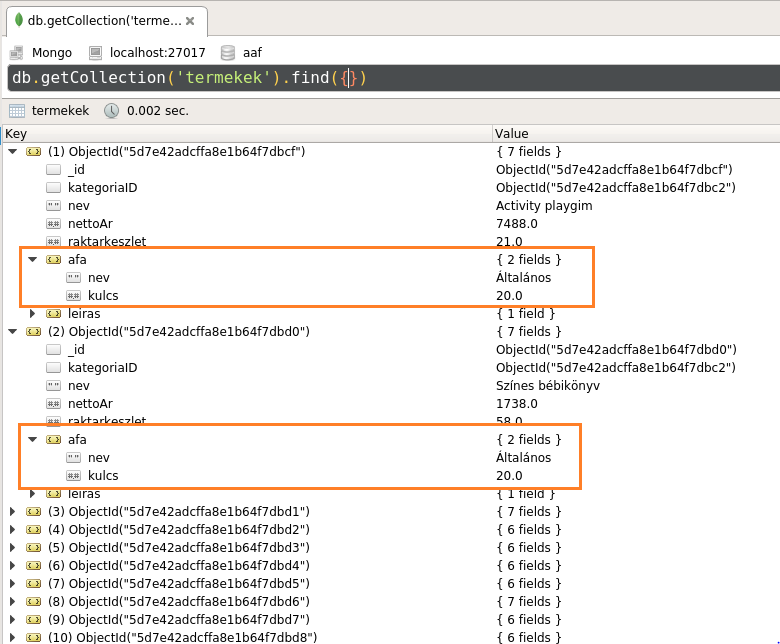

# Opcionális házi feladat: MongoDB

A házi feladat opcionális. A teljesítéssel **2 pluszpont és 2 iMsc pont** szerezhető.

GitHub Classroom segítségével a <https://classroom.github.com/a/eTw1sV_L> linken keresztül hozz létre egy repository-t. Klónozd le a repository-t. Ez tartalmazni fogja a megoldás elvárt szerkezetét. A feladatok elkészítése után kommitold és pushold a megoldásod.

> A letöltött anyagot Visual Studio segítségével megnyitva keresd meg a `Megoldas.cs` fájlt (a `Solution` mappában). A házi feladat elvégzése során kizárólag ezt a fájlt kell módosítanod — minden más módosítás elveszik az automatikus kiértékelés során.
>
> Ezt a fájlt azonban tetszőlegesen módosíthatod — vehetsz fel új metódusokat / adattagokat, stb. Egyetlen kitétel, hogy forduljon a kód: tehát maradjon meg a paraméter nélküli konstruktor és az osztály implementálja az `IMegoldas` interfészt.

## Szükséges eszközök

- MongoDB Community Server ([letöltés](https://www.mongodb.com/download-center/community))
- Robo 3T ([letöltés](https://robomongo.org/download))
- Gyakorlatokon is használt minta adatbázis kódja ([mongo.js](https://raw.githubusercontent.com/bmeviauac01/gyakorlatok/master/mongo.js)).
  - Előkészületként hozz létre egy új adatbázist, a [gyakorlatanyagban](https://bmeviauac01.github.io/gyakorlatok/Gyak4-MongoDB/#feladat-0-adatb%C3%A1zis-l%C3%A9trehoz%C3%A1sa-projekt-megnyit%C3%A1sa) leírt módon.
- Microsoft Visual Studio 2017/2019 [az itt található beállításokkal](VisualStudio-install.md)

## Feladat 0: Neptun kód

Első lépésként a gyökérben található `neptun.txt` fájlba írd bele a Neptun kódodat!

## Feladat 1: Legnagyobb összértékű termék a raktárban (1 pont)

Az első feladat meghatározni, hogy a raktárunkban egy adott kategóriába tartozó termékek közül melyik képviseli a legnagyobb összértéket — tehát melyik termék az, amelyiknek a nettó ára szorozva a raktárban lévő mennyiségével a legnagyobb. Ehhez a következő metódust kell implementálnunk.

```csharp
public (string, double?) LegnagyobbOsszertekuTermek(ObjectId kategoriaID)
{
    throw new NotImplementedException();
}
```

1. A pontos specifikáció megértéséhez vizsgáljuk meg először a feladathoz tartozó teszteket a `TestFeladat1.cs` fájlban.

   - A függvény bemeneti paramétere a kategória ID-ja, amelyhez tartozó termékekre éppen kíváncsiak vagyunk.
   - Amennyiben tartozik termék a megadott kategóriához, akkor a legnagyobb összértékű termék nevét és az összértéket kell visszaadnunk.
   - Amennyiben nem tartozik termék a kategóriához, mind a két értékre `null`-t kell visszaadnunk.

1. A termék kolleckiót reprezentáló `IMongoCollection<Termek>` objektumot a `MongoDatabase` osztály `TermekCollection` statikus propertyjében találhatjuk meg. Ennek segítségével tudunk lekérdezéseket és módosító parancsokat kiadni az adatbázis számára.

1. A lekérdezés elvégzéséhez a MongoDB aggregációs pipeline-ját érdemes használni. Ennek működésének felelevenítéséhez nézd meg a gyakorlatfeladatok megoldását.

   A lekérdezéshez a következő pipeline lépések szükségesek:

   - Szűrjük le a termékeket a megadott kategóriához tartozókra. Ehhez egy [$match](https://docs.mongodb.com/manual/reference/operator/aggregation/match/) (`Match`) lépésre lesz szükségünk, ahol megadhatjuk a megfelelő filter kifejezést.

   - Számoljuk ki minden megmaradt termék esetén az összértéket egy [$project](https://docs.mongodb.com/manual/reference/operator/aggregation/project/) (`Project`) lépés segítségével. Ne felejtsd el, hogy az `Osszertek` mellett a termék `Nev`-re is szükségünk lesz!

   - Rendezzük az így kapott dokumentumokat csökkenő sorrendbe az `Osszertek` alapján. Ehhez a [$sort](https://docs.mongodb.com/manual/reference/operator/aggregation/sort/) (`SortByDescending`) lépést tudjuk alkalmazni.

   - A legnagyobb értékre vagyunk kíváncsiak, azaz az eredmények közül csupán az első érdekel minket. Azonban akkor sem szeretnénk hibát kapni, ha egyáltalán nem tartozott termék ehhez a kategóriához. Ezért a `FirstOrDefault` kiértékelő utasítást érdemes használni.

   > Ha esetleg ismeretlen lenne a `(string, double?)` szintaktika:
   > ```csharp
   > return ("test", 0.0);
   > ```
   > utasítás segítségével egyszerre két visszatérési értéket tudunk adni a függvénynek.

1. Ha úgy gondolod sikerült implementálni a metódust, akkor a korábban már látott `TestFeladat1` osztályban található teszt metódusokkal ellenőrizni tudod a működést.

1. Készíts egy képernyőképet (screenshot), amin látszódik

   - a fejlesztéséhez használt eszköz (pl. Visual Studio),
   - a gép és a felhasználó neve, amin a fejlesztést végezted (pl. konzolban add ki a `whoami` parancsot és ezt a konzolt is rakd a képernyőképre),
   - az aktuális dátum (pl. az óra a tálcán)
   - valamint a `LegnagyobbOsszertekuTermek` metódus kódja.

   [Itt egy példa](img/img-screenshot-pl-vs.png), körülbelül ilyesmit várunk.

   > A képet `f1.png` néven mentsd el és add be a megoldásod részeként!

## Feladat 2: Áfa kulcs módosítása (1 pont)

Ebben a feladatban egy módosító utasítás (`Update`) segítségével kell megváltoztatni egy áfatípus kulcsát. Az implementálandó metódus a következő.

```csharp
public void AfaKulcsValtoztat(string nev, int ujKulcs)
{
    throw new NotImplementedException();
}
```

1. Először is vizsgáljuk meg, hogy hogy találhatók meg az ÁFA értékek az adatbázisunkban. Az SQL adatbázisban megszokott normalizált táblával ellentétben itt denormalizált módon, a `termekek` kollekcióban beágyazott dokumentumként szerepel.

   

   Ezt tükrözi a `Termek` entitás osztály is.

   ```csharp
   public class Termek
   {
       [BsonId]
       public ObjectId ID { get; set; }
       public ObjectId KategoriaID { get; set; }

       public string Nev { get; set; }
       public double? NettoAr { get; set; }
       public int? Raktarkeszlet { get; set; }
       public AFA AFA { get; set; }

       public int? Verzio { get; set; }
   }
   ```

   Ez az adatbázis olvasását igen hatékonnyá teszi: ha például az előző feladatban a bruttó összértékre lettünk volna kíváncsiak, akkor is egyetlen dokumentumban rendelkezésünkre áll minden szükséges érték — szemben az SQL adatbázissal, ahol ehhez `JOIN`-ra lenne szükség.

   Hátránya viszont, hogy módosítás esetén minden dokumentumban módosítanunk kell az áfakulcsot, ahol megjelenik.

1. Az előzőekből következik, hogy a gyakorlaton látott példához hasonlóan itt is `UpdateMany` utasításra lesz szükségünk — ugyanis mindenhol szeretnénk módosítani az áfakulcsot ahol a név megegyezik. A függvény használatának módját érdemes felidézni a gyakorlatanyag megoldásából.

   - Az `UpdateMany` függvény `filter` paraméterében szűrjünk rá azokra a termékekre melyekben az `AFA.Nev` megegyezik a függvény `nev` paraméterével.
   - A függvény `update` paraméterében a módosító  lépést mondjuk meg, itt az `AFA.Kulcs` értéket szeretnénk beállítani az `ujKulcs` paraméter értékére. Ehhez a [$set](https://docs.mongodb.com/manual/reference/operator/update/set/) (`Set`) operátor használható.

1. Az elkészült implementációt a `TestFeladat2` osztályban található teszt metódussal ellenőrizheted.

1. Készíts egy képernyőképet a fent leírtak szerint a `AfaKulcsValtoztat` metódus kódjával.

> A képet `f2.png` néven mentsd el és add be a megoldásod részeként!

## Feladat 3: Termék eladása (2 iMsc pont)

Ebben a feladatban egy termék eladását fogjuk implementálni. Ehhez a következő metódust fogjuk megvalósítani.

```csharp
public bool TermekElad(ObjectId termekID, int darab)
{
    throw new NotImplementedException();
}
```

A specifikáció a következő:

- Amennyiben a `termekID` ID-jú termékből legalább `darab` található a raktárban, akkor csökkentsük a raktárkészletet `darab`-bal. Ekkor a metódus `true` értékkel tér vissza.
- Amennyiben nincs elegendő termék raktáron, az adatbázisban ne változtassunk semmit. Ekkor a metódus `false` értékkel tér vissza.
- A metódus megírásánál építhetünk arra, hogy mindig érvényes (létező) ID értéket fogunk kapni — tehát rossz ID esetén a működés _nem definiált_.

  > Ez azt jelenti, hogy tetszőleges értékkel visszatérhetünk, bármilyen `Exceptiont` dobhatunk, leállíthatjuk az alkalmazást vagy akár a teljes adatbázist is törölhetjük — ez utóbbi persze nem túl praktikus.

1. Első körben a megoldási ötletünk a következő lehet.

   - Olvassuk fel a megadott `Termek` entitást az adatbázisból. Ez egy olyan `Find` utasítást jelent, ahol a termék ID-jára szűrünk. Mivel az ID érték egyedi, és a feladatkiírás garantálja nekünk, hogy a `termekID` mindig létező ID értéket kapunk, így nyugodtan használhatjuk a `First` kiértékelő utasítást.
   - Vizsgáljuk meg ezután a `Raktarkeszlet` értékét, és amennyiben kisebb, mint `darab`, térjünk vissza `false` értékkel.
   - Ha van elegendő termék raktáron, csökkentsük a `Raktarkeszlet` értékét `darab`-bal. Ez még csak a C# objektumban végzi el a változtatást, ezt még el kell mentenünk az adatbázisba is.
   - Az adatbázisba mentéshez használhatjuk a következő utasítást (a `termekEladni` változó tartalmazza a korábban lekérdezett és módosított entitást):

     ```csharp
     MongoDatabase.TermekCollection
         .ReplaceOne(termek => termek.ID == termekID, termekEladni);
     ```

1. Ha most ellenőrizzük a megoldásunkat a `TestFeladat3` osztályban található teszt metódusokkal, akkor azt kell látnunk, hogy az első két teszt sikeresen lefut, azonban a harmadik sikertelen.

   Ennek az az oka, hogy az első két metódus csupán egy változtatást eszközöl, aminek esetében jól működik a logikánk. Amennyiben azonban sok párhuzamos "eladás" történik, akkor a hibás a működés. Miért van ez?

   A probléma oka az _atomicitás_ hiánya. A felolvasás és a módosított entitás kiírása időben eltérnek egymástól, így _nem megismételhető olvasás_ (az általam felolvasott `Raktarkeszlet` azóta már módosult az adatbázisban, tehát hibás értékkel dolgozom) és _elveszett módosítás_ (más módosítását felülcsapom az enyémmel) próblémáiba is belefutunk.

   Sajnálatos módon az SQL rendszerekben megszokott válaszunk erre — tranzakciók — sajnos nem elérhető MongoDB esetében. Hogyan oldható meg mégis ez a probléma?

1. A válaszunk az optimális konkurenciakezelés lesz. Ennek lényege, hogy karbantartunk a dokumentumban egy `Verzio` értéket, melyet minden módosításnál inkrementálunk. Amikor a módosítást megpróbáljuk visszaírni az adatbázisba, akkor ellenőrizzük, hogy módosult-e közben a `Verzio` értéke.

   - Ha módosult, az azt jelenti, hogy valaki megelőzött minket, tehát nem írhatjuk be a saját módosításunkat, ugyanis azzal felülcsapnánk az övét. Ilyenkor újra kell kezdenünk a tevékenységünket, úgy, hogy a friss értéket felolvassuk az adatbázisból. Ezt addig ismételjük, amíg egyszercsak nem mi "győzünk" — tehát amíg egyszer megtaláljuk módosítatlanul az entitást az adatbázisban.
   - Ha nem módosult, akkor "nyertünk", tehát az adatbázisban nem változott az érték mióta mi utoljára felolvastuk. Ilyenkor nyugodtan felülcsaphatjuk a saját értékünkkel.

   Nagyon fontos kitétel, hogy a `Verzio` ellenőrzés és csere _atomikusan_ kell történjen, különben ez a megoldás nem működik.

1. Módosítsuk tehát a korábbi kódunkat, hogy alkalmazza az optimális konkurenciakezelést.

   - Vegyük észre, hogy a `Termek` entitás már fel van erre készülve, megtalálható benne egy erre a célra szánt `Verzio` property.

      ```csharp
      public int? Verzio { get; set; }
      ```

      Arra oda kell figyelnünk, hogy az adatbázisban ez az érték nincs mindenhol kitöltve, tehát szerepelhet benne `null` érték.

   - Első lépésünk a korábbi kódunkat egy `while(true)` ciklusba helyezni — ez fogja végezni az újrapróbálást ha esetleg valaki megelőzött volna minket a változtatással.

   - A korábbi kódban változatlan marad az a rész, mely a termék entitás felolvasását, a `Raktarkeszlet` ellenőrzését és a `false`-al való visszatérést vagy a `Raktarkeszlet` csökkentését végzi. Ez a "logika" rész, melyet nem befolyásol a konkurenciakezelés.

   - A visszaírás előtt azonban módosítanunk kell a `Verzio` értékét. Fontos, hogy mentsük el a jelenlegi értékét egy változóba (pl. `regiVerzio`). Figyeljünk oda, hogy a jelenlegi értéke lehet `null`. Megtehetjük például, hogy ha a jelenlegi érték `null`, akkor a következő fixen **1**, minden más esetben pedig **1**-gyel inkrementáljuk az értéket.

   - A visszaírás maga úgy módosul, hogy a `filter` kifejezésbe fel kell vennünk a `Verzio`-ra vonatkozó kitételt is: `termek => termek.ID == termekID && termek.Verzio == regiVerzio`. Így a `ReplaceOne` utasítás csak akkor jár sikerrel, ha az entitás verziója nem változott miközben dolgoztunk. Ez garantálja nekünk az _atomicitást_: ha a verzió nem változott, az írás megtörténik, egyébként nem, hiszen nem találja a specifikált dokumentumot.

   - A `ReplaceOne` sikerességét úgy tudjuk ellenőrizni, hogy a visszatérési értékét eltesszük egy változóba (pl. `replaceResult`). A metódus akkor volt sikeres, ha a `replaceResult.ModifiedCount` nagyobb, mint **0**. Ha a mósodítás sikeres volt, visszatérhetünk `true` értékkel, egyébként kezdődik elölről a ciklus.

1. Az ilyen módon módosított kód esetében már a harmadik tesztnek is sikeresen le kell futnia a `TestFeladat3` osztályban.

1. Készíts egy képernyőképet a fent leírtak szerint a `TermekElad` metódus kódjával.

> A képet `f3.png` néven mentsd el és add be a megoldásod részeként!
