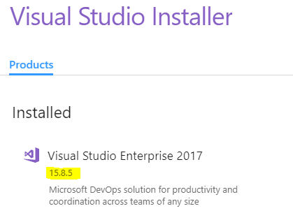

# Visual Studio telepítése és beállítása

A Microsoft Visual Studio ingyenes, [Community változata](https://visualstudio.microsoft.com/vs/community/) elegendő a feladatok megoldásához.

2017-es változat esetén legalább 15.8-as verzió szükséges. A verziót a _Visual Studio Installer_ elindításával ellenőrizhetjük, illetve frissíteni is itt lehet.

A Visual Studio telepítésekor ki kell pipálni az alábbi workload-okat:

- ASP.NET and web development
- .NET Core cross-platform development

Meglevő telepítés a _Visual Studio Installer_-ben a _Modify_ gombbal módosítható, ill. ellenőrizhető.
