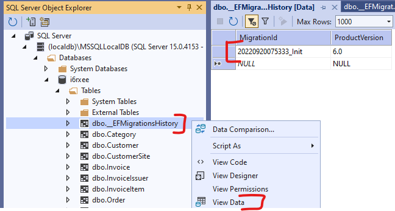

# Entity Framework

The goal of the seminar is to practice writing Linq queries and working with Entity Framework.

!!! important "Entity Framework Core"
    In this seminar, we are using .NET 8 (former .NET Core) available as a cross-platform .NET version for Windows, Linux and Mac.

## Pre-requisites

Required tools to complete the tasks: 

- Microsoft Visual Studio 2022
- Microsoft SQL Server (LocalDB or Express edition)
- SQL Server Management Studio
- Database initialization script: [mssql.sql](https://raw.githubusercontent.com/bmeviauac01/datadriven/master/overrides/db/mssql.sql)

Recommended to review:

- C# language
- Entity Framework Core and LINQ

## How to work during the seminar

The exercises are solved together with the instructor. A few exercises we can try to solve by ourselves and then discuss the results. The final exercise is individual work if time permits.

!!! info ""
    This guide summarizes and explains the behavior. Before looking at these provided answers, we should think first!

## Exercise 0: Create/check the database

The database resides on each machine; thus, the database you created previously might not be available. First, check if your database exists, and if it does not, create and initialize it. (See the instructions [in the first seminar material](../transactions/index.md).)

## Exercise 1: Create a project and map the database

Let us create a new C# .NET console application in Visual Studio. (NOT the ".NET Framework" version!)


Create a new project; you may work in directory `c:\work`.

1. Create the initial EF Core Code First model. We will do _Reverse Engineering Code First_ as we already have a database and we generate C# Code-First model.

    - Install the EF Core NuGet package from the UI or copy these lines in the project file:

    ```xml
    <ItemGroup>
        <PackageReference Include="Microsoft.EntityFrameworkCore.SqlServer" Version="6.0.8" />
        <PackageReference Include="Microsoft.EntityFrameworkCore.Design" Version="6.0.8">
            <PrivateAssets>all</PrivateAssets>
            <IncludeAssets>runtime; build; native; contentfiles; analyzers; buildtransitive</IncludeAssets>
        </PackageReference>
        <PackageReference Include="Microsoft.EntityFrameworkCore.Tools" Version="6.0.8">
            <PrivateAssets>all</PrivateAssets>
            <IncludeAssets>runtime; build; native; contentfiles; analyzers; buildtransitive</IncludeAssets>
        </PackageReference>
    </ItemGroup>
    ```
    
    - Run this EF Core PowerShell script in VS in the _Package Manager Console_ which generates the database context and entity model:

    ```powershell
    Scaffold-DbContext 'Data Source=(localdb)\MSSQLLocalDB;Initial Catalog=[neptun]' Microsoft.EntityFrameworkCore.SqlServer -Context AdatvezDbContext -OutputDir Entities
    ```
    
    !!! note "EF Core .NET CLI"
        In the future, we will continue to use the commands available from the _Package Manager Console_, which is installed with the `Microsoft.EntityFrameworkCore.Tools` package. If anyone wants to use the conventional CLI outside of VS, the documentation can be found at [link](https://learn.microsoft.com/en-us/ef/core/cli/dotnet) below.

2. Let's examine the generated code-first model.

    - The database is accessed through the ``AdatvezDbContext'' class
       - Database tables are accessible via `DbSet` properties.
       - The connection is configured in the ``OnConfiguring`' method. In a live application, this typically comes from a configuration file, which is why the `AdatvezDbContext(DbContextOptions<AdatvezDbContext> options)` constructor was generated
       - The database model was configured in the ``OnModelCreating`' method.

3. Make changes to the model
   
    Rename the `Customer` navigation property of the `CustomerSite` entity to `MainCustomer` both in the entity and in `OnModelCreating`. This modification to the code-first model does not change the database schema.

    ```csharp title="CustomerSite.cs"
    public virtual Customer? MainCustomer { get; set; }
    ```

    ```csharp title="AdatvezDbContext.cs"
    protected override void OnModelCreating(ModelBuilder modelBuilder)
    {
        // ...

        modelBuilder.Entity<CustomerSite>(entity =>
        {
            // ...

            entity.HasOne(d => d.MainCustomer)
                .WithMany(p => p.CustomerSites)
                .HasForeignKey(d => d.CustomerId)
                .HasConstraintName("FK__CustomerS__Custo__32E0915F");
        });

        // ...
    }
    ```

4. Change the database schema - Migrations

    Currently, we have scaffolded our code-first model from the existing database, but we no longer want to maintain the schema with a database-first approach. Instead, use code-first migrations to change the database schema.

    - Let's create an initial migration called `Init', which will contain our initial schema. In the _Package Manager Console_, issue the following command.

        ```powershell
        Add-Migration Init
        ```

    - Let's try to run this migration on the database with the following command.

        ```powershell
        Update-Database
        ```

        This fails by definition, because the commands in the migration want to migrate the schema compared to an empty database, but we already have this schema in our database.
        EF keeps track of which migrations are already applied to the database in a special table called `__EFMigrationHistory`.
            
    - Let's manually add the ``Init'' migration to this table, with which we indicate to EF that it has essentially already run. Pay attention to the name of the migration, which must also include the date.

        

    - Let's change the database schema in our code-first model.

        - Let the `Price' property of our `Product' entity be `decimal' instead of `double', which is more useful for storing amounts of money. It should also be mandatory (cannot be null).

            ```csharp title="Product.cs"
            public decimal Price { get; set; }
            ```
            
        - Set the constraint and precision of the SQL field with `modelBuilder`.

            ```csharp title="DatavezDbContext.cs"
            protected override void OnModelCreating(ModelBuilder modelBuilder)
            {
                // ...

                modelBuilder.Entity<Product>(entity =>
                {
                    // ...

                    entity.Property(e => e.Price).HasPrecision(18, 2).IsRequired();

                    // ...
                }

                // ...
            }
            ```

        - Create a migration of our change and check the generated migration

            ```powershell
            Add-Migration ProductPriceDecimal
            ```

        - Run the migration on the database and check its effect in the database

            ```powershell
            Update-Database
            ```

## Task 2: Queries

Formulate the following queries using LINQ on the mapped data model. Print the results to the console.

Use the debugger to see what kind of SQL statement is generated: by dragging the mouse over the variable of type `IQueryable', you can see the generated SQL as soon as the iteration of the result set begins.

1. List the names and stock of products of which there are more than 30 in stock!

2. Write a query that lists the products that have been ordered at least twice!

3. Create a query that lists orders with a total value of more than HUF 30,000! When listing the result set, the individual items (Product name, amount, net price) should be listed line by line after the customer's name.

4. List the data of the most expensive product!

5. List the buyer pairs that have locations in the same city. A pair should be listed only once.

??? example "Solution"

    ```sharp
    using ConsoleApp3.Entities;

    using Microsoft.EntityFrameworkCore;

    Console.WriteLine("***** Második feladat *****");
    using (var db = new AdatvezDbContext())
    {
    // 2.1
    Console.WriteLine("\t2.1:");
    // Query szintaktika
    var productStockQuery = from p in db.Products
                            where p.Stock > 30
                            select p;

    // Fluent / Method Chaining szintaktika
    // var productStockQuery = db.Products.Where(p => p.Stock > 30);

    foreach (var p in productStockQuery)
    {
        Console.WriteLine($"\t\tName={p.Name}\tStock={p.Stock}");
    }

    // 2.2
    Console.WriteLine("\t2.2:");
    var productOrderQuery = db.Products.Where(p => p.OrderItems.Count >= 2);

    // query szintaktika
    //var productOrderQuery = from p in db.Products
    //                        where p.OrderItems.Count >= 2
    //                        select p;

    foreach (var p in productOrderQuery)
    {
        Console.WriteLine($"\t\tName={p.Name}");
    }

    // 2.3
    Console.WriteLine("\t2.3 helytelen megoldás");
    var orderTotalQuery = db.Orders.Where(o => o.OrderItems.Sum(oi => oi.Amount * oi.Price) > 30000);

    // query szintaktika
    //var orderTotalQuery = from o in db.Orders
    //                      where o.OrderItems.Sum(oi => oi.Amount * oi.Price) > 30000
    //                      select o;

    //foreach (var o in orderTotalQuery)
    //{
    //    // Ez azért fog elszállni, mert EF Core-ban nincs alapértelmezetten Lazy Loading,
    //    // így a navigációs propertyk nem lesznek feltöltve
    //    Console.WriteLine("\t\tName={0}", o.CustomerSite.MainCustomer.Name);
    //    foreach (var oi in o.OrderItems)
    //    {
    //        Console.WriteLine($"\t\t\tProduct={oi.Product.Name}\tPrice={oi.Price}\tAmount={oi.Amount}");
    //    }
    //}

    // 2.3 második megoldás
    // Include-oljuk a hiányzó navigációs tulajdonságokat.
    // Expression alapú Include-hoz szükség van a következő névtér importálására: (CTRL + . is felajánlja a használat során)
    // using Microsoft.EntityFrameworkCore;

    // Csak egy lekérdezést fog generálni, a Navigation Propertyket is feltölti rögtön
    Console.WriteLine("\tc 2.3 helyes megoldás:");
    var orderTotalQuery2 = db.Orders
        .Include(o => o.OrderItems)
            .ThenInclude(oi => oi.Product)
        .Include(o => o.CustomerSite)
        .Include(o => o.CustomerSite.MainCustomer)
        .Where(o => o.OrderItems.Sum(oi => oi.Amount * oi.Price) > 30000);

    // query szintaktika
    //var orderTotalQuery2 = from o in db.Orders
    //                       .Include(o => o.OrderItems)
    //                           .ThenInclude(oi => oi.Product)
    //                       .Include(o => o.CustomerSite)
    //                       .Include(o => o.CustomerSite.MainCustomer)
    //                   where o.OrderItems.Sum(oi => oi.Amount * oi.Price) > 30000
    //                   select o;

    foreach (var o in orderTotalQuery2)
    {
        Console.WriteLine("\t\tName={0}", o.CustomerSite.MainCustomer.Name);
        foreach (var oi in o.OrderItems)
        {
            Console.WriteLine($"\t\t\tProduct={oi.Product.Name}\tPrice={oi.Price}\tAmount={oi.Amount}");
        }
    }

    // 2.4
    Console.WriteLine("\t2.4:");
    var maxPriceQuery = db.Products.Where(p => p.Price == db.Products.Max(a => a.Price));

    // query szintaktika
    //var maxPriceQuery = from p in db.Products
    //                    where p.Price == db.Products.Max(a => a.Price)
    //                    select p;

    foreach (var t in maxPriceQuery)
    {
        Console.WriteLine($"\t\tName={t.Name}\tPrice={t.Price}");
    }

    // 2.5
    Console.WriteLine("\t2.5:");
    var cityJoinQuery = db.CustomerSites
        .Join(db.CustomerSites, s1 => s1.City, s2 => s2.City, (s1, s2) => new { s1, s2 })
        .Where(x => x.s1.CustomerId > x.s2.CustomerId)
        .Select(x => new { c1 = x.s1.MainCustomer, c2 = x.s2.MainCustomer });

    // query szintaktika
    //var cityJoinQuery = from s1 in db.CustomerSites
    //                    join s2 in db.CustomerSites on s1.City equals s2.City
    //                    where s1.CustomerId > s2.CustomerId
    //                    select new { c1 = s1.MainCustomer, c2 = s2.MainCustomer };

    foreach (var v in cityJoinQuery)
    {
        Console.WriteLine($"\t\tCustomer 1={v.c1.Name}\tCustomer 2={v.c2.Name}");
    }
    }
    ```

## Task 3: Data changes

The `DbContext` can be used not only for queries, but also for insertions, modifications and deletions.

1. Write a LINQ-based C# code that increases the price of "LEGO" products by 10 percent!

1. Create a new category called _Expensive toys_ and reclassify here all the products whose price is greater than HUF 8,000!

??? example "Solution"

    ```sharp
    using Microsoft.EntityFrameworkCore;
    using [project name].Entities;
    
    Console.WriteLine("***** Third Task *****");
    using (var db = new DatavezDbContext())
    {
        // 3.1
        Console.WriteLine("\t3.1:");
        var legoProductsQiery = db.Products.Where(p => p.Category.Name == "LEGO");

        Console.WriteLine("\tBefore change:");
        foreach (var p in legoProductsQiery.ToList())
        {
            Console.WriteLine($"\t\t\tName={p.Name}\tStock={p.Stock}\tPrice={p.Price}");
            p.Price = 1.1m * p.Price;
        }

        db.SaveChanges();

        Console.WriteLine("\tAfter modification:");
        // ToList induces a database request
        foreach (var p in legoProductsQiery.ToList())
        {
            Console.WriteLine($"\t\t\tName={p.Name}\tStock={p.Stock}\tPrice={p.Price}");
        }

        // 3.2
        Console.WriteLine("\t3.2:");
        var expensiveToysCategory = db.Categories
            .Where(c => c.Name == "Expensive Toys")
            .SingleOrDefault();

        if (expensiveToysCategory == null)
        {
            expensiveToysCategory = new Category { Name = "Expensive toys" };

            // This is not necessary: if there is an unordered product, we add the category entity to it
            // and it is automatically included in the category table. However, if we take it explicitly, (1) it better
            // expresses our intention; and (2) we insert the category even if there are no reclassified product.
            db.Categories.Add(expensiveToysCategory);
        }

        var expensiveProductsQuery = db.Products.Where(p => p.Price > 8000);

        foreach (var p in expensiveProductsQuery.ToList())
        {
            p.Category = expensiveToysCategory;
        }

        db.SaveChanges();

        expensiveProductsQuery = db.Products
            .Include(p => p.Category)
            .Where(p => p.Category.Name == "Expensive toys");

        foreach (var p in expensiveProductsQuery)
        {
            Console.WriteLine($"\t\tName={p.Name}\tPrice={p.Price}\tCategory={p.Category.Name}");
        }
    }
    ```


## Task 4: Using stored procedures

Create a stored procedure using a new code first migration that lists the products of which at least a specified number of units have been sold. Call the stored procedure from C# code!

1. Create a new empty migration named `PopularProducts_SP`.

    ```powershell
    Add-Migration PopularProducts_SP
    ```

2. Create the stored procedure with the code below. Let's ignore the writing of the backward migration for now, where the stored procedure should to be deleted.

    ```sharp
    public partial class PopularProducts_SP : Migration
    {
        protected override void Up(MigrationBuilder migrationBuilder)
        {
            migrationBuilder.Sql(
    @"CREATE OR ALTER PROCEDURE dbo.PopularProducts (@MinAmount int = 10)
    AS
    SELECT Product.* 
    FROM Product 
    INNER JOIN
    (
        SELECT OrderItem.ProductID
        FROM OrderItem
        GROUP BY OrderItem.ProductID
        HAVING SUM(OrderItem.Amount) > @MinAmount
    ) a ON Product.ID = a.ProductID");
        }

        protected override void Down(MigrationBuilder migrationBuilder)
        {
        }
    }
    ```

3. Update the database and check the result!

    ```powershell
    Update-Database
    ```

4. Call the stored procedure starting from the `Product` `DbSet` of the context using the `FromSqlInterpolated` or `FromSqlRaw` methods

    ??? example "Solution"

        ```sharp
        using Microsoft.EntityFrameworkCore;
        using [project name].Entities;
        
        Console.WriteLine("***** Fourth Task *****");
        using (var db = new DatavezDbContext())
        {
            var popularProducts = db.Products.FromSqlInterpolated($"EXECUTE dbo.PopularProducts @MinAmount={5}");
            foreach (var p in popularProducts)
            {
                Console.WriteLine($"\tName={p.Name}\tStock={p.Stock}\tPrice={p.Price}");
            }
        }
        ```

    !!! danger "`FromSqlInterpolated` vs. `FromSqlRaw`"
        In the above solution, the call is defined with the `FromSqlInterpolated` function, where, due to its name, the string to be interpolated is still processed by EF and the interpolation is not performed traditionally as a string, but replaces `SqlParameters` in order to protect against SQL injection.

        On the other hand, when using the `FromSqlraw` function it is **prohibited** to use string interpolation, instead we have to manually create the `SqlParameters' and define placeholders in the instruction

