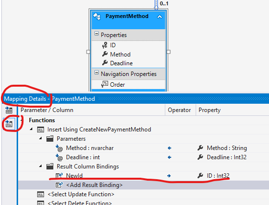

# Entity Framework

A gyakorlat célja, hogy a hallgatók megismerjék a LINQ lekérdezések használatát, valamint az Entity Framework Core ORM keretrendszer alapvető működését.

!!! important "Entity Framework Core"
    A gyakorlat során az Entity Framework Core 6.0-át használjuk, amely már platformfüggetlen.
    
    A régebbi Entity Framework 6 alapvetően a régebbi .NET Frameworkhöz készült, és ott bevett gyakorlat volt az entitás modellt egy vizuális modell szerkesztő eszközben lehetett karbantartani (EDMX), és ebből C# kódot generálni. Az EF 6-ban az EDMX mellett már támogatott volt a Code-First megközelítés is, ahol EDMX szerkesztés helyett már közvetlenül a C# osztályokat írhattuk. Ezt az EF Core tovább is vitte és most már ez az egyedüli lehetőség (és nem mellesleg kényelmesebb is).
    
    A LINQ lekérdezések tekintetében a két technológia közel azonos élményt nyújt.

## Előfeltételek

A labor elvégzéséhez szükséges eszközök:

- Microsoft Visual Studio 2022 (_nem_ VS Code)
- Microsoft SQL Server (LocalDB vagy Express edition)
- SQL Server Management Studio
- Adatbázis létrehozó script: [mssql.sql](https://raw.githubusercontent.com/bmeviauac01/adatvezerelt/master/docs/db/mssql.sql)

Amit érdemes átnézned:

- C# nyelv
- Entity Framework Core és LINQ

## Gyakorlat menete

A gyakorlat végig vezetett, a gyakorlatvezető utasításai szerint haladjunk. Egy-egy részfeladatot próbáljunk meg először önállóan megoldani, utána beszéljük meg a megoldást közösen. Az utolsó feladat opcionális, ha belefér az időbe.

!!! info ""
    Emlékeztetőként a megoldások is megtalálhatóak az útmutatóban is. Előbb azonban próbáljuk magunk megoldani a feladatot!

## Feladat 0: Adatbázis létrehozása, ellenőrzése

Az adatbázis az adott géphez kötött, ezért nem biztos, hogy a korábban létrehozott adatbázis most is létezik. Ezért először ellenőrizzük, és ha nem találjuk, akkor hozzuk létre újra az adatbázist. (Ennek mikéntjét lásd az [első gyakorlat anyagában](../transactions/index.md).)

## Feladat 1: Projekt létrehozása, adatbázis leképzése

Hozz létre Visual Studio segítségével egy C# konzolalkalmazást .NET 6 keretrendszer felett (tehát ne a régi .NET Framework alapút).


Hozd létre a projektet. A `c:\work` mappába dolgozz.

1. Hozzuk létre a kiinduló EF Core Code First modellünket. Ehhez most egy úgynevezett _Reverse Engineering Code First_ megoldást fogunk alkalmazni, aminek a lényege, hogy mivel már van egy kiinduló adatbázisunk abból generálunk egy Code-First modellt, de ezután a továbbiakban Code-First módon dolgozunk.

    - Telepítsük az EF Core alábbi csomagjait a projektbe a NuGet UI-ról (project jobb gomb / Manage NuGet Packages) vagy a projektfájlba másoljuk be a következőt

    ```xml
    <ItemGroup>
        <PackageReference Include="Microsoft.EntityFrameworkCore.SqlServer" Version="6.0.8" />
        <PackageReference Include="Microsoft.EntityFrameworkCore.Design" Version="6.0.8">
            <PrivateAssets>all</PrivateAssets>
            <IncludeAssets>runtime; build; native; contentfiles; analyzers; buildtransitive</IncludeAssets>
        </PackageReference>
        <PackageReference Include="Microsoft.EntityFrameworkCore.Tools" Version="6.0.8">
            <PrivateAssets>all</PrivateAssets>
            <IncludeAssets>runtime; build; native; contentfiles; analyzers; buildtransitive</IncludeAssets>
        </PackageReference>
    </ItemGroup>
    ```

    - Futtassuk le az alábbi EF Core PowerShell parancsot a projekt mappájában, ami legenerálja nekünk az adatbázis kontextust és az entitás modellt:

    ```powershell
    Scaffold-DbContext 'Data Source=(localdb)\MSSQLLocalDB;Initial Catalog=[neptun]' Microsoft.EntityFrameworkCore.SqlServer -Context AdatvezDbContext -OutputDir Entities
    ```

2. Vizsgáljuk meg a generált code-first modellt.

    * Az adatbázis elérése az `AdatvezDbContext` osztályon keresztül történik
      * Adatbázis táblák `DbSet` tulajdonságokon keresztül érhetőek el.
      * A kapcsolat konfigurációja az `OnConfiguring` metódusban történik. Éles alkalmazásban ez tipikusan konfigurációs állományból érkezik, ezért is került legenerálásra a `AdatvezDbContext(DbContextOptions<AdatvezDbContext> options)` konstruktor
      * Az adatbázis modell az `OnModelCreating` metódusban került konfigurálásra.

3. Módosítsunk a modellen 
   
    1. Nevezzük át a `CustomerSite` entitás `Customer` navigációs propertyjént `MainCustomer`-re az entitásban és az `OnModelCreating`-ben is. Ez a módosítás az adatbázis sémán nem változtat csupán a code-first modellen.

    ```cs title="CustomerSite.cs"
    public virtual Customer? MainCustomer { get; set; }
    ```

    ```cs title="AdatvezDbContext.cs"
    protected override void OnModelCreating(ModelBuilder modelBuilder)
    {
        // ...

        modelBuilder.Entity<CustomerSite>(entity =>
        {
            // ...

            entity.HasOne(d => d.MainCustomer)
                .WithMany(p => p.CustomerSites)
                .HasForeignKey(d => d.CustomerId)
                .HasConstraintName("FK__CustomerS__Custo__32E0915F");
        });

        // ...
    }
    ```

    2. Migration

        TODO

## Feladat 2: Lekérdezések

A leképzett adatmodellen fogalmazd meg az alábbi lekérdezéseket LINQ használatával. Írd ki konzolra az eredményeket.

Debugger segítségével nézd meg, hogy milyen SQL utasítás generálódik: az `IQueryable` típusú változóra húzva az egeret látható a generált SQL, amint az eredményhalmaz iterálása elkezdődik.

1. Listázd azon termékek nevét és raktárkészletét, melyből több mint 30 darab van raktáron!

2. Írj olyan lekérdezést, mely kilistázza azon termékeket, melyből legalább kétszer rendeltek!

3. Készíts olyan lekérdezést, mely kilistázza azokat a megrendeléseket, melyek összértéke több mint 30.000 Ft! Az eredményhalmaz kiírásakor a vevő nevét követően soronként szerepeljenek az egyes tételek (Termék név, mennyiség, nettó ár).

4. Listázd ki a legdrágább termék adatait!

5. Listázd ki azokat a vevő párokat, akiknek ugyanabban a városban van telephelyük. Egy pár csak egyszer szerepeljen a listában.

??? example "Megoldás"
    ```csharp
    using ConsoleApp3.Entities;

    using Microsoft.EntityFrameworkCore;

    Console.WriteLine("***** Második feladat *****");
    using (var db = new AdatvezDbContext())
    {
        // 2.1
        Console.WriteLine("\t2.1:");
        // Query szintaktika
        var productStockQuery = from p in db.Products
                                where p.Stock > 30
                                select p;

        // Fluent / Method Chaining szintaktika
        // var productStockQuery = db.Products.Where(p => p.Stock > 30);

        foreach (var p in productStockQuery)
        {
            Console.WriteLine($"\t\tName={p.Name}\tStock={p.Stock}");
        }

        // 2.2
        Console.WriteLine("\t2.2:");
        var productOrderQuery = db.Products.Where(p => p.OrderItems.Count >= 2);

        // query szintaktika
        //var productOrderQuery = from p in db.Products
        //                        where p.OrderItems.Count >= 2
        //                        select p;

        foreach (var p in productOrderQuery)
        {
            Console.WriteLine($"\t\tName={p.Name}");
        }

        // 2.3
        Console.WriteLine("\t2.3 helytelen megoldás");
        var orderTotalQuery = db.Orders.Where(o => o.OrderItems.Sum(oi => oi.Amount * oi.Price) > 30000);

        // query szintaktika
        //var orderTotalQuery = from o in db.Orders
        //                      where o.OrderItems.Sum(oi => oi.Amount * oi.Price) > 30000
        //                      select o;

        //foreach (var o in orderTotalQuery)
        //{
        //    Console.WriteLine("\t\tName={0}", o.CustomerSite.MainCustomer.Name);
        //    foreach (var oi in o.OrderItems)
        //    {
        //        Console.WriteLine($"\t\t\tProduct={oi.Product.Name}\tPrice={oi.Price}\tAmount={oi.Amount}");
        //    }
        //}

        // 2.3 második megoldás
        // Exptession alapú Include-hoz szükség van a következő névtér importálására: (CTRL + . is felajánlja a használat során)
        // using Microsoft.EntityFrameworkCore;

        // Csak egy lekérdezést fog generálni, a Navigation Propertyket is feltölti rögtön
        Console.WriteLine("\tc 2.3 helyes megoldás:");
        var orderTotalQuery2 = db.Orders
            .Include(o => o.OrderItems)
                .ThenInclude(oi => oi.Product)
            .Include(o => o.CustomerSite)
            .Include(o => o.CustomerSite.MainCustomer)
            .Where(o => o.OrderItems.Sum(oi => oi.Amount * oi.Price) > 30000);

        // query szintaktika
        //var orderTotalQuery2 = from o in db.Orders
        //                       .Include(o => o.OrderItems)
        //                           .ThenInclude(oi => oi.Product)
        //                       .Include(o => o.CustomerSite)
        //                       .Include(o => o.CustomerSite.MainCustomer)
        //                   where o.OrderItems.Sum(oi => oi.Amount * oi.Price) > 30000
        //                   select o;

        foreach (var o in orderTotalQuery2)
        {
            Console.WriteLine("\t\tName={0}", o.CustomerSite.MainCustomer.Name);
            foreach (var oi in o.OrderItems)
            {
                Console.WriteLine($"\t\t\tProduct={oi.Product.Name}\tPrice={oi.Price}\tAmount={oi.Amount}");
            }
        }

        // 2.4
        Console.WriteLine("\t2.4:");
        var maxPriceQuery = db.Products.Where(p => p.Price == db.Products.Max(a => a.Price));

        // query szintaktika
        //var maxPriceQuery = from p in db.Products
        //                    where p.Price == db.Products.Max(a => a.Price)
        //                    select p;

        foreach (var t in maxPriceQuery)
        {
            Console.WriteLine($"\t\tName={t.Name}\tPrice={t.Price}");
        }

        // 2.5
        Console.WriteLine("\t2.5:");
        var cityJoinQuery = db.CustomerSites
            .Join(db.CustomerSites, s1 => s1.City, s2 => s2.City, (s1, s2) => new { s1, s2 })
            .Where(x => x.s1.CustomerId > x.s2.CustomerId)
            .Select(x => new { c1 = x.s1.MainCustomer, c2 = x.s2.MainCustomer });

        // query szintaktika
        //var cityJoinQuery = from s1 in db.CustomerSites
        //                    join s2 in db.CustomerSites on s1.City equals s2.City
        //                    where s1.CustomerId > s2.CustomerId
        //                    select new { c1 = s1.MainCustomer, c2 = s2.MainCustomer };

        foreach (var v in cityJoinQuery)
        {
            Console.WriteLine($"\t\tCustomer 1={v.c1.Name}\tCustomer 2={v.c2.Name}");
        }
    }
    ```

## Feladat 3: Adatmódosítások

A `DbContext` nem csak lekérdezéshez használható, hanem rajta keresztül módosítások is végrehajthatóak.

1. Írj olyan LINQ-ra épülő C# kódot, amely az "LEGO" kategóriás termékek árát megemeli 10 százalékkal!

1. Hozz létre egy új kategóriát _Expensive toys_ néven, és sorold át ide az összes olyan terméket, melynek ára, nagyobb, mint 8000 Ft!

??? example "Megoldás"
    ```csharp
    Console.WriteLine("***** Harmadik feladat *****");
    using (var db = new AdatvezDbContext())
    {
        // 3.1
        Console.WriteLine("\t3.1:");
        var legoProductsQiery = db.Products.Where(p => p.Category.Name == "LEGO");

        Console.WriteLine("\tMódosítás előtt:");
        foreach (var p in legoProductsQiery.ToList())
        {
            Console.WriteLine($"\t\t\tName={p.Name}\tStock={p.Stock}\tPrice={p.Price}");
            p.Price = 1.1 * p.Price;
        }

        db.SaveChanges();

        Console.WriteLine("\tMódosítás után:");
        // A ToList adatbázis kérést indukál
        foreach (var p in legoProductsQiery.ToList())
        {
            Console.WriteLine($"\t\t\tName={p.Name}\tStock={p.Stock}\tPrice={p.Price}");
        }

        // 3.2
        Console.WriteLine("\t3.2:");
        var expensiveToysCategory = db.Categories
            .Where(c => c.Name == "Expensive Toys")
            .SingleOrDefault();

        if (expensiveToysCategory == null)
        {
            expensiveToysCategory = new Category { Name = "Expensive toys" };

            // Erre nem feltetlenul van szukseg: ha van atrendelt termek, ahhoz hozzakotjuk a kategoria entitast
            // es bekerul automatikusan a kategoria tablaba is. Igy viszont, hogy explicit felvesszuk, (1) jobban
            // kifejezi a szandekunkat; es (2) akkor is felvesszuk a kategoriat, ha vegul nincs atrendelt termek.
            db.Categories.Add(expensiveToysCategory);
        }

        var expensiveProductsQuery = db.Products.Where(p => p.Price > 8000);

        foreach (var p in expensiveProductsQuery.ToList())
        {
            p.Category = expensiveToysCategory;
        }

        db.SaveChanges();

        expensiveProductsQuery = db.Products
            .Include(p => p.Category)
            .Where(p => p.Category.Name == "Expensive toys");

        foreach (var p in expensiveProductsQuery)
        {
            Console.WriteLine($"\t\tName={p.Name}\tPrice={p.Price}\tCategory={p.Category.Name}");
        }
    }
    ```

## Feladat 4: Tárolt eljárások használata

Tárolt eljárások is hívhatóak a code-first modellből. A tárolt eljárás vagy a DbContext függvényeként, vagy az entitás módosító műveletére köthető be.

!!! note "Tárolt eljárás az EDM-ben"
    A tárolt eljárás leképzésének beállításait (pl. a tárolt eljárás visszatérési típusát) az _Entity Data Model Browser_-ben, az adott függvény _Function Import_-jához tartozó tulajdonságainál szerkeszthetjük.

    

1. Készíts egy tárolt eljárást, mely új fizetési mód rögzítésére szolgál, és visszaadja az új rekord azonosítóját! Használd ezt a tárolt eljárást új entitás felvételéhez!

    - Hozd létre a tárolt eljárást SQL Management Studio segítségével.

        ```sql
        CREATE PROCEDURE CreateNewPaymentMethod
        (
        @Method nvarchar(20),
        @Deadline int
        )
        AS
        insert into PaymentMethod
        values(@Method,@Deadline)
        select scope_identity() as NewId
        ```

    - A tárolt eljárást állítsd be a `PaymentMethod` entitás _insert_ metódusának.

        - Add hozzá a tárolt eljárást az EDM-hez. Az EDM Browser-ben jobb kantitással hozd elő a kontextus menüt, használd az "Update model from database"-t, és importáld (_Add_) az új tárolt eljárást.
        - Mentsd el a modell változásait. Ekkor generálódik a háttérben a C# kód.
        - Állítsd be ezt a metódust a `PaymentMethod` entitás _insert_ metódusaként: kiválasztva az EDM-ben a `PaymentMethod` elemet a _Mapping Details_ ablakban válts át a _Map Entity to Functions_ nézetre, és állítsd be _Insert_ metódusnak. A visszatérési értéket feleltesd meg az _ID_ tulajdonságnak. Mentsd el a modell változásait.

            

    - Próbáld ki a működést: C# kódból adj hozzá egy új fizetési módot a DbContext `PaymentMethod` gyűjteményéhez az `Add` metódussal. Ellenőrizd az adatbázisban a rekord létrejöttét.

1. Készíts egy tárolt eljárást, mely kilistázza azon termékeket melyből legalább egy megadott darabszám felett adtak el. Hívd meg a tárolt eljárást C# kódból!

    - Hozd létre a tárolt eljárást az alábbi kóddal.

        ```sql
        CREATE PROCEDURE dbo.PopularProducts (
        @MinAmount int = 10
        )
        AS
        SELECT Product.* FROM Product INNER JOIN
        (
        SELECT OrderItem.ProductID
        FROM OrderItem
        GROUP BY OrderItem.ProductID
        HAVING SUM(OrderItem.Amount) > @MinAmount
        ) a ON Product.ID = a.ProductID
        ```

    - Importáld az EDM-be a tárolt eljárást. Az eljárás beállításainál (_EDM Model Browser_-ben a _function_-re dupla kattintással nyílik) állítsd be a visszatérési értéket `Product` típusúra. Mentsd el a modell változásait.

        

    - Használd a DbContext-en generált új függvényt a tárolt eljárás meghívásához, és írasd ki a termékek nevét!

??? example "Megoldás"
    ```csharp
    Console.WriteLine("***** Negyedik feladat *****");
    using (var db = new AdatvezEntities())
    {
        // 4.3
        Console.WriteLine("\t4.3:");

        var pm = new PaymentMethod
        {
            Method = "Apple pay",
            Deadline = 99999
        };

        db.PaymentMethod.Add(pm);
        db.SaveChanges();

        // 4.6
        Console.WriteLine("\t4.6:");
        var qPopularProducts = db.PopularProducts(5);
        foreach (var p in qPopularProducts)
            Console.WriteLine("\t\tName={0}\tStock={1}\tPrice={2}", p.Name, p.Stock, p.Price);
    }
    ```
