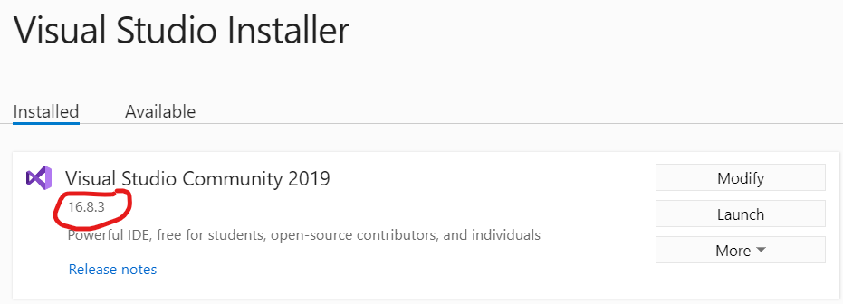
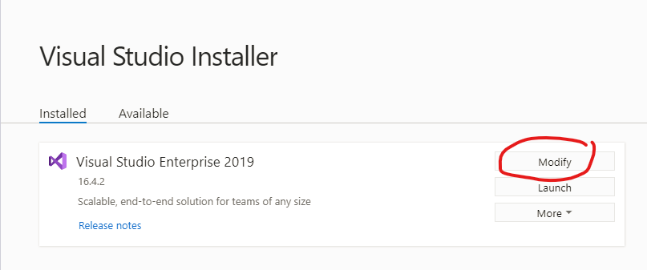
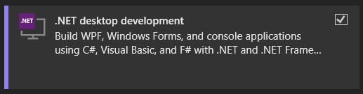

# Visual Studio & .NET Core SDK telepítése

Egyes házikhoz a Microsoft Visual Studio **2019 16.6 vagy újabb** verziója szükséges. Az ingyenes, [Community változata](https://visualstudio.microsoft.com/vs/community/) is elegendő a feladatok megoldásához.

A verziót a _Visual Studio Installer_ elindításával ellenőrizhetjük:



!!! info "VS Code"
    A feladatok Visual Studio nélkül, **Visual Studio Code**-dal is megoldhatóak. A kiadott kód váz Visual Studio-hoz készült, annak konfigurációit tartalmazza. Ha VS Code-dal dolgozol, magadnak kell konfigurálni a környezetet.

## Visual Studio Workload-ok telepítése

A Visual Studio telepítésekor ki kell pipálni az alábbi [workload-okat](https://docs.microsoft.com/en-us/visualstudio/install/install-visual-studio?view=vs-2019#step-4---choose-workloads):

- ASP.NET and web development
- .NET Core cross-platform development


Meglevő telepítés a _Visual Studio Installer_-ben a [_Modify_](https://docs.microsoft.com/en-us/visualstudio/install/modify-visual-studio?view=vs-2019) gombbal módosítható, ill. ellenőrizhető.



### Visual Studio 2022

Visual Studio 2022 telepítésekor ki kell pipálni az alábbi workload-ot:



## .NET Core SDK ellenőrzése és telepítése

Visual Studio mellett bizonyos .NET Core SDK-k telepítésre kerülnek. A megfelelő verzió ellenőrzéséhez legegyszerűbb a `dotnet` CLI-t használni: konzolban add ki a `dotnet --list-sdks` parancsot. Ez a parancs Linux és Mac esetén is működik. A kimenete hasonló lesz:

```hl_lines="2"
C:\>dotnet --list-sdks
3.1.404 [C:\Program Files\dotnet\sdk]
5.0.101 [C:\Program Files\dotnet\sdk]
```

Ha ebben a listában látsz **3.1**-es verziót, akkor jó. Ha nem, akkor telepíteni kell az SDK-t [innen](https://dotnet.microsoft.com/download/dotnet-core/3.1).
