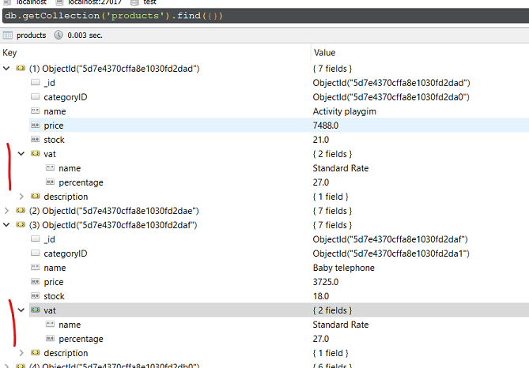

# Feladat: MongoDB

A házi feladat opcionális. A teljesítéssel **2 pluszpont és 2 iMsc pont** szerezhető.

GitHub Classroom segítségével a <TBD> linken keresztül hozz létre egy repository-t. Klónozd le a repository-t. Ez tartalmazni fogja a megoldás elvárt szerkezetét. A feladatok elkészítése után kommitold és pushold a megoldásod.

## Szükséges eszközök

- Windows, Linux vagy MacOS: Minden szükséges program platform független, vagy van platformfüggetlen alternatívája.
- MongoDB Community Server ([letöltés](https://www.mongodb.com/download-center/community))
- Robo 3T ([letöltés](https://robomongo.org/download))
- Microsoft Visual Studio 2019 [az itt található beállításokkal](../VisualStudio.md)
    - Linux és MacOS esetén Visual Studio Code és a .NET Core SDK-val települő [dotnet CLI](https://docs.microsoft.com/en-us/dotnet/core/tools/) használható.
- [.NET Core 3.1 SDK](https://dotnet.microsoft.com/download/dotnet-core/3.1)
    - Visual Studio esetén települ, de ha mégse, akkor a fenti linkről kell telepíteni (az SDK-t és _nem_ a runtime-ot.)
    - Linux és MacOS esetén telepíteni szükséges.
- Gyakorlatokon is használt minta adatbázis kódja: [mongo.js](https://raw.githubusercontent.com/bmeviauac01/adatvezerelt/master/docs/db/mongo.js)
    - Előkészületként hozz létre egy új adatbázist, a [gyakorlatanyagban](../../gyakorlat/mongodb/index.md) leírt módon.
- GitHub account és egy git kliens

## Feladat 0: Neptun kód

Első lépésként a gyökérben található `neptun.txt` fájlba írd bele a Neptun kódodat!

## Feladat 1: Áfa kulcs módosítása (2 pluszpont)

Ebben a feladatban egy módosító utasítás (`Update`) segítségével kell megváltoztatni egy áfatípus kulcsát. Az implementálandó metódus a `ProductRepository` osztályban a következő.

```csharp
public void ChangeVatPercentage(string name, int newPercentage)
```

1. Először is vizsgáljuk meg, hogy hogy találhatók meg az ÁFA értékek az adatbázisunkban. Az SQL adatbázisban megszokott normalizált táblával ellentétben itt denormalizált módon, a `products` kollekcióban beágyazott dokumentumként szerepel.

    

    Ezt tükrözi a `Product` entitás osztály is.

    ```csharp
    public class Product
    {
        [BsonId]
        public ObjectId ID { get; set; }
        public ObjectId CategoryID { get; set; }

        public string Name { get; set; }
        public double? Price { get; set; }
        public int? Stock { get; set; }
        public VAT VAT { get; set; }
    }
    ```

    Ez az adatbázis olvasását igen hatékonnyá teszi: ha egy termék bruttó árára vagyunk kíváncsiak, egyetlen dokumentumban rendelkezésünkre áll minden szükséges érték — szemben az SQL adatbázissal, ahol ehhez `JOIN`-ra lenne szükség.

    Hátránya viszont, hogy módosítás esetén **minden** dokumentumban módosítanunk kell az áfakulcsot, ahol megjelenik.

1. Az előzőekből következik, hogy a tömeges változtatáshoz `UpdateMany` utasításra lesz szükségünk — ugyanis mindenhol szeretnénk módosítani az áfakulcsot ahol a név megegyezik. A függvény használatának módját érdemes felidézni.

    - Az `UpdateMany` függvény `filter` paraméterében szűrjünk rá azokra a termékekre melyekben az `VAT.Name` megegyezik a függvény `name` paraméterével.
    - A függvény `update` paraméterében a módosító lépést mondjuk meg, itt az `VAT.Percentage` értéket szeretnénk beállítani az `newPercentage` paraméter értékére. Ehhez a [$set](https://docs.mongodb.com/manual/reference/operator/update/set/) (`Set`) operátor használható.

1. Készítsd el a függvény implementációját. A repository osztály konstruktorban megkapja az adatbázist és elmenti magának a használandó gyűjteményt, ezen keresztül érheted el az adatbázist.

A teszteléshez találsz unit teszteket a solution-ben. A teszteket [Visual Studio-ban egyszerűen tudod futtatni](https://docs.microsoft.com/en-us/visualstudio/test/run-unit-tests-with-test-explorer?view=vs-2019), de ha mást használsz fejlesztéshez (pl. VS Code és/vagy `dotnet cli`), akkor is [tudsz teszteket futtatni](https://docs.microsoft.com/en-us/dotnet/core/tools/dotnet-test). Az adatbázis eléréséhez a `TestDbFactory` osztályban módosíthatod a connection stringet.

!!! important "Tesztek"
    A tesztek az adatbázis kiinduló állapotát feltételezik. Futtasd le az adatbázis scriptet a kiinduló állapot visszaállításához.

    A tesztek kódját **NE** módosítsd. Ha a teszteléshez szükséges, ideiglenesen beleszerkeszthetsz, de ügyelj rá, hogy az eredeti állapottal kommitold a megoldásod.

!!! example "BEADANDÓ"
    A módosított C# forráskódot tölts fel.

    Emellett készíts egy képernyőképet a **`products` gyűjtemény tartalmáról a változtatás után**. A teszt lefuttatásával a _Standard Rate_ nevű áfakulcs százaléka megváltozik. Robo3T-ből (vagy más eszközből) mutasd meg, hogy valóban frissülnek a gyűjteményben az értékek. Egy-két érintett dokumentumot bonts ki, hogy látható legyen a változás (mint a képen fent).

## Feladat 2: Legnagyobb összértékű termék a raktárban (2 iMsc pont)

A feladat meghatározni, hogy a raktárunkban egy adott kategóriába tartozó termékek közül melyik képviseli a legnagyobb összértéket — tehát melyik termék az, amelyiknek az **ára szorozva a raktárban lévő mennyiségével a legnagyobb**. Ehhez a `ProductRepository` osztályban a következő metódust kell implementálnunk.

```csharp
(string, double?) ProductWithLargestTotalValue(ObjectId categoryId)
```

1. A pontos specifikáció megértéséhez vizsgáljuk meg először a feladathoz tartozó teszteket a `TestExercise2.cs` fájlban.

    - A függvény bemeneti paramétere a kategória ID-ja, amelyhez tartozó termékekre éppen kíváncsiak vagyunk.
    - Amennyiben tartozik termék a megadott kategóriához, akkor a legnagyobb összértékű termék nevét és az összértéket kell visszaadnunk.
    - Amennyiben nem tartozik termék a kategóriához, mind a két értékre `null`-t kell visszaadnunk.

1. A lekérdezés elvégzéséhez a MongoDB aggregációs pipeline-ját érdemes használni. Ennek működésének felelevenítéséhez nézd meg a gyakorlatfeladatok megoldását.

    A lekérdezéshez a következő pipeline lépések szükségesek:

    - Szűrjük le a termékeket a megadott kategóriához tartozókra. Ehhez egy [$match](https://docs.mongodb.com/manual/reference/operator/aggregation/match/) (`Match`) lépésre lesz szükségünk, ahol megadhatjuk a megfelelő filter kifejezést.

    - Számoljuk ki minden megmaradt termék esetén az összértéket egy [$project](https://docs.mongodb.com/manual/reference/operator/aggregation/project/) (`Project`) lépés segítségével. Ne felejtsd el, hogy az összérték mellett a termék nevére is szükségünk lesz!

    - Rendezzük az így kapott dokumentumokat csökkenő sorrendbe az összérték alapján. Ehhez a [$sort](https://docs.mongodb.com/manual/reference/operator/aggregation/sort/) (`SortByDescending`) lépést tudjuk alkalmazni.

    - A legnagyobb értékre vagyunk kíváncsiak, azaz az eredmények közül csupán az első érdekel minket. Azonban akkor sem szeretnénk hibát kapni, ha egyáltalán nem tartozott termék ehhez a kategóriához. Ezért a `FirstOrDefault` kiértékelő utasítást érdemes használni.

    !!! note ""
        Ha esetleg ismeretlen lenne a `(string, double?)` szintaktika:

        ```csharp
        return ("test", 0.0);
        ```
        
        utasítás segítségével egyszerre két visszatérési értéket tudunk adni a függvénynek.

Ha sikerült implementálni a metódust, akkor a korábban már látott módon a `TestExercise2` osztályban található teszt metódusokkal ellenőrizni tudod a működést.

!!! example "BEADANDÓ"
    A módosított C# forráskódot tölts fel.
