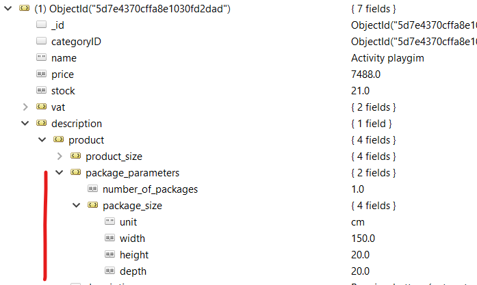

# Feladat: MongoDB

A házi feladat opcionális. A teljesítéssel **2 pluszpont és 2 iMsc pont** szerezhető.

GitHub Classroom segítségével hozz létre magadnak egy repository-t. A **meghívó URL-t Moodle-ben találod**. Klónozd le az így elkészült repository-t. Ez tartalmazni fogja a megoldás elvárt szerkezetét. A feladatok elkészítése után kommitold és pushold a megoldásod.

A megoldáshoz szükséges szoftvereket és eszközöket lásd [itt](../index.md#szukseges-eszkozok).

Előkészületként hozz létre egy új adatbázist, a [gyakorlatanyagban](../../gyakorlat/mongodb/index.md) leírt módon.

## Feladat 0: Neptun kód

Első lépésként a gyökérben található `neptun.txt` fájlba írd bele a Neptun kódodat!

## Feladat 1: Legnagyobb összértékű termék a raktárban (2 pluszpont)

A feladat meghatározni, hogy a raktárunkban egy adott kategóriába tartozó termékek közül melyik képviseli a legnagyobb összértéket — tehát melyik termék az, amelyiknek az **ára szorozva a raktárban lévő mennyiségével a legnagyobb**. Ehhez a `ProductRepository` osztályban a következő metódust kell implementálnunk.

```csharp
(string, double?) ProductWithLargestTotalValue(ObjectId categoryId)
```

1. A pontos specifikáció megértéséhez vizsgáljuk meg először a feladathoz tartozó teszteket a `TestExercise1.cs` fájlban.

    - A függvény bemeneti paramétere a kategória ID-ja, amelyhez tartozó termékekre éppen kíváncsiak vagyunk.
    - Amennyiben tartozik termék a megadott kategóriához, akkor a legnagyobb összértékű termék nevét és az összértéket kell visszaadnunk.
    - Amennyiben nem tartozik termék a kategóriához, mind a két értékre `null`-t kell visszaadnunk.

1. A lekérdezés elvégzéséhez a MongoDB aggregációs pipeline-ját érdemes használni. Ennek működésének felelevenítéséhez nézd meg a gyakorlatfeladatok megoldását.

    A lekérdezéshez a következő pipeline lépések szükségesek:

    - Szűrjük le a termékeket a megadott kategóriához tartozókra. Ehhez egy [$match](https://docs.mongodb.com/manual/reference/operator/aggregation/match/) (`Match`) lépésre lesz szükségünk, ahol megadhatjuk a megfelelő filter kifejezést.

    - Számoljuk ki minden megmaradt termék esetén az összértéket egy [$project](https://docs.mongodb.com/manual/reference/operator/aggregation/project/) (`Project`) lépés segítségével. Ne felejtsd el, hogy az összérték mellett a termék nevére is szükségünk lesz!

    - Rendezzük az így kapott dokumentumokat csökkenő sorrendbe az összérték alapján. Ehhez a [$sort](https://docs.mongodb.com/manual/reference/operator/aggregation/sort/) (`SortByDescending`) lépést tudjuk alkalmazni.

    - A legnagyobb értékre vagyunk kíváncsiak, azaz az eredmények közül csupán az első érdekel minket. Azonban akkor sem szeretnénk hibát kapni, ha egyáltalán nem tartozott termék ehhez a kategóriához. Ezért a `FirstOrDefault` kiértékelő utasítást érdemes használni.

    !!! note ""
        Ha esetleg ismeretlen lenne a `(string, double?)` szintaktika:

        ```csharp
        return ("test", 0.0);
        ```
        
        utasítás segítségével egyszerre két visszatérési értéket tudunk adni a függvénynek.

1. Készítsd el a függvény implementációját. A repository osztály konstruktorban megkapja az adatbázist és elmenti magának a használandó gyűjteményt, ezen keresztül érheted el az adatbázist.

A teszteléshez találsz unit teszteket a solution-ben. A teszteket [Visual Studio-ban egyszerűen tudod futtatni](https://docs.microsoft.com/en-us/visualstudio/test/run-unit-tests-with-test-explorer?view=vs-2019), de ha mást használsz fejlesztéshez (pl. VS Code és/vagy `dotnet cli`), akkor is [tudsz teszteket futtatni](https://docs.microsoft.com/en-us/dotnet/core/tools/dotnet-test). Az adatbázis eléréséhez a `TestDbFactory` osztályban módosíthatod a connection stringet.

!!! important "Tesztek"
    A tesztek az adatbázis kiinduló állapotát feltételezik. Futtasd le az adatbázis scriptet a kiinduló állapot visszaállításához.

    A tesztek kódját **NE** módosítsd. Ha a teszteléshez szükséges, ideiglenesen beleszerkeszthetsz, de ügyelj rá, hogy az eredeti állapottal kommitold a megoldásod.

!!! example "BEADANDÓ"
    A módosított C# forráskódot tölts fel.

    Emellett készíts egy képernyőképet Visual Studio-ból (vagy a fejlesztéshez használt eszközból, akár `dotnet cli` is lehet), amelyben a vonatkozó teszteket lefuttattad. Látszódjon a **repository osztály kódja** és a **tesztek futásának eredménye**! A képet `f1.png` néven mentsd el és add be a megoldásod részeként!

    Ha `dotnet test`-et használsz a teszt futtatásához, a képernyőképen látszódjon az összes teszt neve. Ehhez használd a `-v n` kapcsolód a részletesebb naplózáshoz.

    A képernyőképen levő forráskód tekintetében nem szükséges, hogy a végső megoldásban szereplő kód betűről betűre megegyezen a képen és a feltöltött változatban. Tehát a tesztek sikeres lefutása után elkészített képernyőképet nem szükséges frissíteni, ha a forráskódban **kisebb** változtatást eszközölsz.

## Feladat 2: Raktár méret becslés (2 iMsc pont)

Egy cég új telephelyre költözik. A vezetésnek szüksége van arra az információra, hogy át tudják-e költöztetni a már meglévő raktárkészletet az új raktárba. Implementáld a függvényt, amely kiszámolja a **teljes raktárkészletre a csomagok térfogatát**!

A termékeink egy részénél van méret információ a `description.product.package_parameters` alatt:



Ebből kell kiszámolni a teljes raktárkészlet térfogatát:

- Az adatot a `package_parameters`-ből vedd (és **ne** a `product_size`-ból).
- Egy termék lehet, hogy több csomagból áll, ezt a `package_parameters.number_of_packages`-ben találod. Ez csak egy szorzó, tehát egyetlen mérete van minden terméknek, legfeljebb több, ugyanakkora csomagból áll.
- A végeredmény: minden termékre Σ (termék raktárkészlet * csomag darabszám * szélesség * hosszússág * mélység).
- Amely terméknél nincs meg ez az információ, ott 0 térfogattal számolj.
- Ügyelj rá, hogy a térfogat számítás mértékegység helyes legyen: a termékek mérete vagy _cm_ vagy _m_ mértékegységben lehet megadva, de a végeredményben a térfogat köbméterben kell!

Készítsd el a `double GetAllProductsCumulativeVolume()` függvény implementációját, amely a teljes térfogatot visszaadja **m^3-ben**. A számítást adatbázisban végezd (és ne C#-ban), ehhez használd az aggregációs pipeline-t.

!!! into "Sum aggregáció"
    Az aggregáláshoz a `$group` pipeline stage-re lesz szükséged. Bár nem akarunk csoportosítani, mégis, így van lehetőség a teljes gyűjteményen aggregálásra. Minden termék elemet ugyanabba a csoportba képezz le (tehát, a `$group`-ban az `id`-hoz egy konstanst rendelj), majd a projekció részben végezheted el a [`$sum`](https://docs.mongodb.com/manual/reference/operator/aggregation/sum/#use-in-group-stage) típusú aggregálást a fenti képletnek megfelelően.

    A _cm_ és _m_ mértékegység kezelés csak egy szorzót jelent, a `sum` összegzésben meg tudod oldani egy feltételes szorzással. Ha ez nem sikerül, megoldhatod két külön aggregációval is, amelyekben szűrsz a mértékegységre majd utána jön az aggregáció.

A szükséges adatok nincsenek leképezve C# entitásra, ezeket neked kell elkészítened. Ügyelj rá, hogy a BSON dokumentumban az elemek neve eltér a szokásostól, így amikor C# property-re képezed le, vagy ennek megfelelően kell elnevezni a property-ket, vagy használhatod a `[BsonElement(elementName: "...")]` attribútumot.

!!! warning "Fluent Api-t használj"
    Mindenképpen C#-os Fluent Api-t használj! Ne `BsonDocument`-ben írd meg a lekérdezést!

Ha sikerült implementálni a metódust, akkor a korábban már látott módon a `TestExercise2` osztályban található teszt metódussal ellenőrizni tudod a működést. A teszt az adatbázis kiinduló állapotát feltételezi.

!!! example "BEADANDÓ"
    A módosított C# forráskódot tölts fel.
