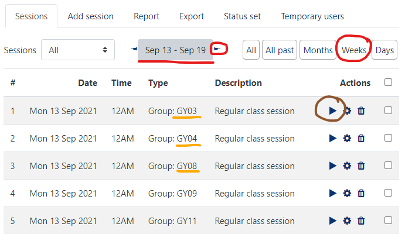

# Gyakorlatvezetőknek

Gyakorlatvezető/demonstrátor lennél? Az alábbiakat érdemes tudnod.

## Gyakorlatvezető feladatai

A gyakorlatvezető a tárgy oktatásában segít a gyakorlatok megtartása és a számonkérések során. A feladat az alábbiakból áll.

**Félév során 12 gyakorlat megtartása.** A gyakorlatok a 2. oktatási héten kezdődnek és a 13. oktatási héten érnek véget. Egy gyakorlatvezető általában 2 gyakorlati csoport oktatásáért felel és mindkét csoportnak 6-6 gyakorlatot tart meg. A gyakorlat fix órarendi időben van, 90 perces, és számítógép laborban tartjuk. Szünetek miatt elmaradó laborokat nem pótlunk, így néha egy-kettővel kevesebb óra lehet. Lehetőség van többet is vállalni, tehát akár 4 csoportot is (4*6 gyakorlat a félév során).

A gyakorlat kiadott segédlet alapján kerül megtartásra. A gyakorlatvezető feladata a gyakorlatra való felkészülés, a gyakorlat megtartása, ennek során a szükséges háttérismeretek rövid átismétlése, a fontos részek kiemelése, és a hallgatók segítése a gyakorlat során. Egy gyakorlati órán 20 hallgató van a teremben.

2021 őszi félév során a gyakorlatok órarendi időpontjai:

- kedd 8-10
- kedd 10-12
- csütörtök 8-10

**Számonkérések lebonyolításában segítség.** A tárgyban ZH, PZH, és 4 vizsga van. Mindegyik számonkérés írásban történik. A gyakorlatvezető feladata a számonkérések felügyelése majd a javításban történő részvétel. A felügyelés ideje alkalmanként körülbelül 1 óra, a javítás ideje létszám függően 0.5-2 óra alkalmanként. Gyakorlatvezetőként körülbelül a számonkérések felében kell részt venni.

**Házi feladatok értékelése.** A félév során 5 kis házi feladatot hirdetünk meg. Ezeket a hallgatók otthon, önállóan oldják meg és adják be GitHub pull request-ek formájában. A házi feladatok kiértékelése részben automatikusan történik: egy szoftver lefuttatja és ellenőrzi a beadott munkát. A gyakorlatvezető feladata a beadott házi feladat formai ellenőrzése: kért képernyőképek megfelelnek-e az előírásoknak és konzisztensek-e a beadott forráskóddal. A házi feladat nem kötelező, nem minden hallgató szokta elkészíteni, így házi feladatonként körülbelül 1 óra idő ráfordítást jelent.

## Demonstrátorság

Hallgató vagy de szeretnél bekapcsolódni az oktatásba? Szeretnéd kipróbálni magad gyakorlatvezetőként? Elvégezted ezt a tárgyat ötössel? Várunk demonstrátorként!

A TVSZ pár követelményt szab demonstrátoroknak: (lásd [aktuális TVSZ](https://www.kth.bme.hu/document/2376/original/BME_TVSZ_2016%20elfogadott_mod_20200131-T.pdf) 165.§):

!!!quote ""
    (5) A demonstrátori pályázat benyújtásának feltétele, hogy a pályázó

    a) a demonstrátori jogviszonnyal érintett félévben rendelkezzen aktív hallgatói jogviszonnyal;

    b) rendelkezzen alapképzésben vagy osztatlan képzésben szerzett oklevéllel;

    c) alapképzésben vagy osztatlan képzésben szerzett oklevél hiányában rendelkezzen legalább annyiszor huszonöt teljesített kredittel, ahány lezárt aktív féléve van és halmozott súlyozott tanulmányi átlageredménye haladja meg a 3,50 értéket; és

    d) ne álljon fegyelmi büntetés hatálya alatt.

Ha érdekel a lehetőség, megfelelsz a fenti követelményeknek, és az órarendedbe belefér a gyakorlat (lásd az időpontokat fentebb), keresd meg a [tárgyfelelőst](mailto:albert.istvan@vik.bme.hu).

## Tudnivalók a gyakorlatok megtartásához

A tárgy alapképzés (BSc) 5. félévében specializációs tárgy. Ezt azt jelenti, hogy a hallgatók szoftverfejlesztési alapismeretekkel és adatbázis alapismeretekkel rendelkeznek. A tárgyunk célja a tudás elmélyítése és új technológiákba való "belekóstolás". Az új ismeretek átadása az előadásokon történik, a gyakorlatokon a technológiák első kézből való kipróbálása a lényeg. A célunk, hogy mindenki maga is lássa és kipróbálja az adott eszközöket, technológiákat, és lássa a működésüket. A gyakorlatokon változatos technológiákkal foglalkozunk, és ennek megfelelően több féle szoftvert is használunk. Ezek egy része újdonság lesz a hallgatóknak, így a gyakorlatokon a szoftverek alapvető használatát is megmutatjuk.

### Oktatás módja

A gyakorlatokon elvárt a részvétel, viszont nincs számonkérés (se beugró, se egyéb). Az előadásokon minden szükséges alapismeret elhangzik, de a gyakorlatokon célszerű szóban elismételni _mivel_ foglalkozunk az adott gyakorlaton és az _miért_ fontos. Emellett érdemes kiemelni a feladatok megoldása során az érdekes, avagy feltétlenül megjegyzendő részeket. (Mindemellett a gyakorlat nem előadás, nem kell mindent újból elismételni.)

A gyakorlatokon önálló munkát csak kis mértékben várunk el. A gyakorlatok anyaga jelzi, mit lehet önálló munkának feladni. A gyakorlat nagy részében tehát a gyakorlatvezető projektoron csinálja a feladatokat, a hallgatók követik és maguk is végzik a feladatokat. A bemelegítő feladatok után (amikor a szoftver környezet már ismert), lehet adni gondolkodási időt a hallgatóknak. A megoldást viszont mindig beszéljétek meg közösen.

A gyakorlati anyagban benne van a megoldás. Ha valaki lemarad, vagy otthon meg akarja nézni, így elérheti a megoldásokat. A gyakorlatok során ne csak átmásoljuk az órán, hanem gépeljük be a megoldást, a gondolatmenetet magyarázva közben! Ha lehet, vegyük rá a hallgatókat is erre.

### Adminisztratív tudnivalók

- A gyakorlatokat óra 15-kor kezdjük pontosan és 90 percet egyben, szünet nélkül tartjuk. A késő hallgatókat első alkalommal figyelmeztessük. Ha többször előfordul vagy zavaróan sokat késik (>5 perc), akkor küldjétek el (TVSZ erre jogot ad!).
- A gyakorlat teljesítésének adminisztrálása Moodle-ben történik. A teljesítés a gyakorlaton való megjelenést, és a munka veletek történő elvégzését jelenti. (Tehát a hallgató nem sétálhat ki a gyakorlat közepén és nem foglalkozhat mással, csak a gyakorlattal. Eseti problémákat azért kezeljünk le, pl. ZH-ja van máshol, stb. Egy-egy kivétel belefér.) Érdemes a jelenlétet a gyakorlat elején könyvelni.
- Ha az órán több ember jelenne meg, mint ahány gép van (hiányzás pótlása pl.), vagy egy gép nem működik, akkor akinek nem jut hely, leül valaki mellé.
- A csoportok között nincs ad-hoc átjárás. Ha valaki jelzi, hogy nem tud részt venni egy gyakorlaton, akkor előre/utólag/ugyanazon a héten egy másik csoportban pótolhat (ha van rá mód). Ennek a megszervezését alapvetően a hallgató bonyolítsa (nézze meg, mikor van még labor azonos anyagból, és egyeztessen a tárgyfelelőssel, vagy a gyakorlatvezetőkkel), de segítsük, ha kell.
- 2021 őszén a tanév első 2 hetében nem minden hallgatónak lesz kollégiumi helye. Rektori utasítás szerint a hallgatók felmentést kapnak ezen alkalmak alól. Ezt központilag intézzük, az első gyakorlatnál is kell könyvelni a jelenlétet, de a hiányzást nem vesszük figyelembe.

#### Gyakorlat jelenlét könyvelése

A jelenlétet Moodle-ben kell könyvelni a "Gyakorlat jelenlét" elemre kattintva.

Csoportonként külön jelenléti alkalom van. Érdemes a heti nézetet választani és az aktuális héthez menni. Az alkalom dátuma _nem_ a csoport órarendi idejében van (hétfő mindig), azt kell választani, amelyik aktuális heti és a megfelelő csoporthoz tartozik. A "lejátszás" gombra kattintva vihető fel a jelentlét.

A jelenlét beírásánál a "J" a jelenlét, a "H" a hiányzás. Fűzhető mellette megjegyzés is hozzá (pl. "késett".)

### Anyagok elérhetősége

- A tárgy előadás anyagai, az időpontok és határidők és hivatalos követelmények Moodle-ben lesznek. (Ehhez a tárgy indulásával kapsz hozzáférést.)
- Gyakorlatok anyagai: lásd a fenti menüben. A gyakorlati anyag minden része teljesen publikus.

    A gyakorlatok anyaga GitHub repository-ban van. Ha hibát, elgépelést találsz benne, arra kérünk, hogy javítsd: minden anyag jobb felső sarkában van egy kis ceruza ikon, javítsd a hibát, és küldj PR-t.

### Belépések

A **labor termekhez** kulcsra és/vagy kártyára van szükség. Ezeket a titkárságon (QB207) kell kérni. I épülethez kell a teremkulcs, ill. a folyosóhoz szükség van kártyára is (kivéve, akinek van ilyenje). Q épület laborjaihoz hozzáférést külön szervezzük. Demonstrátorok: mindezt megmutatom első alkalommal.

**Gépekre**: emailben küldöm félév elején. Kis- és nagybetű számít! Pár elgépelés után le lesz tiltva az account!

**MS SQL szerver**:

- localdb: nincs jelszó, Windows Authentication-t használjunk
- JPA labornál sqlexpress van, SQL Server Authentication kell: `sa` / `sa`

**MongoDB**: nincs autentikáció

## Tudnivalók a házi feladatokkal kapcsolatban

A félév során a házi feladatok vannak meghirdetve, amiket adott határidőig kell beadni GitHub-on. Ennek pontos menete a hallgató szemszögéből [itt](../homework/index.md) elolvasható.

Ahhoz, hogy hozzáférj a GitHub-on a beadott megoldásokhoz (és ahhoz, hogy a hallgatók ezt hozzád tudják rendelni), kell egy GitHub account. A GitHub nevedet írd meg a tárgyfelelősnek, és felvesz GitHub-on a <https://www.github.com/bmeviauac01> organization-be.

### Mikor kell értékelni a házit?

A házikat a határidő lejárta után kell értékelni. A határidő előtt a megoldásokra nem kell ránézni, kivéve, ha ezt a hallgató kéri. Kérdéssel a hallgató direktben kell megkeressen (pl. emailben vagy [GitHub-on](../homework/GitHub.md#kapott-eredmennyel-kapcsolatban-kerdes-vagy-reklamacio)).

### Hol kell értékelni a házit?

A határidő lejárta után a feladatod a **hozzád rendelt** pull request-ek értékelése. A hallgató azzal adja be a házit, hogy a pull request-et a gyakorlatvezetőjéhez rendeli. Ezeket a GitHub keresőjével a legegyszerűbb megtalálni: <https://github.com/pulls?q=is%3Aopen+is%3Apr+org%3Abmeviauac01+assignee%3A%40me+>.

Alternatívaként a GitHub értesítő felületét is lehet használni a <https://github.com/notifications> címen, itt minden hozzád rendelt, vagy review-ra váró PR megjelenik.

### Hogyan kell értékelni a házit?

A PR-eket egyesével kell megnyitni, és meg kell nézni a PR komment felületén az eredményt. Itt látható lesz a lefuttatott értékelés eredménye, valamint a képernyőképek. Emellett meg kell nézni a forráskódot is.

A forráskódot nem szükséges betűről betűre megnézni - a részletes ellenőrzést elvégzi az automata. A gyakorlatvezető feladata a képernyőképek ellenőrzése, valamint annak eldöntése, hogy a forráskód konzisztens-e a kapott eredménnyel.

A feladatok minta megoldása itt érhető el: <https://github.com/bmeviauac01?q=hazi-megoldas>. Ezek csak lehetséges megoldások, a hallgató megoldása nem kell ezzel egyezzen.

Az értékelés végeztével:

- Ha az automata értékelés helyénvaló volt, akkor le kell zárni a PR-t a `/ahk ok` parancs beírásával egy kommentbe. Ennek hatására a PR jóváhagyásra kerül és merge-elve lesz.
- Ha az automata értékelést felülbírálod pontszámban, akkor az `/ahk ok 1.5 2` parancsot kell kiadni, ahol is a számok a feladatokra kapott pontszámok. Az első szám a nem iMsc feladat pontszáma, a második az iMsc pontszám - ez utóbbi elhagyható 0 esetén.
- Ha a beadott megoldás nem fogadható el (határidőn túl érkezett, a képek nem támasztják alá a megoldást, a forráskód elfogadhatatlan, stb.), akkor ki **kell** adni a `/ahk ok 0 0` parancsot. Ezzel fogjuk rögzíteni, hogy az automata értékelő által adott pontszámokat felülírjuk.

A fenti parancs egy kommentben tetszőleges helyen szerepelhet, amennyiben egy sorban csak ez a parancs szerepel. Írhatunk tehát a hallgatónak megjegyzést, majd utolsó sorba írjuk ezt a parancsot. Érdemes a hallgatónak legalább egy mondatot írni, hogy lássa, elfogadtuk a megoldást. Ha még sincs megjegyzésünk a hallgató felé, akkor csak egysoros komment kell ezzel a paranccsal.

A parancs többször is kiadható, tehát elrontott pontszámot lehet javítani az újbóli kiadással.

A parancs hatását látjuk is utána PR-ben:

- a kommentre a parancs felismerésének megerősítésére érkezik egy reakció,
- a PR változtatásai jóváhagyásra kerülnek (ez szükséges a mergeléshez a protected branch miatt),
- a PR mergelésre kerül - ezzel lezárt állapotba kerül a PR és így eltűnik a teendők listájáról,
- és végül elmentésre kerül az eredmény a háttérben - ezt már közvetlenül nem látjuk.

### Problémák és megoldásuk

**Nem futott le az automata értékelés.**

- Lehet, hogy a hallgató _draft_ módban hagyta a PR-t, ezt vissza kell állítani. A PR alján megjelenik ilyenkor egy _Ready for review_ gomb.
- Ha sikertelen volt a kiértékelés, meg lehet ismételni. Ez segít a tranziens hibákon (ritka eset). Ehhez tegyél egy _eval_ nevű label-t a PR-re (új label-ként kell létrehozni).

**Több, mint 5-ször futott a kiértékelés.** Ezt pontlevonással szankcionáljuk. Első alkalommal eltekinthetünk tőle, de mindenképpen tájékoztassuk a hallgatót.

**Hiba van a kiértékelő alkalmazásban.** Előfordulhat. Keresd a tárgyfelelőst, vagy javítsd a hibát (a kiértékelő programok itt vannak: <https://github.com/bmeviauac01/hazi-ahk/>).

**Az értékelési folyamat sikertelen.** Ha elesik az értékelő folyamat, azt a PR-ben látjuk. Ennek több oka is lehet.

- A hallgató kifelejtett valamit. Kötelező elemek hiánya szándékosan blokkolja a folyamatot. Az ilyen házit nem értékeljük (amennyiben valóban a hallgató tévedett).
- Tranziens hiba, pl. nem sikerül egy konténer pull, vagy egy .NET SDK setup. Lásd az újrafuttatást fentebb.
- Hiba van a kiértékelő, avagy a feldolgozó alkalmazásban. A kiértékelő alkalmazások elég stabilak, hibás megoldásra nem szabad elessenek. Azért megtörténhet. A feldolgozó alkalmazás is sokat futott már, de természetesen lehet benne nem várt eset. Szólj erről, az ilyet meg kell nézzük.
