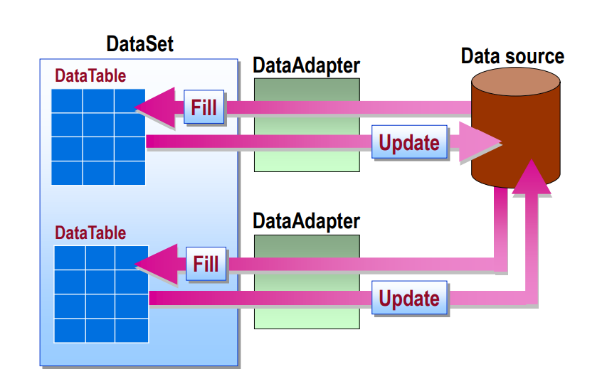
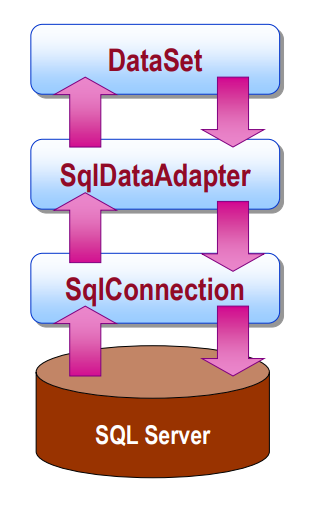

# ADO&#46;NET #
- [ADO&#46;NET](#adonet)
  - [Mi is az az **ADO&#46;NET**?](#mi-is-az-az-adonet)
  - [Connection](#connection)
  - [Command](#command)
    - [Előkészítés](#előkészítés)
    - [Végrehajtás](#végrehajtás)
      - [Tranzakciók](#tranzakciók)
    - [NULL](#null)
  - [Az eredmény](#az-eredmény)
    - [DataReader](#datareader)
    - [DataSet](#dataset)
  - [Veszélyforrások](#veszélyforrások)
    - [Connection string](#connection-string)
    - [SQL injection](#sql-injection)
    - [Connection leak](#connection-leak)

## Mi is az az **ADO&#46;NET**? ##
Adatvezérelt alkalmazásokban fontos, hogy az adatelérési réteg *kényelmes, egyszerű metodikákat* biztosítson az adatbázissal való kommunikációra, összetett lekérdezések könnyebb megfogalmazására, mindezt magától az *adatbázistól függetlenül*.

A Microsoft által fejlesztett **ADO** (*ActiveX Data Object*) egy **adatelérési osztálykönyvtár**, mely pont ezeket az igényeket hivatott kielégíteni. A **.NET Framework** részeként gazdag eszköztárat szolgáltat adatvezérelt alkalmazások készítéséhez, egyszerű hozzáférést biztosítva az alkalmazásból relációs adatbázisokhoz, *függetlenül az adatbázis konkrét példányától és típusától*.

Az **ADO&#46;NET** mindezek mellett azért lenyűgözően erős eszköz, mert egységes, adatbázisfüggetlen kódolást tesz lehetővé. A könyvtár interfészeket és absztrakt osztályokat tartalmaz, amiknek többféle implementációja (*pl. Microsoft SQL Server-hez, vagy OleDB*) létezik.  Ezen implementációk megvalósítják az alap funkciókat, de ki is bővíthetik azokat.


> **ADO&#46;NET** osztálykönyvtár elhelyezkedése az adatvezérelt alkalmazás struktúrájában

Az adatelérési könyvtárak tipikus elemei:
- [Connection](#connection) - *adatbázis meghajtók, maga a kapcsolat*
- [Command](#command) - *paraméter-biztos utasítás*
- [ResultSet](#az-eredmény) - *maga az eredmény halmaz*
- **Exception** - *kivételek, melyek a lekérdezések, végrehajtások során dobódhatnak*

Az elemeket a következő fejezetekben részletesebben is tárgyaljuk.

## Connection ##
Az **ADO&#46;NET** könyvtár az `IDbConnection` interfészt biztosítja adatbázis kapcsolatok reprezentálására. Ebben találhatóak azok a függvények, amik szükségesek valamilyen adatbázissal való kapcsolat létrehozásához, mint például az `open()`, a `close()`, vagy a `beginTransaction()`. Ettől az interfésztől örökölnek az adatbázis specifikus kapcsolatok, mint például az `SqlConnection`.

Ha az adatbázissal való összes kommunikációt, és ennek megfelelően egy kapcsolat felépítését is költségesnek tekintjük, akkor máris értelmet nyer a **connection pooling** kifejezés: **connection pooling**-nak nevezzük azt, amikor egy kapcsolat létrehozása, használása, majd bezárása után a kapcsolatot nem eldobjuk, hanem egy gyűjtőbe, egy "pool"-ba helyezzük (*cache-eljük*), hogy később újra fel tudjuk használni, ha az adatbázishoz szeretnénk szólni. Ennek használata implementáció kérdése, de az *MS SQL Server* és *OleDD* implementációk is alkalmazzák. **Connection pool**-ok **Connection string-enként** jönnek létre. Ezen kontextushoz tartozik még a [**Connection leak**](#connection-leak) fogalma is, ami azt jelenti, hogy egy kapcsolatot használat után nyitva hagyunk (*nem hívunk* `close()`*-t*), ezáltal az nem kerül bele a pool-ba, és nem tudjuk újrafelhasználni!

Az adatbázissal való kapcsolat létrehozásához szükségünk van egy az előbb említett **Connection string**-re! Ez a szöveges változó írja le, hogy milyen paraméterekkel szeretnénk az adatbázishoz csatlakozni! Ilyen például a felhasználónév, jelszó, vagy éppen a szerver címe! 

> A **Connection string**-eknek adatbázis szerver típusonként eltérő szintaktikájuk lehet, és [veszélyforrásokat](#connection-string) is rejthetnek magukban. 

**Példa** kapcsolat létrehozására `StringBuilder`-rel:
```cs
var builder = new SqlConnectionStringBuilder();
builder.UserID = "User";
builder.Password = "Pw";
builder.DataSource = "database.server.hu";
builder.InitialCatalog = "Adatvez";

var conn = new SqlConnection(builder.ConnectionString);
conn.Open();
... //lekérdezések, eljárások végrehajtása
conn.Close(); //nem felejtjük el bezárni, hogy elkerüljük a Connection leak-et
```

## Command ##
Az adatbázis kapcsolat létrehozása után szeretnénk az adatbázissal kommunikálni, lekérdezéseket, eljárásokat futtatni. Ehhez az **ADO** az `IDbCommand` interfészt biztosítja, ami egy utasítást reprezentál.

### Előkészítés ###
Az `IDbCommand` alábbi főbb *property*-jeit beállítva tudjuk megmondani, hogy a megadott parancs, hogyan legyen értelmezve, és miként viselkedjen az utasítás:
- `CommandType`:  háromféle lehet
-- Tárolt eljárás (*StoredProcedure*)
-- Tábla teljes tartalmához hozzáférés (*TableDirect, nem minden implementáció használja, pl. OleDB igen*)
-- SQL query (*Text*) - alapértelmezett
- `CommandText`: maga a parancs szövege
- `Connection`: az adatbázis kapcsolat
- `Transaction`: a tranzakció
- `CommandTimeout`: timeout arra az esetre, ha valami elakad (*alapértelmezetten 30s*)
- `Parameters`: paraméterek, az [SQL injection támadás](#veszelyforrasok) kivédéséhez

### Végrehajtás ###
Miután előkészítettük a `Command`-ot, végre is hajthatjuk azt. Ehhez többféle lehetőség közül is választhatunk, attól függően, hogy mit várunk visszatérési értéknek.

- `ExecuteReader`: több rekord lekérdezése 
- `ExecuteScalar`: skalár érték lekérdezése
- `ExecuteNonQuery`: olyan lekérdezés, amit nem eredményhalmazt ad vissza (pl. INSERT) - az érintett sorok számát adja helyette vissza
- `ExecuteXmlReader` (MS SQL Server): XML dokumentumot (`XmlReader`* objektum*) ad vissza, az eredmény egy rekord egyetlen XML oszlopa 

Parancsokat újrafelhasználni is tudunk, a `Command.Prepare()` (*szerver oldalon előkészíti a parancs futtatását*) hívás után, ám ez csak akkor éri meg, ha elegendően sokszor futtatjuk az utasítást, mivel az előkészítés és előkészülten tartás idő- és erőforrásigényes. 

**Példa** parancs használatára:
```cs
//kapcsolatot létrehozása, megnyitása
...
var command = new SqlCommand();
command.Connection = connection;
command.CommandType = CommandType.StoredProcedure;
command.CommandText = "salesByCategory"; //StoredProcedure, ezért elég a tárolt eljárás nevét megadni


var parameter = new SqlParameter();
parameter.ParameterName = "@CategoryName"; //ilyen néven kerül bele a lekérdezésbe
parameter.SqlDbType = SqlDbType.NVarChar;
parameter.Value = categoryName; 
//valahol már létrehoztuk a categoryName változót

command.Parameters.Add(parameter);
//SQL injection elleni védelem

var reader = command.ExecuteReader();
```

#### Tranzakciók ####
Lehetőség van "hagyományos" **SQL** tranzakciók használatára is, erre az alábbi kódrészlet mutat példát:

```cs
//Connection string megalkotása
...
using (SqlConnection connection = new SqlConnection(connectionString)){
    connection.Open();
    
    SqlCommand command = connection.CreateCommand();
    SqlTransaction transaction = connection.BeginTransaction("TemplateTransaction"); //a BeginTransaction paramétere az induló tranzakció neve, de megadható az izolációs szint is, vagy akár mindkettő
    
    command.Connection = connection;
    command.Transaction = transaction;
    try{
        command.CommandText = "INSERT into CarTable (Description) VALUES('valamifele leíras')";
        command.ExecuteNonQuery();
        
        transaction.commit();
        Console.WriteLine("Sikeres tranzakció!");
    }catch(Exception commitException){
        Console.WriteLine("Commit Exception Type: {0}", commitException.GetType());
        Console.WriteLine("  Message: {0}", commitException.Message);
        
        try{
            transaction.RollBack();
        }catch(Exception rollBackException){
            Console.WriteLine("Rollback Exception Type: {0}", rollBackException.GetType());
                Console.WriteLine("  Message: {0}", rollBackException.Message);
        }
    }
}
```

Timeout is tartozik a tranzakciókhoz, ami a [MachineConfig](https://docs.microsoft.com/en-us/dotnet/api/system.transactions.configuration.machinesettingssection.maxtimeout?view=netframework-4.8)-ban van rögzítve.

Fontos, hogy egy tranzakció egy `Connection` objektumhoz tartozzon, különben MSDTC (*Microsoft Distributed Transaction Coordinator*) használata szükséges!

### NULL ###
Logikus lenne azt gondolni, hogy ha a lekérdezésünk eredménye üres halmaz, akkor azt az `== null` kifejezéssel tudjuk ellenőrizni. Az is logikus lenne, hogy ha egy visszaadott eredmény halmaz valamely rekordjának oszlopában nem szerepel adat, azt is az `== null` kifejezéssel tudjuk vizsgálni.
 > :bangbang: **VIGYÁZAT**
 > Ezen állítások egyike sem igaz! 
 
 Nem szabad elfelejtenünk, hogy adatbázis kontextusban tárgyaljuk a korábban említetteket és az adatbázisok `Null` értéke korántsem ekvivalens a **C#**-os `null`-al! Sőt! A `Null` adatbázis típusonként is eltérő értéket vehet fel, az oszlop típusától függően akár! 
 
 1) Ha a lekérdezés által visszaadott sorok számát akarjuk vizsgálni, akkor felhasználhatjuk, hogy az `ExecuteReader` egy `DataReader` objektumot ad vissza: `if(reader.HasRows);` 
 2) Ha az eredmény halmaz adott oszlopának értékét szeretnénk vizsgálni: `reader["oszlopnev"].IsNull;`
 3) Ha `Null` értéket akarunk manuálisan beszúrni egy új rekordba: pl. `SqlString.Null;`
 
## Az eredmény ##
Az **ADO&#46;NET** kétféle módot is biztosít az adatok adatbázisból való olvasására: `DataReader` és `DataSet`. A két megoldás közti fő különbség a kapcsolat használatában és az adatokkal való bánásmódban van. Két modellt különböztetünk meg: **kapcsolat alapút** (`DataReader`) és **kapcsolat nélkülit** (`DataSet`). A kapcsolat alapú modellben a kapcsolat az adatbázissal végig fennmarad, miközben lekérdezéseket hajtunk végre, míg a kapcsolat nélküli modellben egy `DataSet`-en végzünk módosításokat és ezt szinkronizáljuk az adatbázissal, de a kapcsolat csak a szinkronizáció idejére jön létre. Mindegyiknek megvannak a maga előnyei és hárányai, amiket a következő részekben fogunk tárgyalni.

### DataReader ###

A kapcsolat fennálása alatt aktuális adatok érkeznek az adatbázisból, rövid ideig, de folyamatosan nyitva marad a kapcsolat.

**Feldolgozás lépései:**
- kapcsolat megnyitása
- parancs futtatása
- eredmény feldolgozása
- reader lezárása :bangbang:
- kapcsolat lezárása :bangbang:


> `DataReader` kapcsolati lánc az adatbázisig

**Példa** `DataReader` használatára: 
```cs
using(var conn = new SqlConnection(connectionString){
  var command = new SqlCommand("SELECT ID, NAME FROM Product", conn);
  
  conn.Open();
  using(var reader = command.ExecuteReader()){
      while(reader.Read()){
          Console.WriteLine("{0}\t{0}", reader["ID"], reader["Name"]);
      }
      //a using miatt nem kell reader.Close();
  }
  //a using miatt nem kell conn.Close();
}
```
> :warning: Pár dologra azért érdemes odafigyelni!
- A `reader["ID"]` object lesz, nem típusos a példában szereplő helyen még. Helyettesíthető `reader.GetType(lekérdezésben_az_oszlop_indexe);` hívással. 
- Ha olyan helyen szeretnénk értékül adni, ahol nem kompatibilisek a típusok -> **futás idejű hiba**. 
- Ha az adatbázisban valamelyik oszlopban `Null` érték van -> **futás idejű hiba**, helyette `reader.IsDBNull(lekérdezésben_az_oszlop_indexe);` ha ez `false`, akkor értékül adhatjuk, egyébként típusnak megfelelő `Null`-t adjunk értékül.

> :ballot_box_with_check: **Előnyők**

- egyszerűbb konkurenciakezelés
- az adatok mindenhol a legfrissebbek
- kisebb memória igény

> :x: **Hátrányok** 

- folyamatos hálózati kapcsolat
- rossz skálázhatóság

### DataSet ###

A `DataSet` egyfajta *cache*-nek tekinthető. Egy `adapter` (pl. `SqlDataAdapter`) segítségével kéri le az adatbázisból az adatokat, és tárolja el őket, majd zárja a kapcsolatot az adatbázissal. Ezt követően ezen a `DataSet`-en tudunk módosításokat végezni, majd egy új kapcsolatban az `adapter` segítségével "visszatölteni" (`update`) azt  az adatbázisba. Érdemes megjegyezni, hogy a lekérés és az update között eltelt idő alatt más módosíthatja ugyanazt az adatbázist, ezért is hátránya a `DataSet`-nek a konkurens hozzáférésekből adódó ütközés, és a már korábban a tranzakciókezelésnél megismert konkurens adathozzáférési problémák.

**Feldolgozás lépései:**
- kapcsolat megnyitása
- `DataSet` feltöltése
- kapcsolat lezárása :bangbang:
- `DataSet` feldolgozása
- kapcsolat megnyitása
- változtatások visszatöltése
- kapcsolat lezárása :bangbang:


> Az adatelérés működése `adapter`-rel kapcsolat nélküli modellben. Érzékelteti, hogy könnyen történhet módosítás az adatbázison egy kiolvasás és egy update között.


> `DataSet` kapcsolati lánc az adatbázisig

**Példa** `DataSet` használatára: 
```cs
var dataSet = new DataSet();
var adapter = new SqlDataAdapter();

//kapcsolatot nyitunk, feltöltjük a DataSet-et az adatbázisból, majd zárjuk a kapcsolatot
using(var conn = new SqlConnection(connectionString)){
    adapter.SelectCommand = new SqlCommand("SELECT * FROM Product", conn);
    
    conn.Open();
    adapter.Fill(dataSet);
}
-------------------------------------------------------
//dolgozunk az adatokkal/adatokon
foreach(var row in dataSet.Tables["Product"].Rows)
    Console.WriteLine("{0}\t{1}", row["ID"], row["Name"]);
-------------------------------------------------------
//kapcsolatot nyitunk, update-eljük az adatbázist, majd zárjuk a kapcsolatot
using(var conn = new SqlConnection(connectionString)){
    conn.Open();
    adapter.Update(dataSet);
    //dataSet.AcceptChanges(); -- így csak az adapter frissülne, az adatbázis nem
}
```
> :warning: Érdemes megfigyelni, hogy az `adapter` csak a `Command`-on keresztül kommunikál az adatbázissal. Egy `adapter` több ilyen `Command`-ot is használhat, ezáltal több `Connection`-nel akár több adatbázison is dolgozhatunk ugyanazon `DataSet`-tel.

> :ballot_box_with_check: **Előnyők**

- ütközések lehetnek
- az adatok nem mindig a legfrisebbek
- kliens memóriát foglal

> :x: **Hátrányok**

- nem szükséges folyamatos hálózati kapcsolat
- jó skálázhatóság

## Veszélyforrások ##
### Connection string ###
A **Connection string** megalkotása nagyon hasonló hibát rejt magában, mint az **SQL injection**. Itt is arról van szó, hogy elkérünk, valamiféle, például a felhasználó által megadott adatot (*pl. felhasználónév, jelszó*), de sosem tudhatjuk, hogy pontosan mit fogunk kapni. A **Connection string** kulcs-érték párokból áll és sok adatbázis *last-wins* elvet alkalmaz ezekre. Ez a gyakorlatban azt jelenti, hogy ha egy kulcsra több érték is meg van adva a string-ben, akkor az jut érvényre, ami később szerepel benne. Vagyis, ha a begépelt felhasználónév, és jelszó után, jön egy olyan kulcs-érték pár, ami már szerepelt a string-ben, akkor az új felülírja a régit, ez pedig nagy kockázatot rejt magában. 

> :heavy_check_mark: **MEGOLDÁS:** `ConnectionStringBuilder` használata (***lásd: [Connection rész](#connection)***)

### SQL injection ###
Az **SQL injection** az a **súlyos hiba**, amikor úgy kreálunk egy lekérdezést, hogy a benne szereplő paraméterek értékét nem ellenőrizzük futtatás előtt. A paraméterek érkezhetnek mondjuk kliens oldalról, felhasználó által kiválasztott, vagy megadott adatokkal. A probléma viszont az, hogy nem tudjuk, hogy a felhasználó mit ír be, vagy akár a megjelenítési réteg után és az adatelérési réteghez érkezés előtt is módosíthatók ezek az értékek. Előfordulhat tehát, hogy ahova egy felhasználónevet várnánk, oda a `Monkey92); DROP TABLE Users;--` érték érkezik, ezzel végrehajtva egy táblának a törlését. Noha nem minden esetben visszafordíthatatlan dologról van szó, de kifejezetten **súlyos hiba** az ilyet megengedni!

> :heavy_check_mark: **MEGOLDÁS:** Praméterek használata (***lásd: [Command rész parancs létrehozása példa](#connection)***)

### Connection leak ###
Noha nem kifejezetten veszélyforrás, de mindenképpen hiba olyan kódot írni, amiben nem zárunk le minden `Connection`-t! Ahányszor a lezáratlan kapcsolatot tartalmazó a kódrész végrehajtódik, annyiszor elhasználunk egy `Connection`-t a pool-ból, a végén pedig nem marad több, és az alkalmazásunk megakad. 

> :heavy_check_mark: **MEGOLDÁS:** `using` blokk használata a kapcsolat megnyitására, mert így a blokk végén lezáródik a kapcsolat (***lásd: [Tranzakció rész példa](#tranzakciok)**, vagy [DataReader](#datareader), vagy [DataSet](#dataset)*)

> Megjegyzés: A `DataReader`-t hasonlóan le kell zárni, és ugyanúgy használható rá a `using` is.
