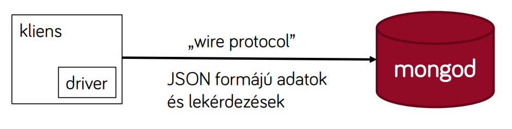

# MongoDB alapok, műveletek, és a MongoDB .NET Driver

## NoSQL adatbázisok

A NoSQL adatbázisok a relációs sémától eltérően működő adatbázisok összefoglaló neve. A név valamennyire megtévesztő, mert a fogalomnak kevés köze van az SQL nyelvhez - ehelyett a releváns különbség az adatreprezentációban és a sémában van. De mégis miért van szükségünk új fajta adatbázisokra, amikor a relációs adatbázisok régóta jól használhatóak? Egy kis méretű adatbázis egyszerű sémával könnyen leírható relációs modellben, még kényelmes is. De az alkalmazásaink fejlődnek, egyre több funkciót kell ellátniuk, ezzel együtt komplexebbé válik a séma is, illetve egyre több adatot kell eltárolni és nő az adatbázis. Ez egy bizonyos határ felett komplikálttá válik.

A relációs adatbázisok hátránya, hogy a folyamatos változások, séma változtatást igényelnek. Ahhoz, hogy ezt karban tudjuk tartani folyamatosan migrálni kell az adatokat és ez nem egyszerű feladat. Továbbá teljesítmény problémákkal, azaz inkább konzisztencia- és skálázási problémákkal járhat, ha relációs adatbázist használunk - ezzel azonban nem foglalkozunk mélyebben.

Ezekre a problémákra a NoSQL adatbázisok nyújtanak megoldást. Ebben a világban **elhagyjuk a szigorú sémákat, helyette egy flexibilis sémát fogunk alkalmazni**. Azaz nem lesznek erős elvárásaink az adatbázisban tárolt adatokkal szemben.

## A MongoDB alap koncepciói

A MongoDB egy kliens-szerver architektúrájú nem-relációs adatbázis. A kép jobb oldalán látható a _mongod_, azaz Mongo démon, vagyis az a processz, ami az adatbázis elérését biztosítja. A másik oldal a mi alkalmazásunk, ahonnan a kliens kapcsolódik a szerverhez egy hálózati kapcsolaton keresztül. Ez a hálózati kapcsolat az ún. _wire protocol_-on keresztül történik, ez a MongoDB saját protokollja. Ebben a protokollban JSON formájú adat kommunikáció zajlik binárisan (azaz BSON).



### Logikai felépítés

Egy MongoDB-alapú adatbázis rendszer legfelső rétege az ún. _klaszter_, ebbe szervezzük a szervereket. Mi klaszterekkel ebben a tárgyban nem foglalkozunk, azok a skálázás eszközei. A második szint a szerver szintje (a _mongod_ processz), ami alatt az adatbázis foglal helyet. Egy szerver/klaszter több adatbázist tárolhat. Az adatbázisok pedig gyűjteményekből (_collection_) épülnek fel. Ha a relációs adatbázisokkal meg akarjuk feleltetni, akkor a gyűjtemények a táblák megfelelői, ezen belül a sorok/rekordok pedig a gyűjteményben tárolt _dokumentumok_ lesznek.

Nézzük ezeket pontosabban.

#### Dokumentum

A dokumentum a MongoDB alap tárolási egysége. Egy dokumentum egy JSON (jellegű) fájl, tehát kulcs-érték párokat tartalmaz. Maga a MongoDB BSON-ként, bináris reprezentációként tárolja mindezt.

```csharp
{
    name: "sue",
    age: 26,
    status: "A",
    groups: [ "news", "sports"]
}
```

Kulcsoknak többnyire bármilyen szabad szöveget választhatunk, de a neveknek egyedinek kell lenniük és nem kezdődhetnek a `$` karakterrel. A nevek case sensitive-ek. Az érték lehet szöveg, szám, dátum, bináris, beágyazott elem, `null`, vagy akár a fenti példában a `groups` kulcsnál láthatóan tömb is - relációs adatbázisban ezt így nem lehet reprezentálni.

Az objektum orientált világban egy dokumentum felel meg egy objektumnak. Fontos megkötés, hogy a dokumentumok maximális mérete 16MB lehet, és ez nem konfigurálható érték.

#### Gyűjtemény

Relációs tábla analógiája a gyűjtemény, de nincs sémája, így ezeket létrehozni, definiálni se kell, első használatkor a rendszer automatikusan létrehozza őket. Úgy fogalmazhatjuk meg, hogy a gyűjtemény a "hasonló" dokumentumok gyűjtőhelye. Bár nincs séma, _indexeket_ ennek ellenére definiálhatunk a gyűjteményeken, amely a gyors keresést fogják segíteni. Séma hiányában nincs tartományi integritási kritérium, tehát például a helyes adattípusok és tartományi kritériumok biztosításában az adatbázis nem nyújt segítséget.

#### Adatbázis

Az adatbázis ugyanazt a célt szolgálja, mint relációs adatbázisban. Ez fogja össze az alkalmazás adatait logikailag. Illetve hozzáférési jogosultságokat adatbázis szinten tudunk adni. Az adatbázisok neve case sensitive és konvenció szerint tipikusan csupa kisbetű.

#### Kulcs

Minden dokumentum egyértelmű azonosítója az `_id` mező, mást kulcsot nem tudunk definiálni. Ezt a mezőt beszúráskor nem szükséges explicit megadni (de lehet), tipikusan a kliens driver vagy a szerver generálja (alapértelmezésben egy 12 bájtos `ObjectId`-t készít).

Az `_id` mezőtől függetlenül egyediséget indexek segítségével tudunk garantálni. Amennyiben szükséges, definiálhatunk tehát más, kulcs-szerű mezőket is. Az így definiált egyedi mezők lehetnek összetettek is (tehát lehet több mező együttes egyediségét előírni).

Külső kulcs hivatkozások MongoDB-ben nincsenek. Tudunk hivatkozni más dokumentumokra azok kulcsainak bemásolásával, azonban ezekre a rendszer nem vállal garanciát (pl. a hivatkozott dokumentum törölhető).

## MongoDB műveletek és a MongoDB .NET Driver

!!! note ""
    Az alábbi, illusztrációra használt kódrészletek a hivatalos [MongoDB.Driver](https://www.nuget.org/packages/mongodb.driver) Nuget csomagot használják.


## Kapcsolat létesítése

A MongoDB adatbázis eléréséhez első lépésben szükségünk van egy kapcsolatra. A kapcsolatot egy `MongoClient` osztály reprezentálja. A kapcsolathoz szükségünk van a szerver elérhetőségére (a connection stringről részletesebben lásd: <https://docs.mongodb.com/manual/reference/connection-string/>).

```csharp
var client = new MongoClient("mongodb://localhost:27017");
```

A kapcsolatot singleton-ként érdemes kezelni, nem kell Dispose-olni.

!!! info "Kapcsolat életciklusa"
    A kapcsolatot tipikusan egy globális statikus változóban tároljuk, avagy a környezet által támogatott IoC (Inversion of Control) / DI (Dependency Injection) tárolóban helyezzük el.

Az adatbázis neve szerepelhet ugyan a connection stringben (pl. `mongodb://localhost:27017/adatvez`), azt csak az authentikációhoz használja a rendszer. Így a kapcsolat felépítése után meg kell adnunk, milyen adatbázist fogunk használni.

```csharp
var db = client.GetDatabase("adatvez");
```

Az adatbázisnak nem kell előzetesen létezni. A fenti hívás hatására, ha még nem létezik az adatbázis, automatikusan létrejön.

## Gyűjtemények kezelése

Egy relációs adatbázistól eltérően **MongoDB-ben a műveleteinket mindig egyetlen gyűjteményen végezzük**, így a gyűjtemény kiválasztása nem a kiadott parancs része (mint az SQL nyelvben a `from`), hanem a művelet előfeltétele. Egy adott gyűjteményt a `GetCollection` hívással kaphatunk meg, generikus paramétere a dokumentum típust megvalósító C# osztály.

```csharp
var collection = db.GetCollection<BsonDocument>("products");
```

A .NET MongoDB driver alap koncepciója szerint minden dokumentumot leképez egy .NET objektumra. Ezzel automatikusan megvalósítja az ún. _ODM (Object Document Mapping)_ funkciót. Az ODM az ORM megfelelője a NoSQL adatbázisok világában.

!!! warning ""Nyers" json"
    Más nyelveken és platformokon a MongoDB driverek nem mindig végzik el a leképezést objektumokra, így az interneten található példákban gyakran "nyers" JSON dokumentumokon keresztüli kommunikációt mutatnak. Igyekezzünk ezt elkerülni, ahogy az ORM témakörében megtanultuk, kényelmesebb és biztonságosabb az objektumorientált leképzés.

Az előző példában `BsonDocument` típusú dokumentumot használunk. A `BsonDocument` egy általános dokumentum reprezentáció, amiben kulcs-érték párokat tárolhatunk. Használata kényelmetlen és nem típusbiztos, ezért általában nem ezt a megoldást használjuk. A javasolt megoldást lásd hamarosan.

A gyűjteményt reprezentáló változón tudunk további műveleteket futtatni, például beszúrunk egy dokumentumot, majd listázzuk a gyűjtemény tartalmát. A gyűjtemény első használatkor automatikusan létre fog jönni, azaz semmilyen módon nem szükséges definiálnunk.

```csharp
collection.InsertOne(new BsonDocument()
{
    { "name", "Apple" },
    { "categoryName", "Apple" },
    { "price", 123 }
});

// minden dokumentum listázása: szükség van egy szűrési feltételre, ami itt
// egy üres feltétel, azaz minden dokumentumra illeszkedik
var list = collection.Find(new BsonDocument()).ToList();
foreach(var l in list)
    Console.WriteLine(l);
```

!!! important "Elnevezési konvenció"
    A dokumentumban a kulcs nevek konvenció szerint kisbetűvel kezdődnek, mint `price` vagy `categoryName` (ez az ún. _camel case_ írásmód). Ez a szokás a MongoDB világának megfelelő szemlélet historikus okokból. Hacsak nincs jó okunk rá, ne térjünk el ettől.

## Dokumentumok leképzése C# objektumokra

Ahogy a relációs adatbázisoknál láthattuk az objektum-relációs leképzést, MongoDB esetén is célszerű objektumokkal és osztályokkal dolgoznunk. A MongoDB .NET drivere ezt teljes mértékben biztosítja számunkra.

Első lépésként definiálnunk kell a C# osztályt, ill. osztályokat, amikre az adatbázis tartalmát leképezzük. Mivel itt nincs az adatbázisnak és táblának sémája, nem tudjuk a séma alapján gerálni a C# kódot (mint Entity Framework esetén csináltuk). Így ebben a világban inkább a _Code First_ elvet követjük, azaz a C# kódot készítjük el, és abból készül az adatbázis és gyűjtemény (habár tudjuk, hogy itt nincs szó az osztály alapján táblák létrehozásáról).

Definiáljuk a _Termékek_ reprezentáláshoz az alábbi osztályokat.

```csharp
public class Product
{
    public ObjectId Id { get; set; } // ez lesz az elsődleges kulcs helyett az _id azonosító
    public string Name { get; set; }
    public float Price { get; set; }
    public int Stock { get; set; }
    public string[] Categories { get; set; } // tömb értékű mező
    public VAT VAT { get; set; } // beágyazást alkalmazunk
}

public class VAT // mivel ez beágyazott entitás, így nem adunk neki egyedi azonosítót
{
    public string VATCategoryName { get; set; }
    public float Percentage { get; set; }
}
```

Figyeljük meg, hogy korábban `price` néven használtuk a dokumentumban a kulcsot, de a C# osztályban az ún. _Pascal Case_ szerint nagybetűvel kezdjük: `Price`. A MongoDB .NET drivere beépül a C# nyelvbe és a .NET környezetbe, és annak szokásait tiszteletben tartja, így az osztály definícióban szereplő mező nevek és a MongoDB dokumentumaiban a kulcsok leképzése automatikusan meg fog történni, a `Price` osztály tulajdonságból `price` kulcs név lesz a dokumentumban.

### A leképzés testreszabása

A C# osztály - MongoDB dokumentum leképzés automatikus, de testreszabható. Amennyiben el szeretnénk térni az alap konvencióktól, több féle módon is megtehetjük.

A legegyszerűbb, ha az osztály definíciójában attribútumokkal jelöljük a testreszabást:

```csharp
public class Product
{
    // _id mezőre képződik le
    [BsonId]
    public ObjectId Azonosito { get; set; }

    // megadhatjuk a MongoDB dokumentumban használatos nevet
    [BsonElement("price")]
    public string Ar { get; set; }

    // kihagyhatunk egyes mezőket
    [BsonIgnore]
    public string NemMentett { get; set; }
}
```

Másik lehetőségünk magasabb szinten ún. konvenció-csomagokat beregisztrálni. A konvenció-csomagok általánosan leírják, hogyan történjen a leképezés. (Az alap viselkedés is egy konvenció-csomag alapján definiált.)

Például az alábbiakkal megadhatjuk, hogy camel case-re szeretnénk a mező neveket leképezni, valamint a default értékkel rendelkező adattagokat (C# nyelv szerint definiált default érték) szeretnénk kihagyni a dokumentumból.

```csharp
// konvenciók definiálása
var pack = new ConventionPack();
pack.Add(new CamelCaseElementNameConvention());
pack.Add(new IgnoreIfDefaultConvention(true));

// konvenciók beregisztrálása
// az első paraméter egy név
// az utolsó paraméterrel szűrési feltételt adhatunk meg, hol használandóak a konvenciók
ConventionRegistry.Register("adatvez", pack, t => true);
```

Ennél bonyolultabb testreszabásokra is lehetőségünk van, például definiálhatunk konverziós logikát a C# reprezentáció és a MongoDB reprezentáció közötti fordításhoz, illetve megadhatjuk a leszármazási hierarchia mentésének módját. Ezekről részletesebben a hivatalos dokumentációban: <https://mongodb.github.io/mongo-csharp-driver/2.8/reference/bson/serialization/>.

## Lekérdezések

A továbbiakban a típusos, `Product` osztályra leképző módon használjuk a gyűjteményt, és így végzünk műveletet. Ez a javasolt megoldás, a `BsonDocument` alapú megoldást csak szükség esetén használjuk.

A legegyszerűbb lekérdezést már láthattuk, listázzunk minden dokumentumot:

```csharp
var collection = db.GetCollection<Product>("products");

var lista = collection.Find(new BsonDocument()).ToList();
foreach (var p in lista)
    Console.WriteLine($"Id: {p.Id}, Name: {p.Name}");
```

A listázás a `Find` metódussal történik. Az elnevezés jól mutatja a MongoDB filozófiáját: az adatbázis keresésre való, minden elem listázása nem praktikus, ezért nincs is rá egyszerű szintaktika. A `Find` egy keresési feltételt vár, ami itt egy üres feltétel, azaz mindenre illeszkedik.

A keresési feltételt több féle módon leírhatjuk.

A **`BsonDocument`** alapú szűrésben nyersen, a MongoDB szintaktikája szerint kell megírni a szűrési feltételt. Erre lehetőségünk van ugyan, de elkerüljük, mert a MongoDB .NET drivere ezt megoldja számunkra, ha az alábbiak szerint adjuk meg a keresési feltételt.

A legtöbb esetben egy **Lambda-kifejezéssel** leírhatjuk a feltételt.

```csharp
collection.Find(x => x.Price < 123);
```

Ilyenkor a Lambda-kifejezés egy `Predicate<T>` típusú delegate, azaz a megadott osztálytípuson (itt: `Product`) fogalmazzuk meg, és `bool` visszatérési értékű. Tehát a fenti példában az `x` változó egy `Product` objektumot reprezentál. Ez a keresés működik természetesen bonyolultabb esetekre is.

```csharp
collection.Find(x => x.Price < 123 && x.Name.Contains("red"));
```

A Lambda kifejezésekkel leírt szűrési feltételek elrejtik, hogy a MongoDB-ben valójában milyen keresési feltételeink is vannak. Például az előbbi `Contains` keresési feltétel egy reguláris kifejezéssel való keresést fog valójában jelenteni.

A MongoDB saját nyelvén az előbbi szűrés így néz ki:

```json
{
  "price": {
    "$lt": 123.0
  },
  "name": "/red/s"
}
```

Vegyük észre, hogy ez a fajta leírás önmaga is egy dokumentum. Ha saját magunk akarnánk megírni a szűrési feltételt, akkor egy `BsonDocument`-ben kellene ezt a dokumentumot összeállítanunk. A szűrési feltételt leíró dokumentum kulcsai a szűréshez használt mezők, az érték pedig a szűrési feltétel. A feltétel bizonyos esetekben egy skalár érték, mint a reguláris kifejezés (vagy ha egyenlőségre szűrnénk), más esetekben a feltétel egy beágyazott dokumentum, mint a `<` feltétel esetén. Ebben az `$lt` kulcs egy speciális kulcs, azt jelöli, hogy a _less than_ operátorral kell a kiértékelés végezni, és az operátor jobb oldalán a 123.0 érték áll. A reguláris kifejezést a [JavaScript RegExp szintaktika](https://www.w3schools.com/jsref/jsref_obj_regexp.asp) szerint kell megadni. Az ilyen módon felsorolt feltételek automatikusan _és_ kapcsolatba kerülnek.

A Lambda-kifejezés helyett egy hasonló leírást magunk is előállíthatunk anélkül, hogy szöveges formában kellene összeállítanunk a szűrési feltételt. A MongoDB .NET drivere lehetőséget ad nekünk arra, hogy egy ún. **_builder_** segítségével építsük fel a szűrési feltételt.

```csharp
collection.Find(
    Builders<Product>.Filter.And(
        Builders<Product>.Filter.Lt(x => x.Price, 123),
        Builders<Product>.Filter.Regex(x => x.Name, "/red/s"),
    )
);
```

A fenti szintaktikai kicsit bőbeszédűbb ugyan, mint a Lambda-kifejezés, de közelebb áll a MongoDB világához, és jobban leírja, mit is szeretnénk valójában. Tekinthetünk erre a szintaktikára úgy, mint az SQL nyelvre: deklaratív, célorientált, de a platform képességeit szem előtt tartó leírás. Emellett azonban típusbiztos is.

A `Builders<T>` generikus osztály egy segédosztály, amivel szűrési, és később látni fogjuk, egyéb MongoDB specifikus definíciókat építhetünk fel. A `Builders<Product>.Filter` a _Product_ C# osztályhoz illeszkedő szűrési feltételek definiálására használható. Először egy _és_ kapcsolatot hozunk létre, amelyen belül két szűrési feltételünk lesz. Az operátorok a korábban látott _less than_ és a reguláris kifejezés. Ezen függvényeknek két paramétert adunk át: a mezőt, amire szűrni szeretnénk, és az operandust.

!!! note "_Expression_ szintaktika"
    Vegyük észre, hogy se itt, se a Lambda-kifejezésekben nem használtunk string alapú mezőneveket, mindenhol ugyanazzal a szintaktikával (ez a _C# Expression_) az osztálydefinícióra hivatkoztunk. Ez azért praktikus így, mert elkerüljük a mezőnevek elgépelését.

Valójában mindegyik leírás, amit használtunk, ugyanazt a szűrési feltételt jelenti. A MongoDB driver mindegyik szintaktikát leképezi a saját belső reprezentációjává. A Lambda-kifejezés alapú kevesebb karaktert igényel, és jobban illeszkedik a C# nyelvbe, míg az utóbbi a MongoDB sajátosságainak kifejezésére való. Bármelyiket használhatjuk.

### Lekérdezés eredményének felhasználása

A `collection.Find(...)` függvény eredménye még nem az eredményhalmaz, hanem csak egy leíró a lekérdezés végrehajtásához. Az eredmény általában három féle módon kérhető le és dolgozható fel.

#### Listázás

Kérjük a teljes eredményhalmazt egy listaként: `collection.Find(...).ToList()`.

#### Első/egyetlen elem lekérése

Amennyiben csak az első elemre van szükségünk, vagy tudjuk, hogy csak egy elem lesz, akkor használhatjuk a `collection.Find(...).First()`, `.FirstOrDefault()`, vagy `.Single()`, `.SingleOrDefault()` függvényeket.

#### Kurzor

Ha az eredményhalmaz sok dokumentumot tartalmaz, célszerű kurzorral feldolgozni. A MongoDB limitálja a lekérdezésre adott válasz méretét, ezért ha túl sok dokumentumot kérdezünk le, előfordulhat, hogy az eredmény helyett hibát fogunk kapni. Ennek feloldására használjuk a kurzorokat, ahol mindig csak egy részhalmazát kapjuk a dokumentumoknak.

```csharp
var cur = collection.Find(...).ToCursor();
while (cur.MoveNext()) // kurzor léptetése
{
    foreach (var t in cur.Current) // a kurzor aktuális eleme nem egy dokumentum, hanem egy lista
    { ... }
}
```

### Szűréshez használható operátorok

A szűrési feltételek a dokumentumban található mezőkre vonatkoznak, és a szűrési feltétel mindig egy konstans. Tehát **nem lehetséges például két mezőt összehasonlítani**, és nem tudunk más gyűjteményekre se hivatkozni. Létezik a MongoDB-ben egy ún. aggregációs pipeline, amely segítségével bonyolultabb lekérdezéseket is megfogalmazhatunk, most viszont az egyszerű lekérdezésekre koncentrálunk.

A szűrési feltétel tehát a dokumentum egy mezőjét egy általunk megadott konstanshoz hasonlítja. Az alábbi lehetőségek a leggyakrabban használtak.

#### Összehasonlítási operátorok

```csharp
collection.Find(x => x.Price == 123);
collection.Find(Builders<Product>.Filter.Eq(x => x.Price, 123)); //Eq, mint equals

collection.Find(x => x.Price != 123);
collection.Find(Builders<Product>.Filter.Ne(x => x.Price, 123)); // Ne, mint not equals

collection.Find(x => x.Price >= 123);
collection.Find(Builders<Product>.Filter.Gte(x => x.Price, 123)); // Gte, mint greater than or equal to

collection.Find(x => x.Price < 123);
collection.Find(Builders<Product>.Filter.Lt(x => x.Price, 123)); // Lt, mint less than
```

#### Logikai operátorok

```csharp
collection.Find(x => x.Price > 500 && x.Price < 1000);
collection.Find(
    Builders<Product>.Filter.And(
        Builders<Product>.Filter.Gt(x => x.Price, 500),
        Builders<Product>.Filter.Lt(x => x.Price, 1000)
    )
);

collection.Find(x => x.Price < 500 || x.Stock < 10);
collection.Find(
    Builders<Product>.Filter.Or(
        Builders<Product>.Filter.Lt(x => x.Price, 500),
        Builders<Product>.Filter.Lt(x => x.Stock, 10)
    )
);

collection.Find(x => !(x.Price < 500 || x.Stock < 10));
collection.Find(
    Builders<Product>.Filter.Not(
        Builders<Product>.Filter.Or(
            Builders<Product>.Filter.Lt(x => x.Price, 500),
            Builders<Product>.Filter.Lt(x => x.Stock, 10)
        )
    )
);
```

#### Több érték közül valamelyikkel megegyező

```csharp
collection.Find(x => x.Id == ... || x.Id = ...);
collection.Find(Builders<Product>.Filter.In(x => x.Id, new[] { ... }));
// hasonlóan létezik a Nin, mint not in operátor
```

#### Érték létezik (nem null)

```csharp
collection.Find(x => x.VAT != null);
collection.Find(Builders<Product>.Filter.Exists(x => x.VAT));
```

!!! note "Létezik-e"
    A létezik-e, azaz nem null szűrés azért különleges, mert a MongoDB szempontjából két módon is lehet null egy érték: ha a kulcs létezik a dokumentumban és értéke null; avagy, ha a kulcs nem is létezik.

### Szűrés beágyazott dokumentum mezőjére

A MongoDB szempontjából a beágyazott dokumentumok ugyanúgy használhatók szűrésre, tehát az alábbiak mind érvényesek, és az se okoz gondot, ha a beágyazott dokumentum (a példákban a _VAT_ nem létezik):

```csharp
collection.Find(x => x.VAT.Percentage < 27);
collection.Find(Builders<Product>.Filter.Lt(x => x.VAT.Percentage, 27));

collection.Find(Builders<Product>.Filter.Exists(x => x.VAT.Percentage, exists: false));
// ez a nem létezik, azaz null szűrés
```

### Szűrés tömb értékű mezőre

A dokumentum bármely mezője lehet tömb értékű, mint a példában a `string[] Categories`. MongoDB-ben a tömbökkel is egyszerűen tudunk dolgozni, az `Any*` szűrési feltételekkel.

```csharp
// azon termékeket, amelyek a jelzett kategóriában vannak
collection.Find(Builders<Product>.Filter.AnyEq(x => x.Categories, "Labdák"));

// azon termékeket, amelyek legalább egy olyan kategóriához tartoznak, amelyet nem soroltunk fel
collection.Find(Builders<Product>.Filter.AnyNin(x => x.Categories, new[] { "Labdák", "Ütők" }));
```

!!! note "Any..."
    Az `Any*` feltételek a tömb minden elemét vizsgálják, de a dokumentum szempontjából csak egyszer illeszkednek. Tehát, ha a tömb több eleme is illeszkedik egy feltételre, attól még csak egyszer kapjuk meg a dokumentumot az eredményhalmazban.

## Lekérdezés-végrehajtó pipeline

A MongoDB lekérdezések egy ún. pipeline-on haladnak végig. Ennek részleteivel nem fogunk megismerkedni, de az egyszerű szűréseken kívül pár további, lekérdezésekben használt elemet fogunk látni.

#### Lapozás, rendezés

A lapozáshoz megadatjuk, maximálisan hány illeszkedő dokumentumot kérünk:

```csharp
collection.Find(...).Limit(100);
```

A következő lapon található elemekhez pedig kihagyjuk az első lapon már látott elemeket:

```csharp
collection.Find(...).Skip(100).Limit(100);
```

A `Skip` és `Limit` ebben a formában nem értelmes, ugyanis rendezés nélkül az "első 100 elem" lekérdezés (a kliens számára) nem determinisztikus. Tehát az ilyen jellegű lekérdezésekhez szükséges, hogy egy megfelelő rendezést is megadjunk. A rendezés definiálása a korábban már látott `Builders<T>` segítségével történik.

```csharp
collection.Find(...)
    .Sort(Builders<Product>.Sort.Ascending(x => x.Name))
    .Skip(100).Limit(100);
```

!!! question "Lapozási probléma"
    A fenti lapozás még mindig nem teljesen helyes. Például, ha a két lap lekérdezése közben egy termék törlésre kerül, akkor "eggyel arrébb csúsznak" a termékek, és lesz egy termék, amely kimarad a következő lapozásnál. Ez nem csak a MongoDB problémája. Gondolkodtató feladat: hogyan oldható meg ez a probléma?

#### Darabszám lekérdezés

A lekérdezésre illeszkedő dokumentumok számát kétféle módon is lekérdezhetjük:

```csharp
collection.CountDocuments(Builders<Product>.Filter.AnyEq(x => x.Categories, "Labdák"));

collection.Find(Builders<Product>.Filter.AnyEq(x => x.Categories, "Labdák")).CountDocuments();
```

#### Csoportosítás

A csoportosítás szintaktikailag bonyolult művelet. A csoportosításhoz egy aggregációs pipeline-t kell definiálnunk. Ezzel részletesebben nem foglalkozunk, az alábbi példa mutatja a használatát.

```csharp
// A "Labdák" kategóriába tartozó termékek az ÁFA kulcs szerint csoportosítva
foreach (var g in collection.Aggregate()
                            .Match(Builders<Product>.Filter.AnyEq(x => x.Categories, "Labdák")) // szűrés
                            .Group(x => x.VAT.Percentage, x => x) // csoportosítás
                            .ToList())
{
    Console.WriteLine($"VAT percentage: {g.Key}");
    foreach(var p in g)
        Console.WriteLine($"\tProduct: {p.Name}");
}
```

## Beszúrás, módosítás, törlés

A lekérdezések után ismerkedjünk meg az adatmódosításokkal.

### Új dokumentum beszúrása

Új dokumentum beszúrásához az új dokumentumot reprezentáló objektumra van szükségünk. Ezt a gyűjteményhez tudjuk hozzáadni.

```csharp
var newProduct = new Product
{
    Name = "Alma",
    Price = 890,
    Categories = new[] { "Gyümölcsök" }
};
collection.InsertOne(newProduct);

Console.WriteLine($"Beszúrt rekord id: {newProduct.Id}"); // beszúrás után frissítésre kerül a C# objektum, és lekérdezhető az Id-ja
```

Figyeljük meg, hogy az `Id` mezőt nem töltöttük ki. Ezt a kliens oldali driver pótolni fogja. Ha akarjuk, mi is adhatunk neki értéket, de nem szokás.

Emlékezzünk rá, hogy a MongoDB-ben nincs séma, így a beszúrt dokumentum lehet teljesen eltérő a gyűjteményben található többi elemtől. Illetve figyeljük meg, hogy nem adtunk minden mezőnek értéket. Mivel nincsenek integritási kritériumok, így minden beszúrás sikerrel fog járni, viszont a lekérdezésnél lehetnek belőle problémák (pl. ha feltételezzük, hogy a raktárkészlet mindig ki van töltve).

Több dokumentum beszúrására az `InsertMany` függvény használható, azonban ne felejtkezzünk el arról, hogy nincsenek tranzakciók, így a több dokumentum beszúrása egyenként független művelet. Ha a beszúrások végrehajtása közben valamely okból hiba történik, az addig sikeresen beszúrt dokumentumok az adatbázisban maradnak. Az egyes dokumentumok azonban atomi módon kerülnek mentésre, tehát egy hiba során se kerülhet egy "fél" dokumentum az adatbázisba.

### Dokumentumok törlése

A törléshez egy szűrési feltételt kell definiálnunk, és vagy a `DeleteOne`, vagy a `DeleteMany` függvénnyel törölhetünk. A különbség, hogy a `DeleteOne` az _első_ illeszkedő dokumentumot törli csak, míg a `DeleteMany` az összeset. Ha tudjuk, hogy a feltételnek csak egy dokumentum felelhet meg (például id alapján törlünk), akkor érdemes a `DeleteOne`-t használni, mert az adatbázisnak nem kell kimerítő keresést végeznie.

A törlés feltétele a keresésnél megismert szintaktikákkal írható le.

!!! note ""
    A törlés tehát eltér az Entity Framework esetén tapasztalható viselkedésről. Itt nem kell az entitásnak betöltve lennie, és nem az entitást töröljük, hanem szűrési feltétellel írjuk le a törlést.

```csharp
var deleteResult = collection.DeleteOne(x => x.Id == new ObjectId("..."));
Console.WriteLine($"Törölve: {deleteResult.DeletedCount} db");
```

Ha szeretnénk a törölt elemet megkapni, akkor használhatjuk a `FindOneAndDelete`-t, amely visszaadja a törölt entitást magát.

### Dokumentumok megváltoztatása

A MongoDB talán legérdekesebb képességei a dokumentumok megváltoztatása körül találhatóak. Míg a korábbiak, a lekérdezések, beszúrások, törlések a legtöbb adatbázis (akár relációs, akár NoSQL) esetén hasonlóak, a MongoDB a módosító műveletekben jóval szélesebb spektrumot támogat.

Alapvetően két féle módon tudunk egy dokumentumot megváltoztatni: lecserélni az egész dokumentumot egy újra, avagy részeit frissíteni.

#### Dokumentum teljes cseréje

A dokumentum teljes cseréjéhez szükségünk van egy szűrési feltételre, amellyel megadjuk, mely dokumentumot akarjuk cserélni; valamint szükségünk van az új dokumentumra.

```csharp
var replacementProduct = new Product
{
    Name = "Alma",
    Price = 890,
    Categories = new[] { "Gyümölcsök" }
};
var replaceResult = collection.ReplaceOne(x => x.Id == new ObjectId("..."), replacementProduct);
Console.WriteLine($"Módosítva: {replaceResult.ModifiedCount}");
```

Ez a csere 1-1 jellegű, azaz egy dokumentumot cserélünk egy dokumentumra. A művelet magában atomi, azaz ha menet közben megszakad, akkor se fordulhat elő, hogy egy fél dokumentum került elmentésre. Ha szeretnénk megkapni a csere előtti dokumentumot, akkor a `FindOneAndReplace` metódust használhatjuk.

!!! note "Érdekesség"
    A csere során lehetőség van a dokumentum id-jának módosítására is. Ha a csere dokumentumban más id szerepel, a dokumentum id-ja megváltozik.

#### Dokumentum módosító operátorok

A dokumentum módosító operátorokkal atomi módon tudunk a dokumentum mezőinek értékén változtatni anélkül, hogy a teljes dokumentumot lecserélnénk. A módosító műveletek leírásához a korábban már látott `Builders<T>` segítségét vesszük igénybe.

Állítsunk be a raktárkészletet egy konstans értékre:

```csharp
collection.UpdateOne(
    filter: x => x.Id == new ObjectId("..."),
    update: Builders<Product>.Update.Set(x => x.Stock, 5));
```

Az `UpdateOne` függvény első paramétere a szűrési feltétel. Leírásához bármely korábban ismertetett szintaktika használható. Második paramétere a módosító művelet leírója, amelyet a `Builders<T>` segítségével építhetünk fel.

A fenti példakódban a paraméterek nevét is kiírtuk (`filter:` és `update:`), hogy egyértelmű legyen, paraméter mit jelképez. Ez nem kötelező, de az olvashatóságot növeli (a kódsorok hosszának rovására).

A módosítás nem csak egy műveletet tartalmazhat.

```csharp
collection.UpdateOne(
    filter: x => x.Id == new ObjectId("..."),
    update: Builders<Product>.Update
                .Set(x => x.Stock, 5) // raktárkészlet legyen 5
                .CurrentDate(x => x.StockUpdated) // mai dátumot beírjuk, mint a frissítés ideje
                .Unset(x => x.NeedsUpdate) // töröljük a frissítendő jelzést
);
```

A tipikusan használt módosító operátorok:

- `Set`: mező értékének beállítása;
- `SetOnInsert`: mint a `Set`, de csak új dokumentum beszúrása esetén fut le (lásd _upsert_ alább);
- `Unset`: mező törlése (a kulcs és érték eltávolítása a dokumentumból);
- `CurrentDate`: aktuális dátum beírása;
- `Inc`: érték növelése;
- `Min`, `Max`: mező értékének lecserélése, amennyiben a megadott érték kisebb/nagyobb, mint a mező jelenlegi értéke;
- `Mul`: érték megszorzása;
- `PopFirst`, `PopLast`: tömbből első/utolsó elem eltávolítása;
- `Pull`: tömbből érték eltávolítása;
- `Push`: tömbhöz érték hozzáadása a végére (további lehetőségek ugyanebben az operátorban: tömb sorrendezése, tömb első _n_ elemének megtartása);
- `AddToSet`: tömbhöz érték hozzáadása, ha még nem létezik.

A fenti műveletek akkor is értelmezettek, ha a megadott mező nem létezik. Az operátor típusától függően egy alapértelmezett értéken végzi a módosítást az adatbázis. Például az `Inc` és `Mul` esetén a mező 0 értéket vesz fel, és azon történik a módosítás. A tömb műveletek esetén egy üres tömb kerül módosításra. A többi művelet esetén [dokumentációból](https://docs.mongodb.com/manual/reference/operator/update/) kikereshető a viselkedés.

A fent látott módszerrel nem csak egyetlen dokumentum módosítható. A kért szerkesztő művelet több, a szűrési feltételre illeszkedő dokumentumon is elvégezhető.

Például: a nyári szezonra való tekintettel _minden_ labdára adjunk 25% engedményt, és adjuk őket hozzá az akciós kategóriához.

```csharp
collection.UpdateMany(
    filter: Builders<Product>.Filter.AnyEq(x => x.Categories, "Labdák"),
    update: Builders<Product>.Update.Mul(x => x.Price, 0.75)
                                   .AddToSet(x => x.Categories, "Akciós termékek"));
```

A módosító operátorok atomi módon teszik szerkeszthetővé a dokumentumainkat. Használatukkal kiküszöbölhető a konkurens adathozzáférésből eredő problémák egy része.

#### _Upsert_: beszúrás vagy módosítás

Módosító művelet során lehetőségünk van az ún. _upsert (update/insert)_ jellegű működésre. Ez azt jelenti, hogy vagy beszúrás, vagy módosítás történik, annak függvényében, hogy megtalálható volt-e az elem az adatbázisban. Az alapvető viselkedés _nem_ upsert, azt külön kérnünk kell.

```csharp
collection.ReplaceOne(
    filter: x => x.Id == new ObjectId("..."),
    replacement: replacementObject,
    options: new UpdateOptions() { IsUpsert = true });
```

Nem csak a teljes dokumentum cseréje esetén van lehetőségünk upsert-re. A dokumentum módosító operátorokkal is elvégezhetjük ugyanezt. Ahogy láthattuk, a módosító operátorokat nem zavarja, ha nem létezik egy mező. Ugyanígy nem okoz gondot, ha nem létezik a dokumentum; ez azzal egyenértékű, mintha egy teljesen üres dokumentumon végeznénk el a módosító műveleteket.

```csharp
collection.UpdateOne(filter: ..., update: ..., options: new UpdateOptions() { IsUpsert = true });
```

Az upsert művelet egy eszköz a konkurens módosítások terén a tranzakció hiányára. Mivel nincs tranzakciónk, ezért nem tudunk meggyőződni arról a beszúrás előtt, hogy még nem létezik egy adott rekord. Helyette használhatjuk az upsert módszert, ami atomi lekérdezést és beszúrást/módosítást tesz lehetővé.

!!! note "`merge`"
    SQL nyelvben a `merge` parancs nyújt erre hasonló megoldást.
