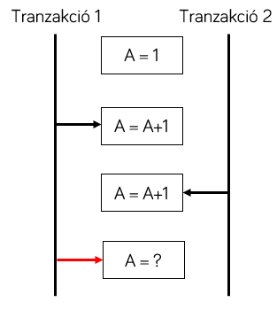

# Tranzakciókezelés adatbázisokban

!!! warning "Kontextus"
    Az alábbiak alapvetően **relációs adatbázisokra** vonatkozóan ismertetik a tranzakciókat. Azonban a problémák és megoldások egy része általános, és más jellegű adatbázis rendszerekben is megtalálhatóak.

## Konkurens adathozzáférés

Az adatbázis-kezelő rendszerek kliens-szerver üzemmódban működnek. A kliensek (az általunk írt szoftverek) csatlakoznak az adatbázishoz és kéréseket hajtatnak végre. Ebben a felállásban egy adatbázis-kezelő rendszer és több kliens vesz részt. Az adatbázis rendszer célja, hogy minél több kérést szolgáljon ki, ezért a **kéréseket egymással párhuzamosan hajtja végre**. Egy ilyen rendszerben az alábbi konkurens (egy időben történő) adathozzáférési esetek lehetségesek.

- Amennyiben a hozzáférések, akár írás, akár olvasás, eltérő adatra vonatkoznak, nincs probléma, a műveletek egyszerre is történhetnek.
- Amennyiben minden hozzáférés csak olvasás, nincs probléma: olvasni egyszerre többen is tudnak.
- Viszont, ha **ugyanazon adathoz egy időben többen férnek hozzá**, és **legalább egy írás is van köztük**, akkor felléphet a konkurencia problémája.

Ez a konkurencia probléma nem különbözik az operációs rendszerek és változatos programozási nyelvek esetén megismert konkurencia és kölcsönös kizárás problémájától. Ott többnyire memória hozzáférésről, azonos memóriaterület írás-olvasásáról van szó, és a megoldás a kölcsönös kizárás, azaz a programozó védelmi vonallal látja el az adat hozzáférés helyét.

Adatbázis-kezelő rendszerekben a konkurens hozzáférés az adatbázisban található rekordokra (sorokra) vonatkozik, és a védelmi vonalat a tranzakciók adják.

## Tranzakciók

!!! quote "Definíció"
    A tranzakció a feldolgozás logikai egysége, olyan műveletek sorozata, melyek csak együttesen értelmesek.

A tranzakciókkal tehát műveleteket fogunk össze egy egységbe, amelyekre vonatkozóan a rendszer biztosítja az alábbi tulajdonságokat:

- atomi végrehajtás (atomicity),
- konzisztencia (consistency),
- egymástól való izoláció (isolation),
- és tartósság (durability).

Vizsgáljuk meg a tranzakciók alaptulajdonságait, hogy megérthessük, hogyan oldhatjuk meg használatukkal a konkurens adathozzáférés problémáját.

!!! danger "A tranzakció csak eszköz"
    A tranzakciók (a kölcsönös kizárás biztosításához használt mutexekhez hasonlóan) csak eszközt adnak a programozó kezébe, de a helyes használat a fejlesztő felelőssége.

### Tranzakciók alaptulajdonságai

#### Atomi végrehajtás

Az atomi végrehajtás azt jelenti, hogy a művelet sorozatunk több utasítást tartalmaz, azonban ezen utasítás sorozat csak egyben értelmes, a részleges végrehajtást meg kell akadályozni. Erre azért van szükség, mert gyakran az adatbázisban végrehajtott műveleteinket több utasítás segítségével tudjuk csak kifejezni, de az utasítások között nem szakítható meg a művelet.

Képzeljük el egy webshopban a vásárlás végét lezáró műveletet:

1. Rögzítjük a megrendelést, elmentjük egy rekordban a megrendelő adatait
1. A megrendelt terméknél csökkentjük a raktáron levő darabszámot, hiszen egyet eladtunk

Ez a műveletsorozat csak egyben értelmes. Amennyiben a megrendelést rögzítettük, muszáj a raktárkészletet is csökkenteni, különben többet adhatunk el a termékből, mint amennyi rendelkezésre áll. A két lépés között tehát a művelet nem szakítható félbe.

Ezt garantálja az atomi végrehajtás: **ha a műveletsorozat végrehajtása megkezdődött, akkor annak vagy teljes egészében le kell futnia, vegy vissza kell állnia a végrehajtást megelőző állapotba**.

#### Konzisztencia

Az adatbázis konzisztenciájának szabályait részben az integritási kritériumokkal írhatjuk le: például egy külső kulcs által hivatkozott rekordnak léteznie kell. Ezen kívül az adatok közötti összefüggéseket is beleértjük a konzisztenciába: például a Neptun rendszerben nem lehet több jelentkező a vizsgára, mint a vizsga létszámkorlátja.

Tranzakciók használata biztosítja számunkra, hogy az adatbázisunk mindig konzisztens állapotban van. Egy megkezdett tranzakció lefutása során előfordulhat ideiglenesen inkonzisztens állapot, mint a fenti példában az egyes lépések között. Azonban a tranzakció végére a konzisztenciának helyre kell állnia. Más szóval: **a tranzakciók az adatbázist konzisztens állapotból konzisztens állapotba viszik**.

#### Tartósság

A tartósság tulajdonsága azt írja elő, hogy a **tranzakció hatása tartósan megmarad**, azaz a tranzakció által végzett műveletek eredménye nem veszhet el. Praktikusan ezt azt jelenti, hogy a tranzakció által végzett módosítások nem csak memóriában kerülnek elvégzésre, hanem tartós tárra (merevlemezre) is kiírásra kerülnek.

Az adatbázisban két féle hibát különböztetünk meg, amikor adatvesztés következhet be: soft crash és hard crash. **Soft crash** esetén az adatbázis szerver leáll, így a memória tartalma elveszik. Ez ellen védenek a tranzakciók. **Hard crash** esetén a merevlemez is sérül; ez ellen csak a biztonsági mentés tud védeni.

#### Izoláció

Az izoláció a tranzakciók egymástól való "elszigetelését" jelenti. A tranzakcióinkat úgy írhatjuk meg, hogy annak helyes lefuttatásáról a rendszer fog gondoskodni. A fejlesztő tehát úgy írhatja meg a tranzakciót, *mintha* az a rendszerben egyedül futna, és az adatbázis rendszer garantálja, hogy **megadott szabályrendszer szerint nem fog előfordulni konkurens adathozzáférési probléma**.

Valójában a rendszerben egyszerre sok tranzakció fut, azonban az adatbázis-kezelő rendszer garantálja, hogy olyan ütemezésben futtatja tranzakciókat, amelyek nem sértik a tranzakciók által elvárt izolációs szintet. Ehhez a tranzakciónak specifikálnia kell az *izolációs szintet*.

## Izolációs problémák és izolációs szintek

Az izolációs szintek megismeréséhez először meg kell ismernünk, hogy pontosan milyen konkurens adathozzáférési problémák merülhetnek fel.

### Problémák

#### Piszkos olvasás (*dirty read*)

A piszkos olvasás során egy tranzakció egy másik tranzakció nem kommitált adatait használja:

1. Egy tranzakció futása során módosít egy értéket, de még nem kommitál.
1. Egy másik tranzakció ugyanezt a (már módosított) értéket kiolvassa.
1. Az első tranzakció megszakításra kerül, és a rendszer visszaállítja a módosítás előtti értéket.

A 2. lépésben felhasznált érték tehát érvénytelen azt nem lett volna szabad felhasználni.

!!! quote "A képek forrása"
    https://vladmihalcea.com/2014/01/05/a-beginners-guide-to-acid-and-database-transactions/

!!! note ""
    A piszkos olvasást szinte minden esetben el akarjuk kerülni.

#### Elveszett módosítás (*lost update*)

Az elveszett módosítás során két írás kerül konfliktusba:

1. Egy tranzakció megváltoztat egy értéket.
1. Egy másik tranzakció ugyanazon értéket felülírja.

Végeredményben csak a második írás eredménye marad meg, mintha az első módosítás nem is történt volna meg.

#### Nem megismételhető olvasás (*nonrepeatable read*)

A nem megismételhető olvasás során a lekérdezés eredménye függ attól, hogy időben mikor adták ki egy tranzakcióban:

1. Egy tranzakció lekérdez egy adatot.
1. Egy másik tranzakció módosítja ugyanazt az adatelemet.
1. Ha az első tranzakció megismétli a korábbi lekérdezést, más eredményt kap.

#### Fantom rekordok (*phantom records*/*phantom read*)

A fantom rekordok problémája akkor jelentkezik, amikor rekord halmazokkal dolgozunk:

1. Egy tranzakció lekérdez egy eredményhalmazt, amelyben több rekord van.
1. Eközben egy másik tranzakció töröl egy rekordot, amely része a lekérdezett eredményhalmaznak.
1. Az első tranzakció elkezdi feldolgozni az eredményhalmazt, például iterátor-szerűen egyesével megy végig a rekordhalmazon.

A törölt rekord ilyenkor része a lekérdezett eredményhalmaznak, vagy sem? Hasonlóan elképzelhető az is, hogy egy rekord módosul a 2. lépésben. Ilyenkor a 3. lépésben a korábbi, vagy a módosult állapotát kellene látni?

### Izolációs szintek

A fenti problémák mindegyike elkerülhető a megfelelő izolációs szint megválasztásával. Azonban minél "magasabb" izolációs szintet választunk, annál kisebb az adatbázis-kezelő rendszer átbocsátóképessége, és annál nagyobb a lehetősége a holtpont kialakulásának (lásd alább). Ezért a cél egy megfelelő *kompromisszum* megtalálása a lehetséges problémák és a teljesítmény között.

Az ANSI/ISO SQL szabvány az alábbi izolációs szinteket különbözteti meg.

- Read uncomitted: nem nyújt megoldást egyik problémára se.
- Read committed: nincs piszkos olvasás.
- Repeatable read: nincs piszkos olvasás, se nem megismételhető olvasás.
- Serializable: egyik probléma sem fordulhat elő.

!!! note ""
    A *read uncommitted* szintet általában nem használjuk. A *serializable-t* pedig lehetőség szerint elkerüljük. Az alapértelmezett szint általában a *read committed*.

### Ütemezés biztosítása: zárolás

Az izoláció biztosításának módja a zárolás: az adatbázis-kezelő rendszer a rekordok olvasása és írása során megjelöli (zárolja) az érintett elemeket. A zár elhelyezése a hozzáférés idejében történik, míg az elengedése a tranzakció végeztével. Azt, hogy milyen művelet esetében milyen zárolásra van szükség (kizárólagos, vagy megosztott zár), az izolációs szint és az adott adatbázis-kezelő rendszer implementációja határozza meg.

A zárak segítségével valójában a tranzakciókat ütemezi a rendszer. Amikor egy zár nem érhető el, mert a mögöttes adatelemet más tranzakció használja és a konkurens elérés a választott izolációs szint szerint nem engedhető meg, a tranzakció várakoztatásra kerül.

Ha egy rendszerben zárak vannak, akkor tudjuk, hogy **holtpontok** (*deadlock*) is előfordulhatnak. Holtpont akkor alakulhat ki, ha egy időben legalább két tranzakció szeretné ugyanazon zárakat megszerezni. Az alábbi ábrán a folytonos nyíl jelöli a megszerzett zárat, a szaggatott vonal pedig a megszerzendő zárat. A megszerzendő zárak egyike se adható ki, így mind a két tranzakció megáll, várakozásra kényszerül, de egyik se fog tudni ebből az állapotból kilépni.

Adatbázis-kezelő rendszerekben a holtpontok nem előzhetőek meg, viszont kezelni szükséges az előfordulásukat. A megoldás, hogy a rendszer aktívan figyeli a zárakat, és amikor holtpontot érzékel, akkor az **egyik érintett tranzakciót megszakítja** és módosításait érvényteleníti. Egy adatbázist használó alkalmazásnak erre az eshetőségre fel kell készülnie.

!!! note ""
    Holtpont után, ha a tranzakció megszakításra került, nem igazán tehet mást az alkalmazás vagy felhasználó, mint hogy kis idő elteltével újra megpróbálja a műveletet.

## Tranzakciós határok

A tranzakciókról láthattuk, hogy egy műveletsorozatot fognak egybe. Ehhez szükség van a tranzakció elejének és végének jelöléséhez. A tranzakció határok alapvetően platform függően jelölhetőek, de alapvetően érvényesek az alábbiak.

1. Minden művelet az adatbázisban tranzakcióban fut. Ha nem jelöli a fejlesztő a tranzakció használatát, akkor minden SQL utasítás automatikusan önmagában egy tranzakció.

    !!! note ""
        Mivel minden SQL utasítás tranzakcióban fut, minden utasításra önmagában is teljesülnek a tranzakciók tulajdonságai. Például, ha egy `delete` utasítás több rekordot töröl, nem lehetséges, hogy az utasítás a lefutása közben megszakad, és csak a rekordok fele került törlésre.

1. A fejlesztő a tranzakció megkezdéshez a `begin transaction` SQL utasítást, míg a bejezeséhez a `commit` vagy `rollback` utasításokat használhatja. A commit sikeresen lezárja a tranzakciót és minden változást ment, míg rollback esetén a tranzakció eldobásra kerül, és visszaáll a tranzakció megkezdése előtti állapot.

    !!! note ""
        Adatbázis-kezelő rendszer függően lehetőség van tranzakcióba ágyazott tranzakcióra is. Ilyenkor a zárójelezés szabályainak megfelelően történik a tranzakciók lezárása.

## Tranzakciós naplózás

Eddigiekben csak arról beszéltünk, mit biztosít az adatbázis-kezelő rendszer a tranzakciók használatával. Ismerjük meg ennek működését is.

A **tranzakciós naplózás** segítségével az adatbázis rendszer nyomon tudja követni a futó tranzakciók által végzett módosításokat, vissza tudja állítani a tranzakció megkezdése előtti állapotot, és soft crash esetén a félbeszakadt tranzakciókat visszagörgeti (rollback).

Ahhoz, hogy megértsük a tranzakciós naplózást, az alábbi koncepcionális rendszermodellel dolgozunk.

Ebben a modellben a következő műveletek vannak:

- Begin T(x): Tranzakció kezdete
- Input(A): Adatelem beolvasása az adatbázis tartós tárból (lemezről)
- Output(A) Adatelem kiírása az adatbázis tartós tárba (lemezre)
- Read(A): Tranzakció kiolvassa az adatelemet a memória bufferből
- Write(A): Tranzakció visszaírja az adatelemet a memória bufferbe
- FLUSH_LOG: Tranzakciós napló lemezre írása

A naplózás működését egy példán keresztük mutatjuk meg. A példában a tranzakció két adatelemet módosít: A-t 2-vel csökkenti, és B-t 2-vel növeli.

### Undo típusú naplózás

Kezdetben a memória buffer üres, az adatok csak az adatbázis fájlban találhatóak meg. A végrehajtás ezért az adatok beolvasásával kezdődik.

| Művelet | A (adatbázis) | B (adatbázis) | A (buffer) | B (buffer) | Tranzakciós napló |
|---|---|---|---|---|---|
| Begin(T1)  | 10 | 20 | - | - | **Begin T1** |
| Input(A)  | 10 | 20 | **10** | - | |
| Input(B)  | 10 | 20 | 10 | **20** | |

A tranzakció számára előálltak a szükséges adatok a memória bufferben. A módosítás elvégzéséhez a tranzakció kiolvassa az adatot, majd a módosított értéket visszaírja. Ezzel együtt a tranzakciós naplóban rögzítésre kerül a *módosítás előtti érték*.

| Művelet | A (adatbázis) | B (adatbázis) | A (buffer) | B (buffer) | Tranzakciós napló |
|---|---|---|---|---|---|
| Read(A) | 10 | 20 | 10 | 20 | |
| Write(A) | 10 | 20 | **8** | 20 | **T1, A, 10** |
| Read(B) | 10 | 20 | 8 | 20 | |
| Write(B) | 10 | 20 | 8 | **22** | **T1, B, 20** |

Ezzel a tranzakció befejezve a műveleteit, azonban a változtatások még nem lettek mentve. Ehhez kommitál a tranzakció, amely során először a tranzakciós napló bejegyzései a naplófájlba kiírásra kerülnek, majd megtörténik a módosítás az adatbázisban.

| Művelet | A (adatbázis) | B (adatbázis) | A (buffer) | B (buffer) | Tranzakciós napló |
|---|---|---|---|---|---|
| Flush_LOG | 10 | 20 | 8 | 22 | |
| Output(A) | **8** | 20 | 8 | 22 | |
| Output(B) | 8 | **22** | 8 | 22 | |
| | | | | | **Commit T1** |

Gondoljuk végig, hogy soft crash esetén hogyan kell helyreállítani a rendszert.

- Amennyiben a tranzakció a kommit előtt lett megszakítva, nincs dolga a rendszernek, mert az adatbázis fájlban nem történt módosítás, a memória buffer pedig a soft crash hatására eltűnik.
- Amennyiben a tranzakció elkezdte a kommit procedúrát, az adatbázisba már kiírásra kerülhetett valamennyi változtatás. Ezeket vissza kell állítani. Ilyenkor a tranzakciós naplót hátulról olvasva kell feldolgozni, és minden olyan tranzakció esetén, amelynek nincs *commit* bejegyzése a naplóban, visszaállítható a naplóban található módosítás előtti érték.

Röviden összefoglalva undo naplózás esetén

- az adatbázis nem írható át, amíg a tranzakciós napló nincs kiírva,
- és commit jelet csak az adatbázis írás után lehet kitenni a naplóba.

A működés kulcsa, hogy a tranzakciós naplót előbb kell kiírni, mint a módosításokat az adatbázis fájlban elvégezné a rendszer. A megoldás hátránya, hogy kétszer is kell a tranzakciós naplót fájlba írni (amely a diszk írás miatt költséges művelet).

### Redo típusú naplózás

A műveletsorozat a korábban látott beolvasásokkal kezdődik, majd következik a módosítások elvégzése, de ezúttal a tranzakciós naplóban a *módosítás utáni érték* kerül rögzítésre.

| Művelet | A (adatbázis) | B (adatbázis) | A (buffer) | B (buffer) | Tranzakciós napló |
|---|---|---|---|---|---|
| Read(A) | 10 | 20 | 10 | 20 | |
| Write(A) | 10 | 20 | **8** | 20 | **T1, A, 8** |
| Read(B) | 10 | 20 | 8 | 20 | |
| Write(B) | 10 | 20 | 8 | **22** | **T1, B, 22** |

A módosítások véglegesítéséhez a tranzakció elkezdni a kommit folyamatot, amely a tranzakciós naplót kiírja, és rögzíti a kommitálás tényét - de az adatbázis fájlban még nem módosultak az adatok. Így a tranzakciós napló fájlba történő írása egy műveletre redukálódott (szemben az undo típusú naplózással).

| Művelet | A (adatbázis) | B (adatbázis) | A (buffer) | B (buffer) | Tranzakciós napló |
|---|---|---|---|---|---|
| | | | | | **Commit T1** |
| Flush_LOG | 10 | 20 | 8 | 22 | |

A tranzakciós napló mentése után végezhető el a tényleges adat mentése az adatbázis fájlba.

| Művelet | A (adatbázis) | B (adatbázis) | A (buffer) | B (buffer) | Tranzakciós napló |
|---|---|---|---|---|---|
| Output(A) | **8** | 20 | 8 | 22 | |
| Output(B) | 8 | **22** | 8 | 22 | |

Gondoljuk végig, hogy soft crash esetén hogyan kell helyreállítani a rendszert.

- Amennyiben a tranzakció a kommit előtt lett megszakítva, nincs dolga a rendszernek, mert az adatbázis fájlban nem történt módosítás, a memória buffer pedig a soft crash hatására eltűnik.
- Amennyiben a tranzakció elkezdte a kommit procedúrát, már kiírásra került a naplóba a commit ténye, de az adatbázis fájl még nem módosult. Ha ilyenkor szakad meg a végrehajtás, akkor a visszaállítás során a tranzakciós naplót ez elejétől kezdve kell feldolgozni, és minden kommitált tranzakciót újra végre kell hajtani.

Röviden összefoglalva redo naplózás esetén

- az adatbázis nem írható át, amíg a tranzakciós napló nincs kiírva,
- és commit jelet az adatbázis írás előtt kell kitenni a naplóba.

Az undo naplózáshoz képest tehát kevesebb a tranzakciós napló szinkronizálása, de hosszabb a visszaállítási folyamat.

### Undo/redo naplózás

A nevéből adódóan ez a megoldás az előző kettő kombinációja. A példa műveletsor ugyanúgy kezdődik, mint korábban. A különbség a tranzakciós naplóba való írásnál jelentkezik: mind a változás előtti, mind a változás utáni érték kiírásra kerül.

| Művelet | A (adatbázis) | B (adatbázis) | A (buffer) | B (buffer) | Tranzakciós napló |
|---|---|---|---|---|---|
| Read(A) | 10 | 20 | 10 | 20 | |
| Write(A) | 10 | 20 | **8** | 20 | **T1, A, 10, 8** |
| Read(B) | 10 | 20 | 8 | 20 | |
| Write(B) | 10 | 20 | 8 | **22** | **T1, B, 20, 22** |

A kommit folyamat is egyszerűsödik. Az adatbázis fájlba való írás és a kommit jel kiírása a tranzakciós naplóba tetszőleges sorrendben elvégezhető (de mindenképpen meg kell előzze őket a tranzakciós napló fájlba írása). A változás tehát, hogy a commit jel helye nem kötött.

| Művelet | A (adatbázis) | B (adatbázis) | A (buffer) | B (buffer) | Tranzakciós napló |
|---|---|---|---|---|---|
| Flush_LOG | 10 | 20 | 8 | 22 | |
| Output(A) | **8** | 20 | 8 | 22 | |
| | | | | | **Commit T1** |
| Output(B) | 8 | **22** | 8 | 22 | |

A visszaállítás során a korábban ismertetett módok kombinálására van szükség:

- már kommitált tranzakciók esetében a változás újrajátszására van szükség (mind a redo esetén),
- míg a félbeszakadt tranzakciók előtti állapot az undo naplózáshoz hasonlóan állítható helyre.

Ennek a megoldásnak az előnye, hogy

- kevesebb szinkronizáció szükséges a belső működésben (a tranzakciós napló írása és az adatbázis fájlok írása tekintetében),
- valamint a módosítás hamarabb rögzíthető az adatbázis fájlban (nem kell a tranzakciós naplóban megvárni a commit jel rögzítését).

### Tranzakciós napló méretének csökkentése

A tranzakciós napló fájlt időnként szükséges kiüríteni, nem nőhet a végtelenségig. Olyan tranzakciók bejegyzései törölhetőek belőle, amelyek valóban kommitálásra kerültek (az adatbázis fájlba beírásra került minden eredményük), vagy amelyek megszakadtak, és nem kell őket visszaállítani. Ez a folyamat általában automatikus, de kezdeményezhető manuálisan is.

!!! note ""
    Hosszan futó tranzakciók esetében különösen érdemes figyelni a tranzakciós napló méretére. Minél nagyobbra nő, annál lassabb utána a méret csökkentés.

---

## Ellenőrző kérdések

- Milyen konkurens adathozzáférési problémákat ismersz?
- Milyen izolációs szintek vannak? Milyen problémákra adnak megoldást?
- Mik a tranzakciók alaptulajdonságai?
- Döntse el, hogy igaz vagy hamis az alábbi állítás:
    - A *serializable* izolációs szint egymás után hajtja végre a tranzakciókat.
    - A holtpont elkerülhető a megfelelő izolációs szint használatával.
    - A *read committed* általában az alapértelmezett izolációs szint.
    - Ha nem használunk explicit indított tranzakciót, akkor (alapesetben) elkerüljük a piszkos olvasást.
    - A tranzakciós napló véd minden féle adatvesztéssel szemben.
    - *Redo* tranzakciós naplózás esetén a *commit* jellel kezdődik a tranzakciós napló.
